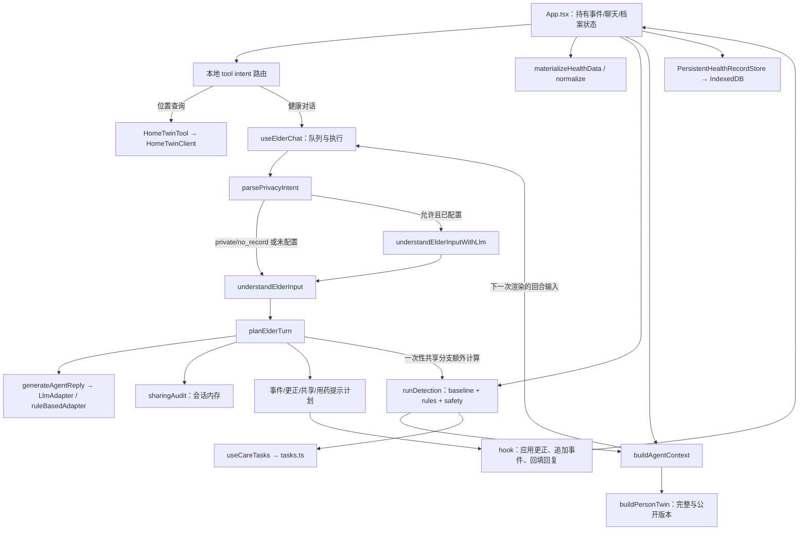

# 安康 Agent core 边界盘点

审计日期：2026-10-01。对象：`ankang/route1-health-agent`，上游 `JerryFreeman333/fdu-hackthon@cbdc8f33a1cf3993b1f49a7b3046ceda1932c39b`；导入提交 `e4e8a9510d519c93c8cae698cad06f18840d563e`。本轮只分析边界，没有删除、修改或重新实现上游代码，没有接 PySide6 bridge。

## 结论与最小闭包的口径

**指定的 19 个入口文件形成 25 个 TypeScript 文件的静态传递依赖闭包；这 25 个文件没有 React、PeerJS、Home Twin、iOS、视觉硬件的 npm 运行时 import。它们不是一个已经封装好的可独立运行 Agent 服务。** 原应用的排队、理解层选择、提交事件、更正执行、任务对账、持久化和会话状态仍分布在 React hook 与 `App.tsx` 中。不能删除 UI 后就宣称原 Agent 完整可用。

应区分三种范围：

| 范围 | 精确含义 | 文件集合 |
| --- | --- | --- |
| C0：现有函数库的最小静态闭包 | 完整保留用户指定入口及其所有本地 import/export 依赖，包含类型依赖；不改源码、不做函数级 tree shaking | 下表 25 文件 |
| C1：未来无 React 运行层的保留基础 | C0 + 原时钟、轮次队列、快照接口；还需要从 hook/App 搬出原编排逻辑，当前没有这个可调用模块 | C0 + `engine/clock.ts`、`engine/turnQueue.ts`、`store/HealthRecordStore.ts`，共 28 文件；不是“28 文件已可直接启动” |
| 可选持久化实现 | 若继续使用原缓存/水合/KV 设计，再保留其平台无关实现 | C1 + `store/PersistentHealthRecordStore.ts`，29 文件；IndexedDB 实现不必进入 Node bridge |

纯函数单次计算允许调用者直接传数组而不 import Store，因此 `HealthRecordStore.ts` **不在 C0**；要求保留原数据/事件运行契约时应进入 C1。具体数据库不是最小 core 必需品。上面的“最小”限定于完整文件和给定入口，不能解释为所有可能产品功能的唯一数学最小集合。

方法：使用快照内 TypeScript 5.6.3 Compiler API 解析 103 个非 `.d.ts` 源码模块及现有测试；解析静态 import、re-export、动态 import，标注 `import type`，用 checker 追踪可静态解析的调用符号，再人工核对回调、React effect、状态读写及脚本读取源码的测试。动态依赖如 `PeerJSCrossDevice.ts:36` 的 `import('peerjs')` 已计入，C0 中没有动态 import。此方法不把接口调用自动当作具体实现调用，也不声称覆盖任意动态控制流。临时分析程序与 JSON 在工作区 `.runtime/ankang-cleanup/`，不进入生产代码。

另以 C0 的 25 个文件生成临时 `noEmit` 配置，`strict`、ES2022、DOM 类型、`types: []`，执行上游 TypeScript 编译器，**通过**。DOM 类型是 URL/fetch/window 的编译契约，不代表必须启动浏览器；此检查证明源码闭包可单独检查类型，不证明完成了无 React 运行服务。

## 实际模块图与调用顺序



不是 `understanding → elderTurn → events → context/personTwin → detection/tasks` 的单向管道。真实关键顺序如下，行号均指本次固定快照：

1. `App.tsx:723–726` 的 `handleElderSend` **先** `routeAgentToolIntent`，命中位置查询走工具，否则调用 hook。Home Twin 路由不在 `engine/agent.ts` 内，LLM 没有在这里直接调用工具。
2. `useElderChat.ts:84–109` 解析隐私、建立老人消息与 pending 回复、固定 `priorChat`，交给 `createTurnQueue`。`runElderTurn:145–170` 调用 `buildUnderstanding`，然后调用 `planElderTurn`。模型仲裁不在 `planElderTurn` 中自动发生。
3. `understanding.ts:531/562` 从子句、人物、日期、状态、数值和既有聊天形成 `StructuredElderInput`；它反向调用 `agent.ts` 的规则标签解析及 `extract.ts`，不是一个独立大模型替代器。`llmUnderstanding.ts:231` 将标签/肯否判断合入本地结构化理解，失败回退规则结果。
4. `elderTurn.ts:157` 接收**回合开始时**的 findings、events、agentContext，决定隐私、澄清、回复、更正和新增事实。`no_record` 提前返回空事件计划；`generateAgentReply` 只在相关分支被调用。`eventsToAppend` 是计划，不是数据库写入。`share_family` 分支在 `elderTurn.ts:433–446` 对“更正后 + 新增”事件额外调用 `runDetection`，计算一次性共享 finding IDs。
5. hook 在 `175–205` 应用家庭更正/家庭事实、共享审计、共享 ID；有新本人事件时应用本人更正并 `appendHealthEvents`，广播，再处理漏服药回调、回填回复。**当前本人更正位于 `eventsToAppend.length > 0` 分支内**；仅更正且无新本人事件时的行为不能在未来搬出 hook 时悄悄改变，应先用回归明确并另立修复。本轮没有修正此上游行为。
6. React 状态变更后，`App.tsx:364/374/376` 分别物化事件、`runDetection(events,today)`、`buildAgentContext(profile,events,today,findings)`；Context 在 `context.ts:166–167` 构建完整/公开两个 Person Twin。**Detection 不依赖 Person Twin**，两者都使用事件和 baseline；公开 Twin 来自公开事件及可公开 findings 的重算。
7. `App.tsx:695` 调 `useCareTasks`；hook effect 过滤 alert/urgent、对账已消失 finding、最多取前两个创建稳定 ID 任务；漏服药创建、同日去重、完成/撤销由 `useCareTasks.ts` 实现。`tasks.ts` 本身只是创建/更新函数，不自动订阅事件。`App.tsx:837–846` 还负责初始药物任务和健康快照保存。

## C0 必保留文件与依据

以下路径相对 `ankang/route1-health-agent/src/`。①=领域 core；②=原 core 的运行依赖。用户指定的 `detection/**` 共有 7 个文件，逐一列出。

| 文件 | 类别 | 实际依赖/责任证据 |
| --- | --- | --- |
| `types.ts` | ① | 所有领域结构及 `METRICS`、标签常量；并非只有可擦除类型 |
| `pipeline/events.ts` | ① | `merge/appendHealthEvents`、来源关联、物化、旧数据转换、公开事件筛选；被检测、Context、Twin、回合直接调用 |
| `data/normalize.ts` | ① | events 物化调用 `mergeMeasurements`、`measurementsToDayRecords`；不是 demo 数据文件 |
| `engine/agent.ts` | ① | 标签/安全回复、`LlmAdapter`、外部上下文过滤、HTTP 适配、失败回退 |
| `engine/understanding.ts` | ① | 人物/状态/时间/更正目标和结构化 claims；依赖 agent/extract/privacy |
| `engine/llmUnderstanding.ts` | ① | 可选模型仲裁与合并规则；原 Agent 的可配置理解能力必须保留 |
| `engine/elderTurn.ts` | ① | `ElderTurnRequest → ElderTurnPlan`；编排语义而非执行存储 |
| `engine/privacy.ts` | ① | private/no_record/share_family 意图与共享许可，不能随 family UI 删除 |
| `engine/correction.ts` | ① | 按 chat 来源、消息 ID、标签/metric 精确过滤更正对象 |
| `engine/context.ts` | ① | 数据窗口、优先 findings、公开/完整 Twin 的 Agent 上下文 |
| `engine/personTwin.ts` | ① | 趋势和功能背景，使用真实已存在数据及 unknown，不依赖 Home Twin |
| `engine/baseline.ts` | ① | 日期、个人基线、近期均值等，被检测、Context、Twin 使用 |
| `engine/extract.ts` | ① | 数值和单位抽取；understanding、agent、elderTurn 都依赖 |
| `engine/questions.ts` | ① | 基于 context/findings 的有依据追问，由 agent 调用 |
| `engine/userFacing.ts` | ① | 未接纳事实、本人/家庭回执的语义文案；虽像 UI 文案却被 planner 直接调用 |
| `engine/sharingAudit.ts` | ②，C0 硬依赖 | planner 直接 `loadSharingAudit`、生成历史答复；模块级会话状态，当前不能直接删除 |
| `engine/tasks.ts` | ① | CareTask 创建、稳定 ID、状态转移和摘要；原任务语义，不是康复训练处方 |
| `engine/detect.ts` | ① | 物化事件、组装规则上下文、执行 evaluate、去重/排序 findings |
| `engine/detection/types.ts` | ① | DetectionContext、Rule、Config 契约 |
| `engine/detection/signals.ts` | ① | 数值基线信号、时间窗、发生状态/标签检查 |
| `engine/detection/helpers.ts` | ① | finding 创建/归一化辅助 |
| `engine/detection/rules/contextual.ts` | ① | 上下文相关规则；detect 的 RULES 注册 |
| `engine/detection/rules/metricBaseline.ts` | ① | 指标与个人基线偏移规则；detect 的 RULES 注册 |
| `engine/detection/fusion.ts` | ① | 多信号组合规则；detect 的 RULES 注册 |
| `engine/detection/safety.ts` | ① | 血压/血氧/心率/血糖/急症/跌倒安全下限；不能因移植删掉 |

关键直接边可复核：`elderTurn → agent/extract/privacy/detect/userFacing/sharingAudit/understanding/correction/events/types`；`understanding → agent/extract/privacy/types`；`llmUnderstanding → understanding/agent/extract/types`（另有 privacy 类型边）；`events → normalize/types`；`context → baseline/events/personTwin/types`；`personTwin → baseline/events/types`。C0 的传递闭包在这 25 文件内闭合。

## LLM 的两层位置

| 层 | 入口与契约 | 权限及限制 |
| --- | --- | --- |
| 理解仲裁 | `llmUnderstanding.ts:115 judgeClauseStatuses` 调 OpenAI-compatible `/chat/completions`；输出子句索引、状态、固定集合标签；`understandElderInputWithLlm` 合并回规则结构 | hook 先 `canUseLlmUnderstanding`；private/no_record 不联网。函数本身不是所有隐私策略的自动总入口，未来 wrapper 不能绕过调用方门禁。它不是任意意图/任意工具调用 Agent |
| 回复措辞 | `agent.ts:293 LlmAdapter.complete(systemPrompt,userText,context)`；`createHttpLlmAdapter:376` 返回该接口；`generateAgentReply:426` 验证回复并回退 | HTTP adapter 过滤私密输入和上下文、超时、限制输入长度；reply 安全检查失败回退规则。返回 tags 不是可执行工具或写入权限 |

`sanitizeExternalContext` 依赖 `personTwinPublic`、visibility/familyEligible 过滤；不能把完整私密 Twin 直接发给回复模型。规则检测决定 findings，LLM 不改变检测阈值、规则等级或 CareTask 权限。理解模型调用只发送本轮编号子句，不把 recentMessages 自动作为模型聊天历史；recentMessages 参与本机上下文理解。

`scripts/local-llm-proxy.mjs` 是可复用 HTTP 服务端适配（③），不是 C0 import 依赖；若沿用原代理必须保留端点/隐私/安全测试。Node 22 提供 fetch、URL、AbortController。浏览器同源 `/...` 端点在 Node 中不能原样当绝对 URL 使用，未来宿主需显式配置允许端点和凭据，不把密钥放进桥接聊天消息。本轮未启用真实 LLM。

## 状态到底在哪里

| 状态 | 当前实际拥有者/保存位置 | 对 core 边界的影响 |
| --- | --- | --- |
| 本人 HealthEvent、家庭事实、chat | `App.tsx` state；启动 `PersistentHealthRecordStore(createIdbKeyValueStore())` 水合；保存到 IndexedDB 单快照 | engine 函数不持有完整会话。聊天 `persisted === false` 在 `App.tsx:845` 被过滤 |
| 物化日记录、findings、AgentContext/PersonTwin | App `useMemo` 根据 events/profile/today 重算 | 是派生视图，不应独立变成另一套事实数据库 |
| CareTask | `useCareTasks.ts` 的 state + 模块级 `sessionTasks` | 会话内存；不在 HealthRecordSnapshot 内，不是全部已持久化 |
| 共享内容审计 | `sharingAudit.ts` 模块级 `sessionAudit`，上限 100 | planner 读全局状态；不是严格纯函数；旧 localStorage 内容会被清掉 |
| 家庭绑定、授权、一次性共享 IDs | `useFamilyBinding.ts` state + localStorage | 与健康快照分开；绑定握手与消息同步另有模块 |
| 通知派发/确认/去重台账 | `useNotificationDispatch` + `notifyPersistence.ts` localStorage | 与“内容计划共享”不同；实际 delivery outcome 才代表通道结果 |
| 档案、dataMode、preferredRole | `profileStore.ts` localStorage；标签页角色另在 sessionStorage | 档案内容可作为宿主输入，浏览器存储实现不必跟到 Node |
| 队列、pending 回复、照片预览 | `useElderChat` ref/state | 回合顺序及业务提交应保留；DOM/图片预览状态可留 UI |

Store 逐文件判断：`HealthRecordStore.ts`（②）保留接口/快照契约；`PersistentHealthRecordStore.ts`（②，可选实现）只要求注入 AsyncKeyValueStore，可复用；`LocalHealthRecordStore.ts`（②，内存替代实现）是模块级会话单例，不能误当生产持久化；`IdbKeyValueStore.ts`（④）是浏览器 IndexedDB 实现；`profileStore.ts`（④，含可复用验证/档案默认值）同时依赖 `data/demo.ts`；`clearLocalData.ts`（④）清浏览器存储的应用键，不能直接移植为删除康复数据库。

现状限制必须保留在决策里：`PersistentHealthRecordStore.save` 返回 void、异步写入失败仅 warn，不能据此向 PySide6 承诺“已持久化”；load/hydrate 是浅层快照校验，不是 bridge 输入验证器。`correction.ts` 从事件数组过滤删除事实，不是不可变追加的撤回日志。共享审计记录的是规划/会话内容，不等于通知已送达。上述契约与此前废弃的 Python A1–A3 设计不能混用。

## useElderChat：包含业务执行，不能整块当 UI 丢弃

`useElderChat.ts` 的静态本地闭包是 **37 文件 + React**，并非 C0 的简单包装。它通过 `data/demo.ts` 的 `formatLocalDate` re-export 引入整个 demo 模块，通过 `parserSelector` 引入视觉链，通过 `appConfig` 引入 Vite 配置和信令配置。虽然文本对话不需要这些功能，直接保留该文件就保留了这些 import；移除它前必须保留其中实际执行语义。

未来应从 hook/App 搬出的逻辑（仅建议，不在本轮执行）：

| 应归独立运行层 | 现有位置 | 为什么不能丢 |
| --- | --- | --- |
| 轮次排队、消息 ID/来源关联、隐私/理解入口选择 | hook `84–170` + `turnQueue.ts` | 决定哪一轮理解什么、是否联网，以及回复和来源消息的配对 |
| 应用 ElderTurnPlan 的更正/append/共享/药物回调顺序 | hook `173–205` | 单独调用 planner 不会保存事件或完成状态变化 |
| 事件、findings、Context/Twin 的重算顺序 | App `364–378` | 原系统依赖 React 重渲染把新状态传给下一轮 |
| 任务对账、同日药物任务去重和状态更新 | `useCareTasks.ts:31–88` | 不在 tasks.ts 函数库里；删除 hook 会失去运行中的任务行为 |
| hydrate 屏障、no_record 聊天过滤、save/clear | App `187–246`、`845` + Store | 防止空状态覆盖历史，保留数据隔离语义 |
| 时钟/生命周期/会话隔离 | `clock.ts`、hook 队列和 App 状态 | Node 默认时钟唤醒监听是 no-op，需宿主注入；当前全局审计/任务没有多用户 session map |

pending 气泡的 React setter、toast、照片 input/preview、TTS/录音组件、导航和页面布局属于④。照片解析/来源控制属于可选输入通道，不能因为 hook import 了它就认定是文本脑的必需品。

`engine/elderTurnGuard.ts` 只有测试引用，当前 src 没有调用；正在使用的是 `turnQueue.ts`。前者归③待复核的旧回合辅助，不能声称当前 runtime 已有完整 stale-reply/session-version 防护。队列也不自动保证重新读取最新 React 闭包；未来抽取必须审计快照时点，不能把“有队列”当成事务证明。

## 可选模块与删除候选（本轮一个也不删）

③=康复可能复用但不属最小 core；④=UI/demo/hardware/Home Twin/platform adapter。下列判断来自实际入口/消费者，不是按文件名猜测。

| 文件/模块（相对 src） | 类别 | 依赖/消费者及拆分条件 |
| --- | --- | --- |
| `engine/escalate.ts`、`familyDisclosure.ts`、`familyLedger.ts` | ③ | App/家属视图使用；C0 不 import。可独立成家属可见性/升级模块，但 C0 内 privacy、visibility、familyEligible、家庭事实隔离必须保留 |
| `engine/notify.ts`、`notifyPersistence.ts`、`dashboardStatus.ts` | ③ | 通知 hook 与家属 dashboard 使用；notify 依赖 escalate/clock，通道由 DeliverFn 注入。持久化 localStorage 属平台实现，不能被称为通用数据库 |
| `engine/familyLinkHandshake.ts` | ③ | `useFamilyBinding`/双端握手测试调用；可复用协议，不是文本脑必需 |
| `engine/report.ts`、`medicationCare.ts` | ③ | 周报和用药视图；分别依赖 baseline、任务/通知领域类型，没有 C0 反向依赖 |
| `engine/retry.ts`、`elderTurnGuard.ts` | ③ | retry 被跨设备 hook 使用；guard 当前仅测试引用；不是现行 core 队列的隐含依赖 |
| `hooks/useFamilyBinding.ts`、`useNotificationDispatch.ts`、`useCrossTabSync.ts`、`useCrossDeviceSync.ts` | ④（含③业务） | React + localStorage/BroadcastChannel/PeerJS 的执行与保存；拆出业务后才可移除具体 hook |
| `adapters/BrowserNotificationChannel.ts`、`WebhookPushChannel.ts` | ④/可选③ | 通知通道实现；分别调用 Notification API、fetch/Webhook 配置。family 模块关闭时不加载、不派发 |
| `adapters/PeerJSCrossDevice.ts`、`signalingConfig.ts` | ④ | 浏览器 PeerJS/信令/ICE；被跨设备 hook 或 appConfig 引入，不在 C0 |
| `adapters/DeviceAdapter.ts` | ③ | 设备读测量的契约；采集通道可复用，但文本 core 直接接 HealthEvent 不需要设备对象 |
| `adapters/HealthKitDeviceAdapter.ts`、`healthkit/autoSync.ts` | ④ | App 设备同步入口；HTTP HealthKit 通道和 revision 轮询，不参与文本解释闭包 |
| `adapters/DemoDeviceAdapter.ts` | ④ | App 的明确 demo 设备，依赖 `data/demo.ts`；不能作为无设备时的真人事实 fallback |
| `adapters/ImageHealthParser.ts`、`imageNormalizer.ts`、`RealImageHealthParser.ts`、`HttpVisionProvider.ts` | ③/④可选视觉通道 | hook 的照片路径调用；接口/单位/结构验证可复用，浏览器文件/图像上传不属文本 core |
| `adapters/DemoImageHealthParser.ts`、`MockVisionProvider.ts`、`parserSelector.ts` | ④ | demo、测试替身和应用选择器；删除前拆掉 hook 硬 import，并保留测试夹具替代方案 |
| `agent-tools/registry.ts` | ③ | Map/register/execute/capabilities 是可复用框架雏形；**当前类型还被 Home Twin 固定，不能称为已通用 tool runtime** |
| `agent-tools/types.ts` | ③，当前 Home Twin 耦合 | `AgentToolName` 只有 `home.find_item`，input 只有 query，result.source 固定 `route2-home-twin`；尚无通用 schema/权限/确认框架 |
| `agent-tools/intentRouter.ts` | ④ | 只路由找药/眼镜/钥匙等位置请求，健康安全句明确返回 null；不是通用 LLM function calling |
| `agent-tools/HomeTwinTool.ts`、`adapters/HomeTwinClient.ts`、`HomeSafetyActionAdapter.ts`、`hooks/useHomeTwinIntegration.ts` | ④ | App 注册/轮询 Route 2、查物品和场景安全动作；从 App 绕开健康聊天入口使用 |
| `config/appConfig.ts`、`config/runtime.ts` | ④（配置字段可复用） | Vite/设备/视觉/信令/LLM 应用配置混在同一入口；未来宿主注入 core 所需配置，不让整个 App 配置进入 core |
| `data/demo.ts`、`demoArchives.ts`、`demoHomeSafetyActions.ts` | ④（测试夹具暂保留） | App 演示种子；`demo.ts` 还 re-export 真正的 clock 函数，hook/日期测试存在依赖，不能整目录删除；`normalize.ts` 明确保留在① |
| `App.tsx`、`main.tsx`、`components/**`、`hooks/useFontScale.ts`、CSS | ④（App 含②编排） | React root/render 与 UI；App 的业务编排先抽离再讨论去 UI，不会用删除页面代替行为迁移 |

Route 1 外层 `native-ios/`、HealthKit bridge 脚本、`design-demos/` 属④；`scripts/security-check.mjs` 是验证工具，应随保留代码继续使用。独立 `route2-home-3d/` 的重建/高斯泼溅/后端/网页没有进入 C0 的源码 import 闭包，只通过上述 Home Twin HTTP/URL 通道接入。它们是未来候选，**本轮整个 ankang（包括这些目录）保持原样**。

`family / notify / sharing` 可以分成可选能力，但不能一刀切：family 发送/绑定/看板能从宿主关掉，C0 的隐私意图、家人主语隔离、共享回执以及 `sharingAudit.ts` 的硬依赖仍在。即使不启用家属服务，也不能把家人的症状记给本人，或把一次“生成共享计划”说成送达。未来可将审计作为 port 注入 planner；这属于另一次明确重构，不是今天的闭包事实。

## PySide6 bridge 建议契约（未实现）

建议由一个本机 TypeScript/Node 运行层复用原函数，PySide6 只通过有版本的 JSON 消息调用；传输可先考虑子进程 stdin/stdout JSON Lines，stderr 专用于日志。不得把语义规则翻译回 Python。Transport 选择不是本轮交付，原程序目前没有此 bridge。

最小业务操作建议为 `session.open`（恢复/初始化可信状态和能力配置）、`turn.process`、`snapshot.read`、`session.close`；任务操作如需开放，再用固定枚举操作而不是任意 JS/Python 执行。

```ts
// 建议，非现有导出 API；只表示应约定的边界。
type TurnInput = {
  protocolVersion: 1;
  requestId: string;
  sessionId: string;
  expectedRevision: number;
  text: string;
  clock: { today: string; receivedAt: string; timeZone: string };
};
type TurnOutput = {
  protocolVersion: 1;
  requestId: string;
  sessionId: string;
  revision: number;
  understanding: StructuredElderInput;
  plan: ElderTurnPlan;
  snapshot: HealthRecordSnapshot;
  findings: Finding[];
  personTwin: PersonTwin;
  tasks: CareTask[];
  receipt: {
    applied: boolean;
    persistence: 'memory_only' | 'saved' | 'failed';
    externalModel: 'not_requested' | 'attempted';
    familyDelivery: 'disabled' | 'not_attempted' | 'pending' | 'delivered' | 'failed';
  };
};
```

初始化状态至少包含可信 ElderProfile、events/familyEvents/chat、任务状态及会话审计（后两者不在现有 HealthRecordSnapshot 里），LLM 配置通过宿主配置通道注入。对外 `turn.process` 不让自由文本携带 API key、任意 endpoint、任意已执行动作或伪造 findings；运行层从已加载状态物化并重算。原 `ElderTurnRequest` 所需 `priorChat/findings/events/familySharing/agentContext/llmAdapter/today/now/receivedAt/sourceMessageId/idSeed` 由 wrapper 显式组装；函数/adapter 不能 JSON 序列化跨进程。

未来必须补齐但当前**不存在**的保证：每 session 串行与 reset/close 后在途结果门禁、requestId 幂等、revision 冲突、输入大小/枚举/日期及作用域验证、全局 audit/tasks 的 session 隔离、真实持久化确认/失败回执。不能把这些建议误写为原库已有功能。Node 时钟需接宿主日期与本地时区，不用 UTC 字符串切片替代本地日期。

运行流程应先复现原语义：隐私门禁 → 理解 → planner → 按现有规则应用 effects → 重算派生状态/任务 → 持久化结果回执。单独 `planElderTurn` 返回的“我已经记下”目前会先于底层持久化完成，bridge 不可据此伪造 saved。原 Agent 并没有此前 Python A1–A3 的逐候选确认系统；不要把那套新语义偷偷带回来。康复训练算法、摄像头和计划执行仍留在 main 既有系统，本建议没有接入它们，也没有进入 B。

## 测试边界与保留原则

当前所有 upstream 测试完整保留。不能只依据 core import 闭包删除 demo/fixture/可选模块，因为**测试的闭包比生产 C0 大**。例如 `detection.test.ts`、`phase1-hardening.test.ts` 还用 demo/report/escalate；`task-regression.test.ts` 用 DemoImageHealthParser；`care-tasks-session-only.test.ts` import React hook；`local-date.test.ts` 从 demo re-export 日期函数。以后拆测试只能在保留原行为断言的前提下分批做。

下方清单由实际测试 import 与人工检查脚本型测试生成：52 个 TypeScript 测试文件直接触及 C0 或本报告的运行/Store/任务契约，整体先随 core 保留；另补充保留日期 re-export、代理安全、旧回合门禁测试。没有把类型 import 单独计作行为覆盖。它们不全是“只依赖 C0 的单测”，混合测试的外部夹具依赖也必须保留到后续拆分完成。

核心行为覆盖必须包括人物/时间/否定/假设/不确定/更正、数值单位、隐私出口和不记录、结构化事件去重及来源、公开/私密上下文、检测安全下限、任务状态、跨午夜、队列顺序、存储失败/水合。`tests/corpus/utterances.json` 必须跟随语料与管线性质测试，原 npm test 会复制它到 `.test-build`。

原 `tsconfig.test.json` 排除了 `useElderChat`、跨设备 hook、PeerJS、appConfig/runtime；因此 **378 项 npm test 不等于 hook 端到端正确性证明**。后续抽运行层必须保留正式浏览器测试及等价的宿主级回归，不可只靠 C0 编译通过验收。

### 直接触及 core/运行契约的测试（52 文件）

| 测试文件（相对 route1-health-agent） | 实际源码依赖/保留说明 |
| --- | --- |
| [`tests/absolute-date-regression.test.ts`](../../ankang/route1-health-agent/tests/absolute-date-regression.test.ts) | `engine/understanding.ts` |
| [`tests/agent-external-context.test.ts`](../../ankang/route1-health-agent/tests/agent-external-context.test.ts) | `engine/context.ts`、`engine/agent.ts`、`pipeline/events.ts` |
| [`tests/blood-pressure-adversarial-blackbox.test.ts`](../../ankang/route1-health-agent/tests/blood-pressure-adversarial-blackbox.test.ts) | `engine/agent.ts`、`engine/detect.ts`、`engine/extract.ts`、`engine/understanding.ts`、`pipeline/events.ts` |
| [`tests/care-tasks-session-only.test.ts`](../../ankang/route1-health-agent/tests/care-tasks-session-only.test.ts) | `hooks/useCareTasks.ts` |
| [`tests/clock.test.ts`](../../ankang/route1-health-agent/tests/clock.test.ts) | `engine/clock.ts` |
| [`tests/context-memory-regression.test.ts`](../../ankang/route1-health-agent/tests/context-memory-regression.test.ts) | `engine/understanding.ts` |
| [`tests/coordinated-family-attribution-regression.test.ts`](../../ankang/route1-health-agent/tests/coordinated-family-attribution-regression.test.ts) | `engine/understanding.ts` |
| [`tests/coordinated-measurement-regression.test.ts`](../../ankang/route1-health-agent/tests/coordinated-measurement-regression.test.ts) | `engine/understanding.ts` |
| [`tests/correction-time-regression.test.ts`](../../ankang/route1-health-agent/tests/correction-time-regression.test.ts) | `engine/understanding.ts` |
| [`tests/detection.test.ts`](../../ankang/route1-health-agent/tests/detection.test.ts) | `engine/context.ts`、`engine/detect.ts`、`engine/escalate.ts`、`engine/agent.ts`、`engine/extract.ts`、`engine/report.ts`、`engine/questions.ts`、`engine/privacy.ts`、`data/demo.ts`、`data/normalize.ts`、`pipeline/events.ts` |
| [`tests/elder-next-layer-blackbox.test.ts`](../../ankang/route1-health-agent/tests/elder-next-layer-blackbox.test.ts) | `pipeline/events.ts`、`engine/understanding.ts` |
| [`tests/elder-overload-blackbox.test.ts`](../../ankang/route1-health-agent/tests/elder-overload-blackbox.test.ts) | `engine/agent.ts`、`engine/understanding.ts`、`engine/tasks.ts` |
| [`tests/elder-privacy-adversarial.test.ts`](../../ankang/route1-health-agent/tests/elder-privacy-adversarial.test.ts) | `engine/privacy.ts`、`engine/familyLedger.ts`、`engine/sharingAudit.ts`、`engine/understanding.ts` |
| [`tests/elder-sharing-audit-blackbox.test.ts`](../../ankang/route1-health-agent/tests/elder-sharing-audit-blackbox.test.ts) | `engine/sharingAudit.ts` |
| [`tests/elder-turn-plan.test.ts`](../../ankang/route1-health-agent/tests/elder-turn-plan.test.ts) | `engine/elderTurn.ts`、`engine/agent.ts`、`engine/understanding.ts` |
| [`tests/family-disclosure.test.ts`](../../ankang/route1-health-agent/tests/family-disclosure.test.ts) | `engine/escalate.ts`、`engine/familyDisclosure.ts`、`engine/tasks.ts` |
| [`tests/family-ledger-regression.test.ts`](../../ankang/route1-health-agent/tests/family-ledger-regression.test.ts) | `pipeline/events.ts`、`engine/familyLedger.ts`、`engine/understanding.ts` |
| [`tests/final-audit-smoke.test.ts`](../../ankang/route1-health-agent/tests/final-audit-smoke.test.ts) | `engine/familyLedger.ts`、`engine/understanding.ts` |
| [`tests/greeting-and-copy.test.ts`](../../ankang/route1-health-agent/tests/greeting-and-copy.test.ts) | `engine/agent.ts`、`engine/privacy.ts`、`engine/understanding.ts` |
| [`tests/health-store-session-only.test.ts`](../../ankang/route1-health-agent/tests/health-store-session-only.test.ts) | `store/LocalHealthRecordStore.ts` |
| [`tests/healthkit-device-adapter.test.ts`](../../ankang/route1-health-agent/tests/healthkit-device-adapter.test.ts) | `adapters/HealthKitDeviceAdapter.ts`、`pipeline/events.ts`、`healthkit/autoSync.ts` |
| [`tests/llm-endpoint-guard.test.ts`](../../ankang/route1-health-agent/tests/llm-endpoint-guard.test.ts) | `engine/agent.ts` |
| [`tests/llm-understanding.test.ts`](../../ankang/route1-health-agent/tests/llm-understanding.test.ts) | `engine/llmUnderstanding.ts`、`engine/understanding.ts` |
| [`tests/mixed-intent-privacy.test.ts`](../../ankang/route1-health-agent/tests/mixed-intent-privacy.test.ts) | `engine/agent.ts`、`engine/privacy.ts`、`engine/understanding.ts`、`engine/elderTurn.ts` |
| [`tests/multi-fact-regression.test.ts`](../../ankang/route1-health-agent/tests/multi-fact-regression.test.ts) | `engine/understanding.ts` |
| [`tests/negation-combinatorial.test.ts`](../../ankang/route1-health-agent/tests/negation-combinatorial.test.ts) | `engine/understanding.ts`、`engine/agent.ts`、`engine/detect.ts`、`pipeline/events.ts` |
| [`tests/negation-hypothesis-blackbox.test.ts`](../../ankang/route1-health-agent/tests/negation-hypothesis-blackbox.test.ts) | `engine/understanding.ts` |
| [`tests/numeric-extraction.test.ts`](../../ankang/route1-health-agent/tests/numeric-extraction.test.ts) | `engine/extract.ts` |
| [`tests/persistent-health-store.test.ts`](../../ankang/route1-health-agent/tests/persistent-health-store.test.ts) | `store/PersistentHealthRecordStore.ts` |
| [`tests/phase1-hardening.test.ts`](../../ankang/route1-health-agent/tests/phase1-hardening.test.ts) | `data/demo.ts`、`data/normalize.ts`、`pipeline/events.ts`、`engine/detect.ts`、`engine/context.ts`、`engine/agent.ts`、`engine/tasks.ts`、`engine/escalate.ts`、`engine/extract.ts`、`engine/privacy.ts`、`engine/report.ts`、`adapters/DemoImageHealthParser.ts` |
| [`tests/pipeline-properties.test.ts`](../../ankang/route1-health-agent/tests/pipeline-properties.test.ts) | `engine/elderTurn.ts`、`engine/agent.ts`、`engine/understanding.ts` |
| [`tests/privacy-regression.test.ts`](../../ankang/route1-health-agent/tests/privacy-regression.test.ts) | `engine/agent.ts` |
| [`tests/privacy-time-window-regression.test.ts`](../../ankang/route1-health-agent/tests/privacy-time-window-regression.test.ts) | `engine/detect.ts`、`pipeline/events.ts` |
| [`tests/private-urgent-gate.test.ts`](../../ankang/route1-health-agent/tests/private-urgent-gate.test.ts) | `engine/detect.ts`、`engine/escalate.ts`、`engine/dashboardStatus.ts`、`pipeline/events.ts` |
| [`tests/route1-audit2.test.ts`](../../ankang/route1-health-agent/tests/route1-audit2.test.ts) | `engine/understanding.ts`、`engine/extract.ts`、`engine/agent.ts`、`engine/detect.ts`、`pipeline/events.ts`、`engine/escalate.ts` |
| [`tests/route1-audit4role.test.ts`](../../ankang/route1-health-agent/tests/route1-audit4role.test.ts) | `engine/understanding.ts`、`engine/extract.ts`、`engine/agent.ts`、`engine/detect.ts`、`pipeline/events.ts`、`engine/escalate.ts`、`engine/familyLedger.ts`、`engine/familyDisclosure.ts`、`engine/tasks.ts`、`engine/correction.ts` |
| [`tests/route1-corpus.test.ts`](../../ankang/route1-health-agent/tests/route1-corpus.test.ts) | `engine/understanding.ts`、`engine/extract.ts`、`engine/escalate.ts`、`engine/detect.ts`、`engine/agent.ts` |
| [`tests/route1-e2e.test.ts`](../../ankang/route1-health-agent/tests/route1-e2e.test.ts) | `engine/understanding.ts`、`engine/extract.ts`、`engine/agent.ts`、`engine/detect.ts`、`pipeline/events.ts`、`engine/escalate.ts` |
| [`tests/route1-phase2.test.ts`](../../ankang/route1-health-agent/tests/route1-phase2.test.ts) | `engine/understanding.ts`、`engine/extract.ts`、`engine/agent.ts`、`engine/detect.ts`、`pipeline/events.ts`、`engine/escalate.ts`、`engine/familyLedger.ts`、`engine/familyDisclosure.ts`、`engine/tasks.ts` |
| [`tests/route1-safety-reply.test.ts`](../../ankang/route1-health-agent/tests/route1-safety-reply.test.ts) | `engine/agent.ts` |
| [`tests/self-correction-regression.test.ts`](../../ankang/route1-health-agent/tests/self-correction-regression.test.ts) | `pipeline/events.ts`、`engine/correction.ts`、`engine/understanding.ts` |
| [`tests/share-recipient-routing.test.ts`](../../ankang/route1-health-agent/tests/share-recipient-routing.test.ts) | `engine/understanding.ts`、`engine/privacy.ts` |
| [`tests/sharing-audit-session-only.test.ts`](../../ankang/route1-health-agent/tests/sharing-audit-session-only.test.ts) | `engine/sharingAudit.ts` |
| [`tests/tag-fallback-regression.test.ts`](../../ankang/route1-health-agent/tests/tag-fallback-regression.test.ts) | `engine/understanding.ts` |
| [`tests/task-regression.test.ts`](../../ankang/route1-health-agent/tests/task-regression.test.ts) | `engine/tasks.ts`、`adapters/DemoImageHealthParser.ts` |
| [`tests/temporal-attribution-chain-regression.test.ts`](../../ankang/route1-health-agent/tests/temporal-attribution-chain-regression.test.ts) | `engine/understanding.ts` |
| [`tests/temporal-attribution-regression.test.ts`](../../ankang/route1-health-agent/tests/temporal-attribution-regression.test.ts) | `engine/understanding.ts` |
| [`tests/time-regression.test.ts`](../../ankang/route1-health-agent/tests/time-regression.test.ts) | `engine/understanding.ts` |
| [`tests/turn-queue.test.ts`](../../ankang/route1-health-agent/tests/turn-queue.test.ts) | `engine/turnQueue.ts` |
| [`tests/user-diagnostic.test.ts`](../../ankang/route1-health-agent/tests/user-diagnostic.test.ts) | `engine/agent.ts`、`engine/extract.ts`、`engine/understanding.ts` |
| [`tests/user-input-regression.test.ts`](../../ankang/route1-health-agent/tests/user-input-regression.test.ts) | `engine/understanding.ts`、`engine/escalate.ts` |
| [`tests/user-ux-blackbox.test.ts`](../../ankang/route1-health-agent/tests/user-ux-blackbox.test.ts) | `engine/privacy.ts`、`engine/familyLedger.ts`、`engine/userFacing.ts`、`engine/understanding.ts` |

### 其他测试及模块依赖（18 文件）

| 测试文件（相对 route1-health-agent） | 实际源码依赖/保留说明 |
| --- | --- |
| [`tests/agent-tool-routing.test.ts`](../../ankang/route1-health-agent/tests/agent-tool-routing.test.ts) | `agent-tools/intentRouter.ts`、`agent-tools/registry.ts` |
| [`tests/dashboard-status.test.ts`](../../ankang/route1-health-agent/tests/dashboard-status.test.ts) | `engine/escalate.ts`、`engine/dashboardStatus.ts` |
| [`tests/elder-chat-turn-order.test.ts`](../../ankang/route1-health-agent/tests/elder-chat-turn-order.test.ts) | `engine/elderTurnGuard.ts`；补充保留作旧门禁对照，guard 当前未接生产 |
| [`tests/family-link-handshake.test.ts`](../../ankang/route1-health-agent/tests/family-link-handshake.test.ts) | `engine/familyLinkHandshake.ts`、`hooks/useFamilyBinding.ts` |
| [`tests/family-session-isolation.test.ts`](../../ankang/route1-health-agent/tests/family-session-isolation.test.ts) | `engine/familyDisclosure.ts` |
| [`tests/home-safety-family-gate.test.ts`](../../ankang/route1-health-agent/tests/home-safety-family-gate.test.ts) | 读取 App.tsx/FamilyDashboard.tsx 源码验证家庭空间权限门禁；Home Twin 可选链 |
| [`tests/home-safety-session-isolation.test.ts`](../../ankang/route1-health-agent/tests/home-safety-session-isolation.test.ts) | `data/demoHomeSafetyActions.ts` |
| [`tests/image-health-parser.test.ts`](../../ankang/route1-health-agent/tests/image-health-parser.test.ts) | `adapters/RealImageHealthParser.ts`、`adapters/MockVisionProvider.ts`、`adapters/DemoImageHealthParser.ts`、`adapters/ImageHealthParser.ts`、`adapters/parserSelector.ts`、`adapters/HttpVisionProvider.ts`、`adapters/imageNormalizer.ts` |
| [`tests/llm-proxy.test.ts`](../../ankang/route1-health-agent/tests/llm-proxy.test.ts) | 补充保留：启动 scripts/local-llm-proxy.mjs 验证代理安全；非静态 src import |
| [`tests/local-date.test.ts`](../../ankang/route1-health-agent/tests/local-date.test.ts) | `data/demo.ts`；补充保留：demo re-export 的真实 clock 日期契约 |
| [`tests/medication-care.test.ts`](../../ankang/route1-health-agent/tests/medication-care.test.ts) | `engine/medicationCare.ts` |
| [`tests/notify-persistence.test.ts`](../../ankang/route1-health-agent/tests/notify-persistence.test.ts) | `engine/notifyPersistence.ts` |
| [`tests/notify.test.ts`](../../ankang/route1-health-agent/tests/notify.test.ts) | `engine/notify.ts` |
| [`tests/personal-mode-gates.test.ts`](../../ankang/route1-health-agent/tests/personal-mode-gates.test.ts) | `adapters/parserSelector.ts` |
| [`tests/profile-store.test.ts`](../../ankang/route1-health-agent/tests/profile-store.test.ts) | `store/profileStore.ts` |
| [`tests/retry.test.ts`](../../ankang/route1-health-agent/tests/retry.test.ts) | `engine/retry.ts` |
| [`tests/signaling-config.test.ts`](../../ankang/route1-health-agent/tests/signaling-config.test.ts) | `adapters/signalingConfig.ts` |
| [`tests/webhook-push.test.ts`](../../ankang/route1-health-agent/tests/webhook-push.test.ts) | `adapters/WebhookPushChannel.ts`、`engine/notify.ts` |

### 浏览器/黑盒门禁

原 8 个 npm 脚本 `test:browser`、`:sos`、`:onboarding`、`:webhook`、`:notif`、`:cross-device`、`:binding`、`:crosstab`，及 `tests/helpers/demo-seed.mjs`、`helpers/preview-server.mjs`，在拆运行层期间均保留作原实现对照。Webhook/Notification 使用测试拦截或替身，不证明真实家属送达。未来纯 core 可替换 UI 操作驱动，但不能丢掉隐私/授权/来源/更正/顺序/持久化断言。

补充的 demo-filled、family-management、four-tab-flow、voice-dialog 测试及 `p0-blackbox/` 也保留；home-capture 面向 Route 2，不是最小 core 的验收。上轮固定快照实测：npm test 378/378，正式浏览器 8/8 组 71/71 检查；补充 1 过、3 个失败在独立上游复现（旧文案 2 项、手机首屏布局 1 项），P0 独立脚本在 Windows `spawn npm ENOENT`。这些是 **2026-10-01 导入阶段的历史实测**，本轮源码完全未改，不把它们改写成全绿或本轮重新执行结果。

本轮仅新增 C0 独立 noEmit 类型验证和静态依赖分析；没有更改 npm scripts、tsconfig、package-lock 或任何测试。下一阶段须用户审核后再决定抽取/裁剪次序；每批验证都应区分原有失败与新回归。
