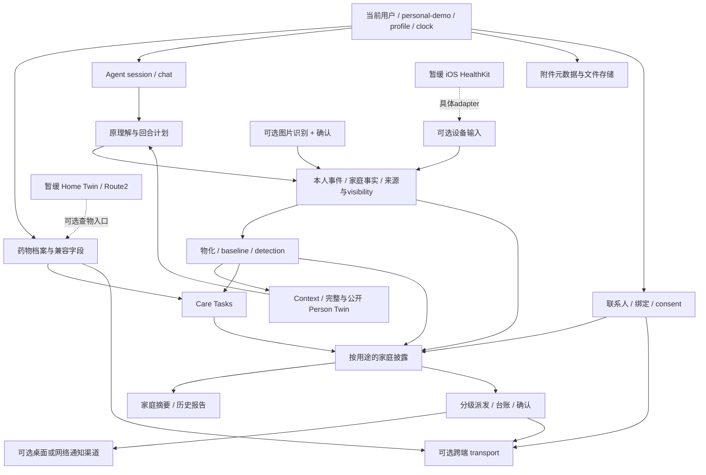

# 安康产品功能迁移地图（阶段 4；阶段 5A/5B 状态更新）

盘点日期：2026-10-01。分支 `codex/rehab-agent-stage1`；开始时本地和远端均为 `04b726cc865f7fd2387bc092d37d20a4562ca208`，远端 main 为 `2ebc388d4160d647456487007670d89f02f80914`。

**阶段 4 当时只有本文档变更。** 不修改生产代码，不抽离模块，不改变 Runtime/bridge，不裁剪 React、Route 2、iOS 或 demo，不接评估/训练/反馈，不 merge main。本表是未来迁移建议，不是已实现的 PySide6 产品。

## 阶段 5A 更新（2026-10-01）

基线 `d405135c46c1c8da9c113df5f537fd8381ba3eac`。A08 的药物增改、停用/恢复、双字段兼容已迁到无 React 的 `src/medication/`，`src/profile/ProfilePersistence.ts` 定义 ownerId / personal-demo / 存储回执边界。MedicationPage 和 ProfileForm 调用同一领域规则；browser adapter 继续使用原本地 profile key。A09 的每日任务、漏服语义原样保留，本阶段未增加提醒或产品整合。

下文未明确更新的功能证据与建议仍是阶段 4 的历史盘点；不代表已经抽离。阶段 5A 实测及边界见 [阶段 5A 验收](../validation/ANKANG_STAGE5A_MEDICATION.md)。未增加 Python 药物接口、PySide6 页面或家庭/同步服务。

## 阶段 5B 更新（2026-10-01）

基线 `6731287de40b74c36e75cde8106921f2b111cb93`。`src/family/` 已抽出 owner 专属关系/绑定/授权/一次性许可/共享计划记录/家属投影；React hook、App 和 Dashboard 复用，浏览器存储在 `src/store/familyStore.ts`。纯审计规则移到 `engine/sharingAuditRules.ts`，旧导出保留兼容。

A12–A14 的核心边界已抽，A17 的权限投影已抽；A11 本轮仅提供关系与接收者标识，电话/SOS/通知功能未迁。周报聚合、通知台账/派发、附件、全应用健康存储的多用户迁移均不在本轮。旧无 owner 的 family v1 权限不会自动归给当前用户，须重新绑定。详见 [阶段 5B 验收](../validation/ANKANG_STAGE5B_FAMILY_SHARING.md)。后面的原阶段 4 盘点与后续建议按历史阅读，以此更新及表内状态为准。

## 结论与证据口径

按用户可识别的能力划分为 **30 项**：A 明确要迁 18 项，B 后续很可能有用 5 项，C 暂缓 4 项，D 不进入正式产品的旧呈现/演示 3 项。这个数字是产品划分，不是页面数；例如聊天、多轮、事实自报共享一个入口但有不同业务责任。

主要结论：

- 原安康不只有 Agent，还包含药物档案、文件附件、家庭绑定与披露、通知台账、任务、趋势及设备输入。多数有真实执行代码，不能整体视为演示 UI。
- 原 Agent Runtime 已独立，但**药物编辑、附件管理、家庭授权、通知派发与同步编排仍未全部独立**。Python bridge 目前仅暴露 open/process/close，不能据此声称药物/档案/家庭能力已能从 Python 调用。
- 最先抽取的用户功能建议是**药物档案**，前置只补其真正需要的 profile/身份/存储边界；家庭权限和通知不能跟药物 UI 一起顺手复制。随后按“家庭/共享 → 档案/历史 → 通知 → Person Twin 产品整合”推进。
- Person Twin 是领域状态，不是 Home Twin。前者明确保留，后者及高斯泼溅、Route 2、iOS 硬件链暂缓。

方法：以固定基线的 `App.tsx` 路由与回调为起点，核对组件实际分支、hook、engine、runtime、store、adapter、agent-tools、pipeline、data 和 tests；对 Route 2/iOS 仅追踪 Route 1 外部依赖到其实现入口。通过调用/状态读写判断完成程度，不把注释、文件名、UI 文案或未挂载组件当成完整功能。

本文“已实现”指代码存在且接入相应路径；“测试证据”区分函数测试、浏览器替身和实机。**本轮没有重跑测试或启动设备**。此前已记录的结果：核心 396/396；正式浏览器 8 组 71 项通过；补充黑盒 1 组通过、3 组有上游已复现的文案/布局失败；Python bridge 两轮 smoke 通过。详见 [Runtime 验收](../validation/ANKANG_RUNTIME_2026-10-01.md)、[bridge smoke](../validation/ANKANG_BRIDGE_SMOKE.md)，不把历史结果当作本轮新实测。

## 当前入口与执行链

`App` 先 hydrate 健康快照并读 `profileStore`，新用户经 `FirstRunGate → OnboardingFlow/ProfileForm` 选择 demo/personal 与角色；`AppRoot` 持有 events/familyEvents/chat/profile，切换老人和家属页面。

老人侧：`ElderHome` 提供助手、任务和求助入口；`ElderAssistantPage → ChatView` 发文字/语音；`MedicationPage` 管理药物；`HealthArchivePage` 管理文件，内部挂 `ElderHealthPage/ProfileView/DeviceDebugPanel`；家庭空间进入 `ElderHomeSpacePage`；`ElderSettingsPage` 管理档案、共享、字号、清空和角色。

家属侧：`FamilyDashboard` 根据 view 切换首页、详情、周报、药物、档案、消息、隐私等。实际 App 传入 `medicationPage` 和 `archivePage`。**当前药物路由优先返回传入的 MedicationPage，旧 `buildMedicationCareView` 展示分支仅在没有该 prop 时走到**；不应把两个分支算成同一条已验证用户路径。

关键实际链：

```text
聊天文字 / 语音转文字
  → App.handleElderSend（先检查 Home 查物意图）
  → useElderChat → runtime.prepareTurn → 原 understanding / elderTurn
  → runtime.applyTurnPlan → React events / familyEvents / audit / share IDs
  → deriveHealthState → materialize / detection / context / Person Twin
  → careTasks 对账；家庭披露；通知派发；健康快照 save

MedicationPage.save → onSave → App.handleProfileSave
  → profileStore.saveStoredProfile + React profile
  → 满足条件时 medication.update 广播 → 接收端校验后写档案

HealthArchivePage.save → 组件内 IndexedDB files.put
  → 本机列表刷新 + 同浏览器 archive-updates 广播
  → 可选 onRecognize → 图片识别待确认 → 明确确认后转 HealthEvent
```

独立 Runtime 是另一路宿主入口：`AgentRuntime.processTurn` 自己管理上述健康回合状态和重算；原 React 复用 turn/derive/careTasks 函数，但仍拥有自己的 UI/session 接线。不是所有 App 功能都在 `processTurn` 内。

## 迁移总表

以下代码路径除明确注明外相对 `ankang/route1-health-agent/src/`。A/B/C/D 表示产品迁移价值，不表示删除授权。“低/中/高”是业务抽取耦合度，不是完整上线工作量。E 编号对应后文测试证据。

| 功能 | 用户现在看到什么 | React 页面/入口 | 业务逻辑位置 | 数据/状态位置 | 是否迁 | PySide6 对应位置 | 抽离难度 | 备注 |
| --- | --- | --- | --- | --- | --- | --- | --- | --- |
| A01 Agent 聊天 | 文本输入、快捷输入、分块回复、安全动作 | ElderAssistantPage / ChatView → App.handleElderSend | runtime/turn、session；engine/agent、understanding、llmUnderstanding、elderTurn | chat + Runtime session；React 健康快照 | A 明确 | 助手页 | 低（核心已独立） | 规则路径可独立运行；LLM 需配置；bridge 未传模型配置；E01 |
| A02 多轮记忆与顺序 | 召回前文、澄清、回复配对 | useElderChat 队列/占位回复 | turnQueue、understanding、elderTurn；runtime/session revision/generation | session chat，持久化排除 no_record | A 明确 | 助手会话 | 低 | 不是长期通用记忆系统；React 旧闭包不等同新 Runtime 事务；E01 |
| A03 健康自报 | 说症状/血压后得到记录回执 | 聊天输入 → 健康数据页 | extract/understanding/elderTurn → pipeline/events → normalize | HealthEvent，来源 message ID、日期、visibility；家庭事实分账 | A 明确 | 助手录入 + 健康档案 | 低 | 数值和时间归属有规则测试，不是诊断；E02 |
| A04 基本健康档案 | 首次建档、编辑姓名/健康背景/联系方式 | OnboardingFlow、ProfileForm、ElderSettingsPage | profileStore 校验/默认值；App.handleProfileSave | StoredProfile/ElderProfile；localStorage | A 明确 | 现有身体档案的健康资料区 | 中 | 校验主要检查名字，不能视为完整 schema；保存失败静默降级；E03 |
| A05 医疗文件附件 | 六类资料、上传、编辑、图片预览、原文件下载 | HealthArchivePage | database/save、scope 过滤、文件事务均在 TSX 中 | 独立 IndexedDB `ankang-health-attachments/files`；File；demo/personal + owner 名称 scope | A 明确 | 健康档案 / 附件与历史 | 高 | 真正本地功能；不是云端档案；同名 owner 不能作为未来可靠用户 ID；E04 |
| A06 健康指标与变化检测 | 指标卡、趋势图、异常等级、行动建议 | ElderHealthPage / ProfileView / Sparkline | pipeline/events、normalize、baseline、detect、detection/** | events → measurements/records/findings（派生） | A 明确 | 健康档案指标区 / 状态摘要 | 中 | 原安全规则需保留；不等于康复动作评估算法；E02/E05 |
| A07 Person Twin | 部分状态通过提示/调试面板可见，驱动追问 | DeviceDebugPanel；助手上下文 | personTwin、context、questions；runtime/derive | 活动/行动/睡眠/夜间变化、症状、functionalProfile；完整/公开两套 | A 明确 | 后台状态能力，可给摘要卡供数 | 低至中 | 数据不足为 unknown；非 3D 人体模型；E05 |
| A08 药物档案 | 添加/编辑、剂量、用途、时间、在用/曾用、查药位置入口 | MedicationPage；家属授权后使用同组件 | medication/medications + MedicationService；profile/ProfilePersistence；medicationCare 旧视图模型保留 | medicationRecords + 兼容 medications 字符串；profileStore | A 明确 | 药物页 | 中 | 5A 已抽离业务并由 React 复用；ownerId 稳定、保存有回执；尚未接 Python/PySide6。times 仍是文本；查药位置暂缓；E06 |
| A09 今日服药/漏服药 | 今日药物任务、完成/未确认、聊天漏服回执 | ElderHome 任务；旧家属用药摘要分支 | runtime/careTasks；tasks；elderTurn.medicationMissed；medicationCare | session CareTask；每天去重；药物档案 | A 明确 | 药物页今日确认 / 待办 | 中 | 5A 保留原实现并通过相关回归，未抽新任务服务、未加提醒。已完成同日任务不复活；E06/E07 |
| A10 Care Tasks | 安全确认、联系家属、观察任务、状态操作 | ElderHome / FamilyDashboard | runtime/careTasks + engine/tasks；App.handleTaskStatus | hook 实例或 Runtime session；finding 来源 ID | A 明确 | 待办区 | 低至中 | 非康复训练计划；未做持久化任务历史；家属可见任务需过披露门禁；E07 |
| A11 家属/老人/医生联系与 SOS | 联系电话、120、求助入口、可选微信求助 | SafetyActions / App SOS / FamilyDashboard | App.contactElder/contactDoctor/handleNotifyFamilyUrgent | ElderProfile 电话字段；webhook 配置与结果 | A 明确 | 家庭页 / 求助入口 | 中 | 5B 仅新增稳定关系/recipient 边界；电话、SOS、微信/通知保持原状，未抽离。tel: 不等于拨通；E08 |
| A12 家属绑定 | 邀请码、等待/成功/失败、重新生成、解绑 | ElderSettingsPage、FamilyDashboard | family/FamilyService、familyLinkHandshake；hook 为 React adapter；App 原 transport 接线 | ownerId + OwnedFamilyLink、remoteConsent、share IDs；FamilyPersistence；邀请仅 session | A 明确 | 家庭页 / 绑定关系 | 高 | 5B 已抽到 FamilyService + FamilyPersistence；owner/模式隔离，短命邀请不落盘，active 可恢复；旧无 owner 状态须重绑。非实名账号；E09 |
| A13 家庭共享与家人事实 | 长期授权、一次性共享、家人近况、共享历史答复 | 隐私卡、设置、聊天、家属页 | family/FamilyService + projection；复用 privacy/familyLedger/familyDisclosure/sharingAuditRules | consent、share ID 集合、familyEvents、session audit | A 明确 | 家庭页 / 共享范围与记录 | 高 | 5B 已抽长期授权、限定 ID 的一次性许可、分账投影及 session 共享计划记录；permission/planned 不等于 sent/acknowledged；E09/E10 |
| A14 隐私控制 | 不记录、仅本人、暂停/撤销共享、被挡住状态 | 聊天、设置、家属隐私视图 | privacy、context 外部投影、familyDisclosure、escalate；UI gating | visibility、familyEligible、familySharing、persisted 标记 | A 明确 | 助手 + 家庭/设置 | 高 | 5B 家属出口统一验证 owner/active/授权/private/no_record；远端授权限定当前关系。原 Agent 隐私语义未改；非全应用多账号隔离；E10 |
| A15 更正/撤销事实 | “说错了”等修正前次来源事实 | 助手自然语言 | correction、understanding、elderTurn、runtime.applyTurnPlan | sourceMessageId；本人/家庭事件数组 | A 明确 | 助手 / 来源记录 | 低 | 不是任意历史 CRUD/撤销栈；仅更正无新事件的原本人 gate 限制仍在；E11 |
| A16 通知核心与台账 | 分级、送达状态、未确认数、确认按钮、浏览器/微信渠道 | useNotificationDispatch、FamilyDashboard、SOS | escalate、notify、notifyPersistence；BrowserNotificationChannel/WebhookPushChannel | dispatch records：deliveries 与 new/acknowledged；localStorage | A 明确 | 消息中心 / 家庭通知 | 高 | 核心可迁，具体渠道另适配；Runtime delivery port 尚未接原派发引擎；E12 |
| A17 家属 Dashboard 业务摘要 | 需介入/被隐私挡住/未有数据、详情、任务、消息 | FamilyDashboard 各 view | dashboardStatus/familyDisclosure/familyLedger；TSX 中聚合与权限分支 | public findings、通知台账、远端摘要、授权状态 | A 明确 | 家庭页摘要，不照搬 Dashboard | 中至高 | 5B 已抽最小披露投影，React 消费过滤后数据；周报聚合、状态呈现及旧通知/附件编排仍待后续，未称全部抽完；E13 |
| A18 本地档案生命周期 | personal/demo 分开、刷新恢复、清空重来 | 首启、App hydrate、设置清空 | profileStore、PersistentHealthRecordStore/IdbKV、clearLocalData；App 删除附件库后 reload | 多个库/键，不是单一数据库 | A 明确 | 现有用户/档案管理 + 数据设置 | 高 | 迁的是生命周期与隔离语义，不复制 localStorage 键作为身份系统；E03/E04 |
| B01 报告/历史趋势 | 指标趋势、家属按周浏览均值/范围/异常 | ProfileView/Sparkline；FamilyDashboard report | 当前周统计在 TSX；engine/report.buildWeeklyReport 是另一路已测函数 | records/observations/findings/tasks；weekOffset | B 很可能有用 | 健康档案 / 历史报告 | 中 | ReportView 当前未被 App 挂载；不可混称同一报告实现；E14 |
| B02 图片健康信息识别 | 选照片 → 识别预览 → 确认/取消 → 入库 | useElderChat、ElderHealthPage、档案 onRecognize | parserSelector、ImageHealthParser、Real/HttpVisionProvider、imageNormalizer | pendingPhoto 在 hook；确认后 measurements/labs → HealthEvent | B 很可能有用 | 档案导入 / 助手附件 | 中 | 有真实 HTTP 接口实现，服务另配；无服务走 demo，personal 明确拒绝 demo 数值；E15 |
| B03 通用设备数据输入 | 手动同步、来源/数量/错误、状态刷新 | App.syncDevice、DeviceDebugPanel | DeviceAdapter → measurementToEvent/mergeHealthEvents → derive | events、deviceSync、diagnostics/revision refs | B 很可能有用 | 健康数据来源管理 | 中 | 当前具体实现只有 demo/HealthKit；不是任意设备即插即用；E16 |
| B04 跨 tab / 跨设备同步 | 本地协同、连接中/失败/跨设备、远端通知确认 | useCrossDeviceSync + App 消息订阅 | PeerJS adapter、retry、familyLinkHandshake；App 按消息类型授权/合并 | tabId/sessionStorage；内存连接；本地与 peer 信封 | B 很可能有用 | 家庭同步后台状态 | 高 | 不是完整档案/附件/任务复制系统，也没有账号云同步；E09/E12/E17 |
| B05 语音输入与朗读 | 麦克风、取消/停止、识别文字、回复朗读 | VoiceListeningDialog / HoldToTalk / ChatView | 浏览器 SpeechRecognition 生命周期；TTS 文本选择 | 组件 phase/transcript；识别完调用同一 onSend | B 很可能有用 | 助手输入适配 / 可访问性 | 中 | 真实浏览器 API，但依赖支持/权限/语音服务；不保证离线，测试用替身；E18 |
| C01 Home Twin 查物与空间行动 | 找药/物品最后位置、房间链接、风险处理状态 | 家庭空间、药物查找、聊天意图路由 | HomeTwinTool/registry/intentRouter、HomeTwinClient、useHomeTwinIntegration | 外部 Route 2 integration/items/actions；App 空间动作 | C 暂缓 | 暂不增加正式入口 | 高 | 真实 HTTP 桥接存在；未连接不猜位置；done 不等于复扫 resolved；E19 |
| C02 高斯泼溅 / Route 2 | 外部 3D 空间展示、语义锚点、上传/重扫 | ElderHomeSpacePage 外链/空间入口 | `ankang/route2-home-3d/backend`、web、pipeline | 外部场景产物/manifest/PLY/风险动作 | C 暂缓 | 本阶段无 | 高 | 无 home.ply 可合成演示；COLMAP/语义/3DGS 真实管线需另建环境，不保证实机效果；E19 |
| C03 iOS HealthKit | 同步 Apple 健康、自动刷新、来源/过期错误 | App.syncDevice + native-ios companion | HealthKitDeviceAdapter、healthkit/autoSync、scripts/healthkit-bridge、Swift HealthKitService/Uploader | iPhone 授权；局域网 bridge latest JSON/revision；Route1 events | C 暂缓 | 通用设备 port 的后续实现 | 高 | 有实际 Swift/HTTP 代码，不是纯 mock；需 Mac/iPhone/Watch 授权，当前盘点非实机验收；E16 |
| C04 其他专用硬件/采集落地 | 当前看到设备调试/空间采集入口 | DeviceDebugPanel、Route2 采集页 | Route1 未发现其他完整硬件 driver；Route2 capture 边界 | 设备外部数据/采集批次 | C 暂缓 | 暂无 | 高/尚缺实现 | 不把 DeviceAdapter 抽象或硬件 runbook 当作雷达、摄像头等通用驱动已完成 |
| D01 演示数据与导览 | 王秀兰档案、预置聊天/指标/药物/12 份附件/空间示例 | 首启 demo、各页面预填 | data/demo、demoArchives、demoHomeSafetyActions、DemoDeviceAdapter/DemoImageHealthParser | 合成种子、演示 scope | D 不进正式数据路径 | 测试/演示夹具可保留 | 低 | demo/personal 门禁本身需迁；不删测试依据；E03/E04/E15 |
| D02 旧 React 页面呈现 | 手机底栏、CSS、卡片/弹窗、图标、角色导航 | MobileTabBar/RoleGate/FontSizeControl/styles 等 | 主要是布局/导航；useFontScale 为浏览器偏好 | React UI state、字体 localStorage | D 不照搬实现 | 复用现有 PySide6 导航/字号能力 | 低 | 大字、清晰反馈等体验需求保留；不把混入页面的业务也一并扔掉 |
| D03 开发调试展示 | 模式横幅、连接 diagnostics、事件数量/Twin 调试 | RuntimeModeBanner、DeviceDebugPanel | runtimeConfigurationErrors/diagnostics 展示 | 配置与调试状态 | D 不作为正式主页面 | 后续开发诊断面板 | 低 | 真实断线/来源/保存失败状态仍应呈现，不因删调试 UI 隐去错误 |

## 测试与证据索引

路径相对 `ankang/route1-health-agent/tests/`。证据表示覆盖的责任，不证明整个产品链路或真实硬件均已通过。

| 编号 | 已检查的实现/测试证据 | 能支持什么、不能支持什么 |
| --- | --- | --- |
| E01 | `runtime.test.ts`、`runtime-dependencies.test.ts`、`elder-turn-plan.test.ts`、`turn-queue.test.ts`、`context-memory-regression.test.ts` | Runtime 完整回合/并发/隔离、reference parity；不证明整个 React App 已迁出 |
| E02 | `numeric-extraction.test.ts`、`multi-fact-regression.test.ts`、日期/否定归属测试、`pipeline-properties.test.ts` | 来源/语义/事件转换；不是自由输入全部正确的保证 |
| E03 | `profile-store.test.ts`、`persistent-health-store.test.ts`、`onboarding-blackbox.test.mjs` | 档案加载、刷新与 demo/personal；profileStore 不是严格多用户持久化层 |
| E04 | `demo-filled-browser.test.mjs`；HealthArchivePage 的 readwrite transaction、scope 和 App 删附件库 | 六分类、示例预览/下载与个人模式隔离有浏览器证据；任意真实文件/同名用户隔离没有完整专门测试 |
| E05 | `detection.test.ts`、`phase1-hardening.test.ts`、`agent-external-context.test.ts` | 检测、Twin/context、公开投影；不是临床效果测试 |
| E06 | `medication-care.test.ts`、`browser-smoke.test.mjs`、`demo-filled-browser.test.mjs` | 保守药名解析/授权、当前页面药物详情与状态；不支持定时服药推送已实现的说法 |
| E07 | `task-regression.test.ts`、`care-tasks-session-only.test.ts`、`runtime.test.ts` | 任务状态、同日去重与跨午夜；旧 session-only 测试含模拟实现，结合 Runtime 直接测试判断 |
| E08 | `elder-sos-blackbox.test.mjs`、`webhook-blackbox.test.mjs` | tel: 入口、安全按钮和 mock webhook 调用；不证明电话接通或真实家属收到 |
| E09 | `family-link-handshake.test.ts`、`family-binding-blackbox.test.mjs`、`family-notification-crosstab.test.mjs` | 正确/错误邀请码、同浏览器绑定/授权/通知；非真实双机网络与账号身份验收 |
| E10 | `family-disclosure.test.ts`、`family-ledger-regression.test.ts`、`private-urgent-gate.test.ts`、`elder-privacy-adversarial.test.ts`、`sharing-audit-session-only.test.ts` | 多种披露门禁/私密事实/审计；端到端服务端授权尚不存在 |
| E11 | `self-correction-regression.test.ts`、`correction-time-regression.test.ts`、`runtime.test.ts` | 按来源更正，且显式保留 correction-only gate；不是完整撤销系统 |
| E12 | `notify.test.ts`、`notify-persistence.test.ts`、`notification-push-blackbox.test.mjs`、`webhook-push.test.ts` | 去重、状态/确认、localStorage、渠道替身；不把 sent/acknowledged 等同救援完成 |
| E13 | `dashboard-status.test.ts`、`family-disclosure.test.ts`、浏览器 binding/crosstab | 摘要不把“私密挡住/无数据”显示为正常，当前与历史通知区分 |
| E14 | `phase1-hardening.test.ts` 对 buildWeeklyReport；FamilyDashboard report 分支源码 | 纯周报基线窗口有测试；当前组件内周聚合没有等价的独立 domain 测试 |
| E15 | `image-health-parser.test.ts`、`personal-mode-gates.test.ts` | adapter、归一化、HTTP/mock 与个人模式拒绝 demo；不证明已部署真实 OCR/视觉服务 |
| E16 | `healthkit-device-adapter.test.ts`、`scripts/test-healthkit*.mjs`、`native-ios/Sources/*` | bridge/adapter 来源、stale、revision 及 Swift 读取/上传代码；实机状态需另验 |
| E17 | `cross-device-status-blackbox.test.mjs`、`signaling-config.test.ts`、`retry.test.ts` | 连接失败如实展示/重试，不把同浏览器 tab 当作真正跨手机验证 |
| E18 | `voice-dialog-browser.test.mjs` | 使用 SpeechRecognition 替身；此前在手机取消按钮布局断言失败，不可宣称语音端到端全绿 |
| E19 | `agent-tool-routing.test.ts`、`home-safety-family-gate.test.ts`、`home-safety-session-isolation.test.ts`；Route2 backend 路由 | 查物路由/家属空间门禁；部分测试是规则模拟，不能代替真实重建与硬件精度验收 |

补充测试的已知情况必须保留：`family-management-browser` 等待旧文案失败，`four-tab-flow` 等待旧入口失败，`voice-dialog-browser` 手机布局失败；此前均在独立上游复现。本文不改测试让其通过，也不把这些失败当成对应所有业务能力都不存在。

## 删除 React 会一并丢失的业务

| 模块 | 当前性质 | 真正混入/保留的业务责任 | 阶段 5 以后要抽什么 |
| --- | --- | --- | --- |
| [MedicationPage](../../ankang/route1-health-agent/src/components/MedicationPage.tsx) | 5A 已改为表单/显示/调用服务 | medications.ts 统一归一化与双字段更新；MedicationService 通过 port 保存并返回结果 | 仍保留选中/筛选/草稿/错误 UI 与原查物回调；不接 Python/PySide6 |
| [FamilyDashboard](../../ankang/route1-health-agent/src/components/FamilyDashboard.tsx) | UI + 业务混合 | 不同 view 的授权/绑定门禁、家属 finding/task 投影、周日期/均值/范围、台账索引、webhook 设置/测试动作 | 按用途生成家属视图模型与命令；统计、权限、渠道设置移出 TSX；不要直接返回完整本人 snapshot |
| [HealthArchivePage](../../ankang/route1-health-agent/src/components/HealthArchivePage.tsx) | UI + 存储/业务混合 | 附件 schema、DB 建表/查询/事务、scope、合成/实存合并、编辑、跨 tab 更新 | 文件元数据/二进制存储 port、可靠 owner ID、上传/编辑/读取结果；URL/File/input 留在平台 adapter |
| [useFamilyBinding](../../ankang/route1-health-agent/src/hooks/useFamilyBinding.ts) | hook + 核心业务混合 | 生成/消费邀请码、pending→active、grant/revoke、一次性 ID、remote consent 采纳、持久化和解绑 | 会话内家庭关系/授权状态机、命令、存储/transport/clock ports；toast 留 UI |
| [useNotificationDispatch](../../ankang/route1-health-agent/src/hooks/useNotificationDispatch.ts) | hook + 业务编排混合 | active+granted+canDispatch 门禁、签名去重、浏览器/webhook fan-out、失败重试、确认/远端合并、持久化 | notification service 的调度和生命周期；复用原 notify，不重写等级；平台渠道独立 |
| [useCrossDeviceSync](../../ankang/route1-health-agent/src/hooks/useCrossDeviceSync.ts) | hook + transport 混合 | tab ID、BroadcastChannel、Peer 建连重试/状态/ping、签名去重、订阅、清理 | 可选 transport 服务；App 的收发授权/内容校验必须一起盘点，不能只移连接类 |
| [profileStore](../../ankang/route1-health-agent/src/store/profileStore.ts) | 无 React，但不是纯业务 | localStorage、版本/弱校验、demo fallback/迁移、默认档案、保存异常吞掉 | profile 数据与迁移规则 + 存储 port 分开；去掉对 demoProfile 的生产硬依赖前保留兼容测试 |
| [notify](../../ankang/route1-health-agent/src/engine/notify.ts) | 已是无 React 业务模块 | 给定 findings/授权/绑定/台账，调用注入 deliver，生成结果；幂等确认与排序 | 可直接复用；notifyPersistence 是浏览器 adapter，需要替换存储边界 |
| sharing 系列 | 纯规则 + hook/global 混合 | privacy/familyDisclosure/familyLedger 为规则；sharingAudit 同时含纯追加/问答和 legacy 全局/localStorage 清理；hook 管授权 | 保留规则；审计、长期/一次性授权、绑定、实际送达分别归属，不能合成一个 shared 布尔值 |
| [medicationCare](../../ankang/route1-health-agent/src/engine/medicationCare.ts) | 已是纯业务视图模型 | 解析字符串、当天任务状态、已授权家属可见范围、未确认提示 | 可以直接复用，但它不是 MedicationRecord CRUD，也不等同当前优先挂载的编辑页 |
| App / useElderChat / useCareTasks | 共享业务已部分抽取，仍混接线 | profile save 与 medication.update 校验；设备 polling/merge；照片确认；通知/共享传播；UI session 状态 | 分模块将输入/命令/投影接宿主；不能假设 Runtime 已统一拥有整个 App |
| MobileTabBar / Sparkline / FontSizeControl / CSS | 主要纯 UI | 导航、几何绘制、样式；字体偏好另在 hook | 无需迁 React；保留体验要求和必要派生数据即可 |

值得特别保留的事实与缺口：

1. **药物双表示**：结构化 `MedicationRecord` 有 name/dose/purpose/times/status，但兼容 `medications` 只回填在用药名。只迁 medicationCare 字符串解析会丢剂量等档案编辑能力；只迁 UI 表单会丢双字段一致性与同步校验。
2. **附件不同于健康事件**：File 不在 HealthRecordSnapshot，也不在 bridge processTurn 输出中；单独的附件库按 mode+名字区分 owner，并接受无 scope 的旧 personal 附件。后续需明确用户隔离迁移，不是直接照搬多用户设计。App 清空数据会先删除附件库再清理健康/本地键。
3. **不同存储回执**：健康快照 save 是 fire-and-forget；profile/通知 localStorage 失败静默降级；附件事务 await 完成；Runtime 新 port 才有显式 receipt。不能沿用 UI“已保存”文案作为持久化事实。
4. **绑定 ≠ 授权 ≠ 一次性共享 ≠ 送达 ≠ 已知悉**：familyLedger 对家庭事实做 private/persistent/one_time 判断；escalate 支持一次性 finding ID；useNotificationDispatch 实際派发又要求 active+granted。不要在抽取中把这些不同路径悄悄放宽为同一个规则。
5. **两种报告**：App 没有导入/挂载 ReportView。实际 FamilyDashboard report 自算周范围和均值；engine/report 用此前基线生成另一份周报，而且依赖调用者提供合适授权数据。应先确认产品口径再迁，不要把存在函数当作页面已使用。
6. **同步边界**：健康 events.append 发送方用 broadcastLocal；通知/授权/药物等消息可走 Peer。接收方的授权/模式/家庭 ID/姓名/字段检查在 App，并非 transport 自动完成；events.append 分支没有与其他 peer 分支相同的显式 via 门禁，需在后续抽取时保留并审查实际收发契约，本轮不修复。附件只有本地 BroadcastChannel 通知，不是跨设备文件传输。
7. **组件注释不一定反映现状**：useNotificationDispatch 顶部仍有 session-only 描述，但实际 mount/load 和 effect/save 已用 localStorage。useCrossDeviceSync 的 peer 默认注释与 `opts?.peer ?? true` 实现也不同；迁移必须看调用者显式参数和真实执行代码。

## 功能依赖图



图中是业务依赖，不表示已接好所有宿主调用。存储是横切边界：profile、事件快照、附件、授权/绑定、通知台账属于不同状态，不能因为都曾使用浏览器存储就合并生命周期。Person Twin 当前已可由 Runtime 返回，不需要等外部 3D 或硬件。

## 必须先抽的共享基础与可独立部分

阶段 5 的前置应控制在最小范围：

| 共享基础 | 为什么必须先明确 | 不需要现在扩张成什么 |
| --- | --- | --- |
| 当前用户 ID、personal/demo、profile 读取/更新边界 | 药物、附件、共享依赖同一个人；姓名与 tab role 不是可靠归属键 | 不先搭账号云平台 |
| profile / 时钟 / 存储结果契约 | 药物增改要保持双字段一致，跨日任务要用同一日期，保存要有真实结果 | 不先统一所有数据库或重做 Runtime |
| 本人事实、家庭事实、附件的来源/可见性 | 防止药物/附件迁移绕过共享；保留现有 sourceMessageId/correction 规则 | 不先发明新的 Python Agent 协议 |
| 命令与平台副作用分离 | 保存/绑定/派发和 toast、tel:、File、DOM 不应混在一起 | 不先实现全部 transport、渠道或 PySide 页面 |

可较独立复用：现有 Runtime、pipeline/detection/context/personTwin；`medicationCare` 的保守解析与授权视图；`notify` 的台账/确认；familyDisclosure/familyLedger；report 的领域计算。它们仍需合适输入/存储/授权，不能仅因无 React import 就视为完整服务。

5A 已抽取 MedicationPage / ProfileForm 的药物更新逻辑。可独立抽取但尚未抽：HealthArchivePage 的附件服务；FamilyDashboard 的周统计/家庭投影。跨设备 transport、真实图片识别、HealthKit 都应作为可选 adapter，不能成为药物档案或基本聊天的启动依赖。

暂缓整体：Home Twin/Route2/高斯泼溅、iOS HealthKit 真机链和额外专用硬件。保留其源码、demo 与现有测试作为参照，本表不授权删除。

## 未来 PySide6 信息架构草图

现有 `app/ui/workspace.py` 已有身体评估、训练中心、身体档案、历史记录、银发健康守护入口。以下是功能归位建议，**不是本轮增加按钮或改动现有业务**：

```text
现有康复 PySide6
├─ 身体评估 / 训练中心                  保持原功能，本轮及本阶段不接入
├─ 身体档案
│  ├─ 原康复身体资料                   保持原口径
│  ├─ 健康资料 / 指标 / 医疗附件        A04–A06
│  └─ 药物档案                         A08–A09（入口位置待产品审核）
├─ 历史记录                            原记录 + 经授权的健康历史；B01 后续
└─ 银发健康守护（候选统一承载区）
   ├─ 助手                            A01–A03、A15；语音 B05 可选
   ├─ 待办                            A09–A10
   ├─ 家庭                            A11–A14、A17
   ├─ 消息                            A16
   └─ 设置 / 本地数据                  A18

后台：Person Twin / Context / detection / privacy / session
可选以后：图片导入、设备数据、跨端同步
暂缓：家庭空间 3D / iOS 专用链路
```

药物也可独立一级页面；本轮只决定业务归属，不定视觉或导航层级。联系人应复用现有用户上下文，电话/通知由宿主适配；不能把浏览器 tel: 或微信测试成功直接当成桌面产品闭环。React 保留作行为与测试参考，等业务与宿主分别验证后再讨论退出正式产品。

## 阶段 5 推荐拆分顺序（本轮不执行）

| 顺序 | 建议独立交付单元 | 依赖原因与验收边界 |
| --- | --- | --- |
| 0 | 最小 profile/用户归属/存储结果边界 | 先让后续药物更新有确定 owner、读写与保存结果；不扩大到账号/全库迁移 |
| 1 | **药物档案纯 TypeScript 业务模块** | 从 profileMedicines/save 抽增改/停用、旧字段归一化、稳定 ID/双字段一致性；medicationCare 保持复用；保留 React 调用作 parity。先不搬查物、网络同步、定时提醒 |
| 2 | 家庭关系与隐私/共享状态 | 抽 useFamilyBinding 的 state machine、授权/撤销/一次性 ID、家属投影；绑定和 consent 分开；纯 transport port，不要求立即接真实跨设备 |
| 3 | 健康档案/附件/历史服务 | 已有 identity 和共享边界后抽附件元数据/文件事务与查询，区分本人/家属、demo/personal；先用原事件层，不接康复评估或训练库 |
| 4 | 通知编排与台账 | 依赖第 2 步的权威 consent/link 和现有 findings；搬调度、去重、重试、确认、真实结果；browser/webhook 留 adapter，不扩成新消息系统 |
| 5 | Person Twin 在产品侧整合 | 领域计算已经独立，应复用 Runtime 返回值；等 profile/数据读取归属稳定后定公开投影与展示，不再抽/重写一遍 Twin，不依赖 Home Twin |
| 后续可选 | 报告、图片、设备、跨设备、语音 | 报告先选当前 TSX 统计或原 report 口径；其余按真实产品需要逐个 adapter 验证，不和 A 类迁移绑成大版本 |

上述是功能抽取顺序，不是承诺第 1 步就改 PySide6 UI/bridge。每一步应先保留 React 调用同一份业务实现并做所需对照，避免双实现；只有用户明确授权相应阶段才动代码。康复评估、训练、反馈/B 阶段不在此顺序中。

## 文档交付与审计范围

本轮只新增 `docs/plans/ANKANG_PRODUCT_MIGRATION_MAP.md`。源码、配置、测试、Runtime、bridge、route2 与本机用户数据均不修改；不新增测试、不为文档盘点重新跑整套程序。只检查文档引用和 Git 变更范围。

文档所在提交的最终 SHA 无法写进其自身；以交付答复及 `git rev-parse HEAD` 为准。提交推送到同一分支后停止，等待人工审核；分类 A/B/C/D 不授予删除或实现阶段 5 的权限。
