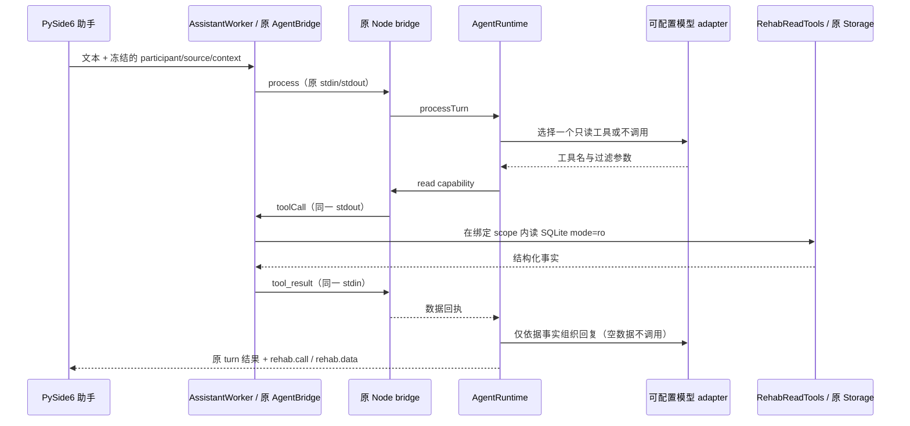

# 安康助手：三个康复只读工具

2026-10-01，`codex/rehab-agent-stage1`。本轮基线 `a3ed36b60eec3bee9cbc0f54931dc7c1de380aa0`。不合并 main；没有康复写操作。

## 实际调用链



没有新服务器或第二套 Python 通信。原 AgentBridge 的同步请求循环仅增加处理 host tool callback；原 Node host 将普通请求串行化，允许在 Runtime 等待期间消费 `tool_result`。

## 接口与事实来源

Python：`RehabReadTools(database, scope)(name, arguments)`，位于 `rehab_codex_single_camera_v2_1/app/rehab_read_tools.py`。scope 来自 `MainWindow._body_scope_key()`，不能由模型传入或覆盖。

| 工具 | 现有业务读取接口 | 返回内容与限量 |
| --- | --- | --- |
| `rehab.get_training_plan` | `Storage.list_training_plans`；`build_body_profile`；`training_plan_view`；`program_progress`；自动计划另用 `validate_automatic_use` | 最近 3 个已保存 ACTIVE 计划：ID/revision/name/status/origin、原项目/settings、进度、has_next、next_available、availability_reason |
| `rehab.get_recent_assessments` | `Storage.list_sessions` → 原 `build_body_profile` | 最多 6 条各动作/侧别的最新已结束尝试；时间、结果/不可用原因、原 motion_range、有效比例、measurement_mode、必要测量条件 |
| `rehab.get_training_history` | `Storage.list_sessions` 中原 session summary 与 `training_feedback`（与 runtime 的 history/training_review 同一存储来源） | 最多 5 条已结束训练：动作/侧别/时间/状态、原完成情况、本人反馈 pain/fatigue/reason/notes/origin/revision |

`arguments` 支持可选 `exercise_id` 或 `joint`（评估/历史过滤）；计划读取使用 `{}`。动作/部位由原 exercise registry 校验。未知工具及其他参数拒绝；没有开始/修改/生成/接受/保存工具。

自动计划的原验证函数内部会重算证据与规则以核对已保存计划，但不会保存、接受或向模型返回新建议。`has_next` 只表示计划尚有条目；`next_available` 另含有效期、评估和反馈门禁。两者不代表已开始训练。已归档计划不返回。不会替历史不可用评估回填更早的成功值，也不做跨记录比较或临床改善推断。

通用结果：

```json
{
  "tool": "rehab.get_recent_assessments",
  "scope": {"participant_id":"...", "source_kind":"SYNTHETIC", "usage_context":"TEST"},
  "read_only": true,
  "status": "empty",
  "records": [],
  "comparison_performed": false
}
```

示意中的 records 实际有数据时为字段白名单数组；无记录时为 `status: "empty", records: []`。空结果由 Runtime 固定回复“没有找到当前用户、数据来源和使用情境下的相关记录。”；数据库/模型失败则报错，不冒充空记录。没有向模型发送完整数据库、帧、关键点、附件、设备路径或完整个人档案。评估条件只提供必要子集，不声称已完成同条件历史比较。

## Runtime 与模型边界

`src/runtime/rehabTools.ts` 定义可选 `RehabToolPort`：`select → read → describe`。`session.ts` 在原串行回合中调用，检查 generation；完成后仍由原 Runtime 提交 chat/revision。康复历史事实不再追加为安康 HealthEvent，不创建第二套评估/反馈逻辑。

原 `understanding.ts / llmUnderstanding.ts / agent.ts` 未修改。原 safety/correction/共享/漏药及新健康事实处理分支优先；含这些处理的混合问题本轮先处理原业务，不覆盖待写入的健康事实。private/no_record 不调用新模型或康复读取 port。未配置 rehab port 或模型选择 null 时保留原 Agent 路径。没有引入 React/DOM/Home Twin 依赖。

`scripts/rehab-model.cjs` 使用 Chat Completions 兼容 HTTP 契约。第一请求让模型返回 JSON 工具选择（明确的三项 allowlist），第二请求用本次结构化事实组织文本。当前一次回合最多一次读取；只将当前问题送给选择模型，不外发既往完整聊天。省略主语的跨轮康复追问不作为本轮已验收能力。普通安康多轮上下文仍由 Runtime 管理。

## 身份、只读与 UI

sessionId 由 `rehab:` 加规范序列化的 participant_id/source_kind/usage_context 组成。ID 使用现有 participant 标识，不用显示姓名。worker 在发送时冻结 scope，Node 不能要求读取另一 scope；模型参数中不能传 participant。UI 对话按同一 scope 分开，切换及迟到回执不会出现在当前另一 scope。历史聊天属于本次应用会话，不写康复数据库。

数据库只以现有 `Storage(..., readonly=True)` 的 SQLite `mode=ro` 打开。找不到库时返回空，不创建数据库。工具不调用 runtime 写命令，不改计划、反馈、档案或通知。读取使用原 `list_sessions` 的内存结果再按 scope 过滤，未来大库可优化查询；本轮未改 schema。

## 本机配置

先按原方式安装依赖并构建 bridge：

```powershell
node ankang/route1-health-agent/scripts/build-agent-bridge.cjs
```

启动康复程序前，在宿主环境配置：

- `ANKANG_REHAB_LLM_URL`：完整 Chat Completions endpoint（含路径），HTTPS；本机 loopback 测试允许 HTTP。
- `ANKANG_REHAB_LLM_MODEL`：该 endpoint 提供的模型名。
- `ANKANG_REHAB_LLM_API_KEY`：需要认证时设置，不写入仓库或聊天。
- `ANKANG_NODE`：沿用现有可选 Node 路径。

模型服务需要支持 `messages`、JSON `response_format` 与 `choices[0].message.content`。缺 URL/MODEL 时不会偷偷选其他服务或规则路由：原安康聊天仍可用，UI 明确提示康复只读工具未启用。模型失败也不回填虚构记录。

本机未提供真实模型配置；验收使用 loopback 协议替身 + 真实 Runtime/bridge/SQLite。真实模型工具选择和措辞质量仍需配置后验收，不能把替身结果作为真实 LLM 已通过的证据。测试与命令见[本轮验收](../validation/ANKANG_REHAB_READ_TOOLS.md)。
