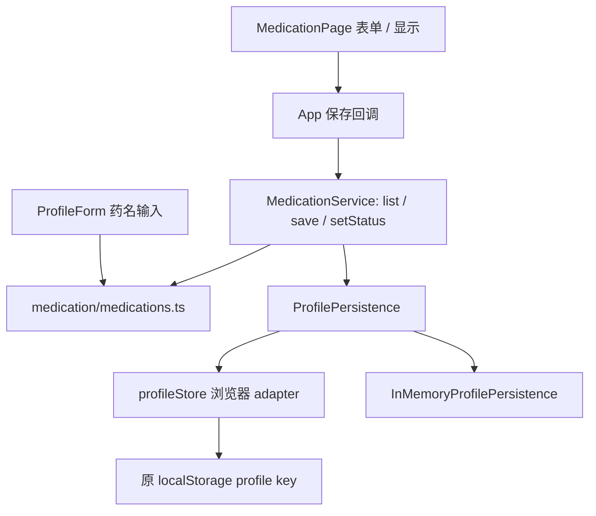

# 阶段 5A：最小 profile 边界与药物业务验收

日期：2026-10-01。分支：`codex/rehab-agent-stage1`。开始时本地及 origin 分支均为 `d405135c46c1c8da9c113df5f537fd8381ba3eac`；main 为 `2ebc388d4160d647456487007670d89f02f80914`。本阶段仅抽药物，不 merge main。

## 结构与调用

以下路径相对 `ankang/route1-health-agent/`。



- `src/medication/medications.ts`：列表兼容、草稿 ID、增改、停用/恢复、结构化记录与旧字符串同步、档案表单的药名列表更新规则。
- `src/medication/MedicationService.ts`：按 ownerId 读最新 profile，执行领域变更，通过注入 port 保存，返回实际回执；`list(ownerId)` 返回记录，读失败抛错，写失败返回 `{ok:false,error}`。
- `src/profile/ProfilePersistence.ts`：StoredProfile、DataMode、ProfilePersistence、ProfileSaveResult 和内存实现。
- `src/store/profileStore.ts`：浏览器适配、旧数据迁移；不被领域模块反向导入。

已核对传递 import：新业务模块仅相互依赖及 type-only `types.ts`（该文件无 import）。没有 React、TSX、localStorage、DOM、PeerJS、Runtime、Home Twin 依赖。UUID 使用标准 `crypto.randomUUID()`；内存 port 使用 `structuredClone`，Node 22 可直接运行。

## 身份与存储

`StoredProfile` 仍使用 `version:1`，兼容新增 `ownerId:string`；这是本地稳定 userId 的唯一字段，不另造第二个同义 ID。`ElderProfile`、Agent、Runtime 和 bridge 的契约不变。姓名只是显示字段，编辑姓名不更换 ownerId。

- personal/demo 创建档案时各生成 UUID；旧档案首次读取时补 ownerId 和结构化药物，写回原 `ankang-route1-profile-v1` key，刷新复用 ID。
- 迁移写失败会抛出可显示错误；App 显示失败与重试入口，保留原数据，不当作空档案进入建档。普通写失败返回失败；不会更新 React 已保存档案或发送保存成功提示。
- port 为 `loadProfile(ownerId)` / `saveProfile(ownerId, stored)`。写回执区分 `persistent`、`memory` 和失败。浏览器 adapter 校验当前 ownerId 与 dataMode，拒绝写到另一当前档案。
- 浏览器仍只有一个活动 profile 槽位；内存 adapter 按 ownerId 分开保存。未建设登录、云账号、多档案切换或跨标签并发事务，不声称有完整多用户存储。
- 本轮 ownerId 仅覆盖 profile/药物边界。既有附件、家庭消息等使用姓名的归属方式没有迁移；不能把本轮结果当成全应用身份迁移完成。

## 原业务语义与 React 改动

结构化 `MedicationRecord` 保留 id/name/dose/purpose/times/status。增改依 ID 替换并移到列表末尾，与旧页面一致；保存时仅 trim 药名，不推断剂量、用途或时间。不删除停用记录。`medications` 始终由在用记录的 name 派生，继续供原任务和旧视图读取。

旧字符串缺少结构化记录时生成确定的 `legacy:<编码药名>:<同名序号>` ID，dose/purpose/times 留空，不把解析推断当成医嘱。已有结构化记录（含停用）优先；已有 ID 不重造。迁移落盘后改药名仍保留 ID。旧 demo 的原有资料补齐逻辑保留。

MedicationPage 移出了兼容列表构造、ID 生成规则、药物增改与 active 字符串回填；保留筛选、选中、草稿、表单、错误和既有查物按钮。保存失败保留草稿，保存进行中禁用重复提交。ProfileForm 的按药名启停规则也调用领域模块，避免另留业务副本。

App 在成功持久化后才应用 profile。原药物同步接收处复用同一双字段转换并检查保存回执；成功后的原同步回调保留，未新增家庭/通知/同步功能，未改其授权与路由。`medicationCare.ts` 保留既有旧摘要解析；`tasks.ts` / `runtime/careTasks.ts` 保持原样，它们消费兼容药名列表，不承担结构化药物编辑。

## 实测

Node **22.14.0** / npm **10.9.2**，原 lockfile 与依赖未改。

| 检查 | 结果 |
| --- | --- |
| `tsc -b`；`tsc -p tsconfig.test.json` | 通过 |
| 新 `medication-service.test.ts` 4 项 | 全通过：完整字段增改/启停、旧字段兼容与稳定 ID、owner/模式隔离、浏览器迁移/保存失败 |
| 既有 medication-care、profile-store、care-tasks-session-only、task-regression | 全通过；与新测试一起由 Node 报告 12/12（部分旧文件内部自有多个断言） |
| `npm run build` | 通过 |
| 新 `medication-service-browser.test.mjs` | 通过：原页面增改/停用/恢复、字段保留、刷新 ID、失败保留草稿与落盘数据 |
| 既有 `demo-filled-browser.test.mjs` | 通过：含原药物详情/历史用药和 personal 隔离 |

复跑核心：先 `tsc -p tsconfig.test.json`，在已有 `.test-build/package.json` 的 `type:commonjs` 环境执行：

```sh
node --test .test-build/tests/medication-service.test.js .test-build/tests/medication-care.test.js .test-build/tests/profile-store.test.js .test-build/tests/care-tasks-session-only.test.js .test-build/tests/task-regression.test.js
npm run build
node tests/medication-service-browser.test.mjs
```

全新 checkout 可先使用现有 `npm test` 脚本生成测试环境。本轮未重跑全部 Runtime/upstream 测试或无关浏览器黑盒；未改 understanding、llmUnderstanding、agent、Runtime、bridge、康复 Python 项目。没有新增提醒、自动用药建议、通知、家庭服务、档案附件整合、Person Twin 整合、SQLite 或 PySide6。
