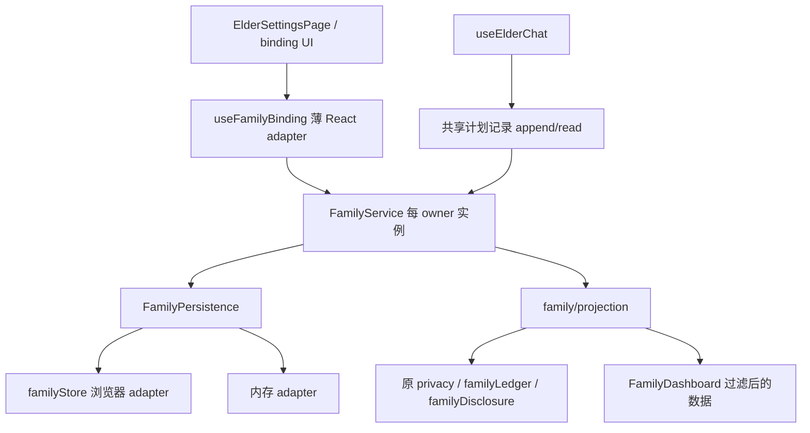

# 阶段 5B：家属关系、权限与共享边界验收

日期：2026-10-01。分支 `codex/rehab-agent-stage1`。开始时及提交前远端核实基线均为 `6731287de40b74c36e75cde8106921f2b111cb93`；main 为 `2ebc388d4160d647456487007670d89f02f80914`。不 merge main。

## 模块与状态

路径相对 `ankang/route1-health-agent/`。

| 文件 | 职责 |
| --- | --- |
| `src/family/FamilyService.ts` | 邀请/绑定/解绑、授权/撤销、远端授权、限定 ID 的一次性许可、共享计划记录、触发家属投影 |
| `src/family/FamilyPersistence.ts` | owner/mode/relationship/recipient/state 类型，同步本地 persistence port，内存 adapter |
| `src/family/projection.ts` | 权限判定与最小家属投影；复用原 privacy、familyDisclosure、familyLedger、events/normalize |
| `src/store/familyStore.ts` | 浏览器 adapter：校验数据，按 owner 保存、返回真实存储结果 |
| `src/engine/sharingAuditRules.ts` | 从原 sharingAudit 原样搬出的纯规则；原模块 re-export 保留兼容及既有测试 |

`FamilyState` 包含 `version:2, ownerId, dataMode, familySharing, consentUpdatedAt, familyLink, remoteConsent, sharedFindingIds, sharedFamilyEventIds`。OwnedFamilyLink 保留原 FamilyLink 字段并加 ownerId、recipient（稳定 id、daughter/son/family 类型、显示名）。recipient ID 属于关系，不是经过登录验证的外部账号；姓名不作归属键。

待用邀请码、绑定异步请求版本、提示去重集合、共享内容审计由服务实例持有，不在 module-global。readState/readSharingRecords 返回副本；React 通过订阅获取用于渲染的稳定快照。解绑/换邀请会使旧握手结果失效；close 清会话邀请码/审计并终止旧握手应用，不把已持久化关系当成被解绑。

## 关系与权限不是一个布尔值

- 生成邀请建立 pending，正确邀请消费后 active。错误、被替换、已用、关闭会话或刷新丢失的邀请不能再次绑定。保持原会话有效期规则，没有新增按分钟 TTL。
- 绑定不自动 grant。长期授权仍为 granted / denied / ask，时间使用原本地墙上时间规则。
- one_time 使用本人 finding IDs 与家人 event IDs 两组独立集合，各保留最多 50 项。仅已绑定关系接受许可；不改变长期授权，不扩大到其他事实。consumeOneTime 只消费显式 ID，读投影不消费，也不表示送达。
- revoke 清授权及两组一次性许可，保留已有计划记录；不宣称撤回对方已收到的内容。unbind 清关系/远端授权/一次性许可；保留本人长期偏好，但无 active 关系时投影全部关闭。新远端关系没有授权回执时按 denied，不继承上段关系授权。
- 远端 consent 只接受当前 active relationshipId；App 原 consent 消息补关系 ID，只有老人角色广播其授权。旧无关系 ID 的后续 consent 消息不采纳，避免其他 owner/关系覆盖本人的状态。未新增 PeerJS adapter 或传输通道。

## 存储与迁移

port 为同步本地 `loadFamilyState(ownerId)` / `saveFamilyState(ownerId,state)`，返回沿用 5A 的 persistent / memory 成功或失败回执。浏览器 key 为 `ankang-route1-family-state-v2:<编码 ownerId>`，校验 owner 与模式；内存 adapter 也按 owner 分隔。它不是账号系统或并发多写者数据库。

只有 active 关系及权限状态落盘，pending 邀请不落盘，敏感审计内容仍 session-only。旧 `ankang-route1-family-state-v1` 没有可靠 owner 信息，**保留但不自动导入**，升级后需重新绑定/授权；不能按姓名或“当前恰好打开的档案”猜归属。

读失败按关闭权限启动并显示错误。写失败返回真实失败并提示“仅本次会话生效”；撤销仍立即在内存生效，不能声称已经持久化，刷新后的持久状态取决于此前成功写入的内容。

## 隐私、分账、projection 与审计

familyPermission 检查 owner、active 关系、长期/一次性许可，并拒绝 private/no_record。投影复用原严格 `familyEligible === true`、alert/urgent、关联任务披露规则；家人事实仍经 visibleFamilyEvents 按 visibility/shareMode/选中 ID 过滤。本人 HealthEvent 和 FamilyHealthEvent 保持不同数组，家人事实不进入本人 materialized health data。

projection 返回 recipient、permission 状态、可见 findings/tasks/records/familyEvents（可选独立 selfEvents），不返回本人完整 snapshot、聊天或完整 profile。指标只在长期授权且非 private 时形成 DayRecord。原 Runtime 已在入口排除 no_record；直接调用服务时可提供 privacyIntents，额外拒绝这些输入。

宿主必须提交该 owner 的事实集合；现有 HealthEvent 没有统一 owner 字段，服务不能凭内容猜身份。本轮隔离的是 family state/权限/审计，并未宣称原健康数据库、附件库或其他广播都已完成多账号改造。

共享记录有 ownerId、relationshipId/recipientId（无绑定时为空）、scope、recipient 类型、shareMode、内容、时间，以及唯一阶段 **planned**。权限输出为 **permission**。这两者没有 sent/delivered/acknowledged 字段，服务不发送通知。旧通知台账和确认状态保持独立。

React 聊天把计划审计交给新服务，不再将计划记录回灌到旧 Agent 的“已告诉家属”历史回答；该回答拿不到送达证据时沿用原“没有可靠历史共享记录”的回答。计划仍可通过 readSharingRecords 查看。本轮没有接送达历史查询，也没有改 Agent Runtime 的独立会话审计或领域语言理解。

## React 已移出与仍保留

已移出：useFamilyBinding 的业务状态机/存储规则/授权/许可/邀请码；App 的 ask 提示去重与有效授权选择、可见家人事实/指标投影；Dashboard 的发现/任务权限筛选；useElderChat 内独占的审计数组。

React 保留：展示、表单、toast、视图导航、同步 transport 装配/订阅、请求的角色/通道检查、周报时间区间聚合、原通知台账/发送 UI、附件与 Home Twin 既有入口。ElderSettingsPage 本来通过 callbacks 操作，组件本身未改。FamilyDashboard 接收最小 profile 显示字段和服务投影；没有删除 React。

## 验证

Node 22.14.0 / npm 10.9.2；原 lockfile 未改。

| 验证 | 本轮结果 |
| --- | --- |
| `tsc -b`、`tsc -p tsconfig.test.json` | 通过 |
| 新 `family-service.test.ts` 六个核心场景，连同既有 family/privacy/sharing 测试 | Node 报告 **37/37** 通过；旧文件内部还包含自有断言，不另累加成新计数 |
| 新 `family-service-browser.test.mjs` | 通过：原设置授权、邀请绑定、暂停共享、刷新保持、解绑与 owner 存储 |
| 原 `family-binding-blackbox.test.mjs` | **10/10**：正确/错误邀请、跨 tab 绑定、隐私门禁及原回合顺序 |
| `npm run build` | 通过 |
| 编译后 FamilyService require 闭包审查 | 11 个本地纯 TS 模块；无 React/TSX/hooks/store/PeerJS/Home Twin/route2 |

六个新核心场景覆盖失效邀请、unbind、grant/revoke、one_time、private/no_record、本人/家人分账、两 owner 的关系/审计隔离、远端关系匹配、保存失败。既有规则测试包括 family-link-handshake、family-disclosure、family-ledger-regression、family-session-isolation、privacy-regression、mixed-intent-privacy、elder-privacy-adversarial、sharing-audit-session-only 等，均保留。未跑无关 UI/硬件或完整 upstream 套件。

复跑：先用原测试编译步骤生成 `.test-build`（CommonJS），对其中名称含 family/privacy/sharing 的 `*.test.js` 执行 `node --test`；构建后分别运行上述两个浏览器脚本。浏览器使用已安装 Playwright Chromium 和本地预览。

本轮未改 Runtime、bridge、药物业务、康复 Python；未抽通知派发、健康附件、Person Twin、PySide6、康复数据库或算法；未删 upstream 文件。后续须人工审核后另行授权。
