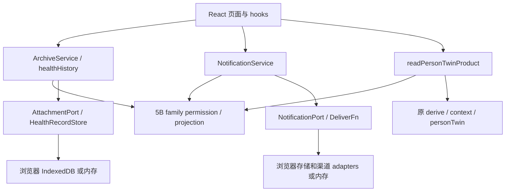

# 阶段 5C / 5D / 5E：核心服务验收

日期：2026-10-01。分支 `codex/rehab-agent-stage1`；开始及 fetch 后远端基线均为 `08a466df50391cda284cf8844e993d786428917a`。远端 main：`2ebc388d4160d647456487007670d89f02f80914`。本轮单独提交服务抽离和验收文档；不 merge main。最终 commit SHA 与 push/clean 结果见本轮交付回复（避免文档自引用 SHA）。

## 模块与调用关系

路径相对 `ankang/route1-health-agent/`。

| 模块                                         | 职责 / 接口                                                                                                                                         |
| -------------------------------------------- | --------------------------------------------------------------------------------------------------------------------------------------------------- |
| `src/profile/OwnerScope.ts`                  | 复用 5A profile 的 ownerId/dataMode；统一 scopeKey，不生成第二套身份，不使用姓名                                                                    |
| `src/archive/ArchiveService.ts`              | 附件 list/read/save/clear；Attachment/AttachmentMetadata/AttachmentPort；InMemoryAttachmentPort；绑定/授权/owner/mode/private 校验                  |
| `src/archive/healthHistory.ts`               | readHealthHistory；复用事件物化、family projection、原 weekly report；从 TSX 搬出 metricTrend/recentObservations/familyReportWindow/summarizeMetric |
| `src/store/BrowserAttachmentPort.ts`         | IndexedDB 适配，demo 文件到 bytes 的转换，File/清空本机附件 adapter                                                                                 |
| `src/store/PersistentHealthRecordStore.ts`   | 原 HealthRecordStore + AsyncKeyValueStore port 保留；新增可注入 key，App 按 owner/mode 水合健康历史                                                 |
| `src/notification/NotificationService.ts`    | permission → 去重/预留 pending → injected deliver → 渠道结果/台账；acknowledge、受限 retry、合并、家属通知投影；NotificationPort + 内存实现         |
| `src/store/BrowserNotificationPort.ts`       | owner/mode localStorage adapter，显式保存成功/失败；损坏台账读取失败阻止自动派发                                                                    |
| `src/adapters/FamilyNotificationDelivery.ts` | 组合原 BrowserNotificationChannel/WebhookPushChannel；构造 Notification 或 HTTP 接受只记 accepted                                                   |
| `src/personTwin/readPersonTwinProduct.ts`    | self/public/family-safe Twin、findings、tasks 摘要、最近 10 条事件摘要、asOf、最近事件时间；无缓存/数据库                                           |

通过 TypeScript import/export 图检查四个新业务入口的传递闭包：32 个模块，无 react/react-dom、TSX、hooks、components、store 或渠道 adapter 导入。Node 测试实际在无浏览器环境调用业务模块。旧 clock 模块有可选浏览器时钟函数；新通知核心只用其中纯日期格式化函数，不启动 DOM 时钟。未修改 Runtime、bridge、understanding、llmUnderstanding、agent、personTwin、context 或 detection 算法。

## 5C：档案、附件与历史

附件数据：ownerId、dataMode、稳定 id、name/category/date、fileName/mediaType、Uint8Array bytes、visibility。list 返回元数据（含 size），read 返回独立副本；编辑保留 id，日期沿用原保存时更新语义。React 负责表单、File input、预览 object URL、下载和局部刷新广播；业务模块不接触 DOM/File/URL/IndexedDB。

存储仍与 HealthEvent 分开。原 IndexedDB 库升级为 version 2，新 `owned-files` 以 scope + attachment id 为键。原 `files` 内按姓名/无 scope 的文件保留，但不会自动指派当前 owner。demo seeds 仅注入 demo 服务；personal 从空白起。原批量清理入口保留在 browser adapter；ArchiveService.clear 只清当前 owner/mode 的存储附件，demo 合成种子仍存在。没有新增单文件删除 UI。

HealthRecordStore 继续是平台无关健康快照 port，PersistentHealthRecordStore 继续适配 AsyncKeyValueStore。App 不再使用模块级共享 store，水合 key 为 `ankang-route1-health-snapshot-v2:<mode>:<ownerId>`，AppRoot 按该 scope 重建。旧 v1 无 owner 快照保留、不自动认领。当前 store 的既有异步 save 仍是内存优先、失败 console.warn；本轮没有改 Runtime 的 persistence 语义，也没有把这一旧接口称为 durable commit。

家属档案需要当前 active relationship + 长期 granted，复用 5B projection 的 canViewSharedDetail；单条 one-time 不开放整份档案，private 附件不显示。健康事件/指标/周报先经 family projection，再由原 events 物化。App 家属健康页仅收到姓名和投影后的 findings。

## 5D：通知与真实状态

通知记录包含 ownerId/dataMode、relationshipId、创建 sessionId、shareMode、findingId、phase、逐渠道 deliveries，以及独立 lifecycle/acknowledgedAt。没有模块级任务/台账状态。一个服务内派发串行，同一次输入及多次调用按 findingId 去重；重开服务恢复台账去重。关系更换后旧台账不能向新家属披露。

流程：原 finding/escalate 规则 + 当前 familyPermission → 创建 pending 并保存 → 保存成功才调用注入渠道 → 记录真实返回结果。未绑定/未授权不派发；显式 familyEligible=false 无法借 one-time 越权；no_record 在原输入管道中不产生事件。长期授权与指定 finding 的 one-time 权限分别记录，服务不擅自扩大或消费长期权限。

- permission 只是许可，未必有台账。
- pending 是计划/预留，无渠道送达证据。
- accepted 是渠道受理，sent 是渠道声称发送，都不等于 delivered。
- delivered 仅在 adapter 明确返回该回执时记录；本轮没有真实远端送达证据。
- failed/unavailable 保留失败详情；acknowledged 仅表示家属确认，绝不改写渠道 phase。

原失败 browser push 在新会话重试一次的策略移入服务；仅重试恢复的、未确认且当前仍获许可的失败 browser push，不重试 Webhook，不无限循环。加载失败时阻止派发；预留保存失败时不调用渠道；结果保存失败则保留内存真实结果并返回 lastSave 失败，React 显示失败提示。close 阻止后续编排/结果落入已关闭 UI，已发起的外部请求不能追回；React StrictMode 使用 resume/close 管理相同实例。

原 engine/notify 的公共兼容入口和 notifyPersistence 的旧导出保留，现 React 使用新 service/port；共享计划、排序、确认规则仍复用同一原引擎。原 sent→已送达文案改为已发送，送达未确认；相关单测断言随真实含义更新。

边界：localStorage 不是跨标签页原子锁。服务会重读已保存 IDs，但同时创建的多 tab 仍不能保证 exactly-once；在途崩溃留下 pending 不自动重发，避免伪造送达或盲目重复通知。未来宿主可提供带事务/锁的 port。本轮不建设分布式 outbox/账号系统。

## 5E：Person Twin 产品读取

readPersonTwinProduct 输入由宿主提供同一 owner 的 profile/events/tasks/family、today/asOf。本人 Twin 与 findings 直接复用原 derive；本人 publicPersonTwin 与原 context 输出一致。家属先经现有 family projection，再调用原 buildPersonTwin，不传完整本人 snapshot。撤销长期授权后 family Twin 为 null；one-time 至多披露获准的 findings/tasks，不开放整体 Twin/事件历史。

返回当前 Twin、公开/家属安全 Twin、findings、任务状态计数、最近事件摘要、asOf 和 dataUpdatedAt（最近可见事件时间，不冒充 profile 保存时间）。没有第二套 Twin 状态；每次从传入数据重新派生。App 的调试/状态面板与家庭健康摘要已消费此读取接口。未混入 Home Twin、3D 或高斯泼溅。

## React 残留与兼容范围

已移出：附件存储事务/scope/合并规则、趋势和周统计、通知去重/台账/权限/重试/确认/通知列表合并，以及 Twin 产品投影。原页面保留作为 UI 与行为对照。

仍在 React / browser adapters：表单、选择文件、object URL、导航、toast、图片识别 UI 流程、系统通知权限请求、Webhook 配置及测试按钮、原 SOS/电话入口、现有跨端同步与设备生命周期。App 仍装配 profile/events/tasks 并调用服务；未声称整个 App 完全没有编排。现有通知/事件同步载荷增加 owner/mode 校验；不猜测跨设备 owner 映射，不新增 PeerJS 协议/账号服务。不同 owner 的跨设备映射须后续明确，不能靠同名接收。

## 验证

工具链：Node 22.14.0 / npm 10.9.2，原 package-lock 不变。仅相关验证，未全量重跑上游或硬件/Route 2 黑盒。

- TypeScript typecheck、测试编译和 Vite build：通过。
- 新 `stage5cde-services.test.ts`：9/9；附件增改读清理/owner-mode/权限，健康快照分区，通知权限/one-time/private/去重/状态/owner-mode/失败/重试，Twin 原算法 parity/private/revoke/无额外状态。
- 同批既有相关测试：32/32 TAP 项；总计 **41/41**。文件：notify、notify-persistence、persistent-health-store、family-service、family-disclosure、agent-external-context、privacy-regression。部分原测试按脚本入口计一个 TAP 项，内部还有多条断言。
- 新 `stage5cde-browser.test.mjs`：附件上传/编辑/下载字节/刷新/同名不同 owner 隔离；真实 React 聊天 → 通知受理 → 家属确认 → 刷新去重。系统通知用 mock，外部请求阻断，不发送真实消息。
- 既有 `demo-filled-browser.test.mjs`、`family-service-browser.test.mjs`：均通过；覆盖 demo/personal 档案、预览、药物演示路径，以及授权/绑定/撤销/刷新/解绑。三组浏览器脚本全部通过。

复跑核心：`tsc -p tsconfig.test.json` 后 `node --test .test-build/tests/stage5cde-services.test.js`；浏览器需先 `npm run build`，再 `node tests/stage5cde-browser.test.mjs`（脚本自启 preview）。演示档案脚本依赖 TEST_BASE_URL 指向 preview。

未修改康复 Python、PySide6、康复数据库/算法；未修改 Runtime/bridge；未删除 React/Home Twin/Route 2/iOS/demo；未接真实短信/微信/电话。阶段 5 核心抽离基本完成；宿主产品集成与上述适配边界仍须后续审核。
