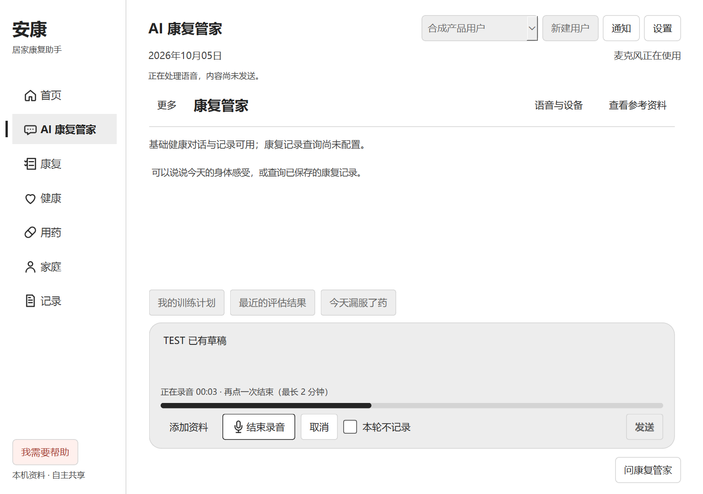
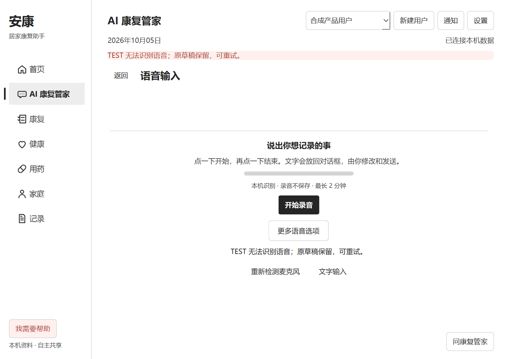
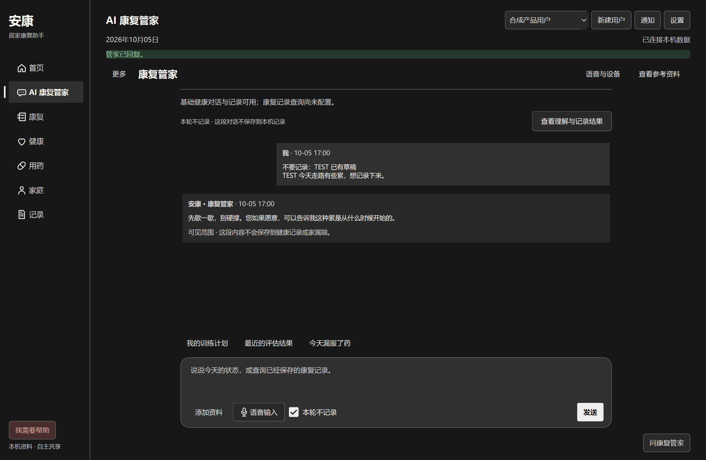

# 点击式语音听写与对话界面 · 2026-10-05

## 本轮范围

用户要求点击开始录音、再次点击结束，Agent 对话和语音界面参考 ChatGPT。正式应用保持 PySide6 / Qt Widgets。本轮实现听写草稿，不实现持续实时语音对话。

[OpenAI 官方说明](https://learn.chatgpt.com/docs/features/voice)区分语音对话与听写：前者是持续交谈，后者将语音转为发送前的提示文字。此处参考操作模式，不宣称使用 ChatGPT 相同识别模型或准确率。

## 已完成

- 管家默认进入对话；旧四模块入口移至“更多”，附件、记录、参考和语音能力保留。
- 居中阅读区域，用户消息偏右；底部统一输入区包含资料、录音、取消、隐私和发送。浅色 / 深色、1024 窄窗可用。
- 同一按钮开始 / 结束，不再弹第二次确认；显示真实采集时长与输入电平。最多 2 分钟，音频只在内存处理。
- 结束后转写为可编辑草稿，不自动发给 Agent，不自动写健康事件。录音期间编辑的原草稿保留，文字追加；发送继续使用原 private / chat / Runtime / 记录确认流程。
- 取消支持录音、识别及结果已排队的边界；切离管家取消，用户切换清空旧状态；失败保留草稿并允许重试。
- 语音页只有一个主要录音操作；原朗读及兼容结束按钮收在“更多语音选项”，增加重新检测麦克风。
- 新增 UI-only `ui.voice.transcribe`，不触发 Agent；原 `voice.input` 端口及业务链路保留。
- 修复实测发现的 Windows 中文编码错误：ASR 子进程明确输出 UTF-8 二进制，避免系统 cp936 与父进程 UTF-8 不匹配。
- 同步扩大采集与 ASR 输入上限，避免界面允许两分钟但识别器仍拒绝超过 30 秒。

没有新增依赖、React Bits 组件、云端语音上传或模型下载；未修改 Agent Runtime、grounding、医疗判断、数据库结构、药物 / 家属逻辑或撤回 / 审计能力。

## 本轮测试证据

1. `pytest tests -q -k 'product or voice_ui or native_voice'`：126 passed / 1 failed / 1578 deselected。失败为旧按钮集合断言未包含新按钮；测试加载后更新文件导致 traceback 的源文本显示为新版本，不能据此称首跑全绿。
2. 修正按钮合同并增加 Windows 编码回归后，`pytest tests/test_native_voice.py tests/test_product_visual.py -q`：12 passed。覆盖同按钮开始 / 结束、双击不重复提交、取消、编辑保留、隐私、原 VoicePort、主题 / focus / 已发布按钮与 UTF-8。
3. 可见 Windows Qt `tools/validate_dictation_ui.py`：1024×720 浅色与 1440×940 深色，各 8 状态，共 16 状态通过。QTest 实际点击开始、结束、取消、发送；语音宿主为隔离合成 TEST，使用真实 ProductService。不能作为真人识别验收。
4. Windows `validate_product_blackbox.py --only 'AI 四模块'`：2 PASS / 0 FAIL（前置建档与管家路径），保留聊天、快捷提问、草稿、模块返回和康复关联。
5. Windows 原生 `validate_product_visual.py --phase ux-audit --width 1024 --height 720`：九个主要页面、页签、四模块、键盘焦点、hover、loading、错误与记录弹窗检查通过；无水平溢出，对话发送区在视口内。输出 `qa-output/dictation-final-native/windows-light-1024x720-scaleauto`。同一脚本此前离屏运行在关闭弹窗后的焦点断言失败，原生复验通过；不隐去离屏限制。
6. 当前本机 Whisper-base 复测已有公开 Google FLEURS 音频（CC-BY-4.0，文件 `10026684690566417990.wav`）：编码修复前复现 UnicodeDecodeError；修复后 4.55 秒返回中文。输出包含“偏章”同音字错误，不能宣称识别准确。输入来源和旧许可记录保留于 `qa-output/voice-native`；本轮结果在 `qa-output/dictation-ui/public-file-asr.json`。
7. 修改 Python 文件 AST / NUL 扫描及 diff whitespace 检查通过。未重跑完整姿态 / 摄像头 Python 套件；不把历史测试计数当作本轮结果。

构建 / Node CI：`npm run ci` exit 0；TypeScript typecheck、bridge build、411 项 Runtime 测试、15 项 Product / 扩展测试及 security 检查全部通过。

## 已知边界与下一步

- 本地识别在结束后产生文字，不逐字流式展示；尚未接入语音回复。界面明确区分录音和转写阶段。
- 本机默认麦克风与模型检测可用，未擅自录制用户声音。真人普通话、噪声、方言、医疗术语和长句准确率仍需验收。
- 下一步优先收集经用户同意的实际失败样本，再决定是否调整识别器；不为模仿 ChatGPT 偷换服务或上传录音。
- 本轮无已知业务回归；该结论只覆盖上述检查范围。

## 审阅截图

以下截图均为隔离 SYNTHETIC / TEST 数据和合成语音宿主。

