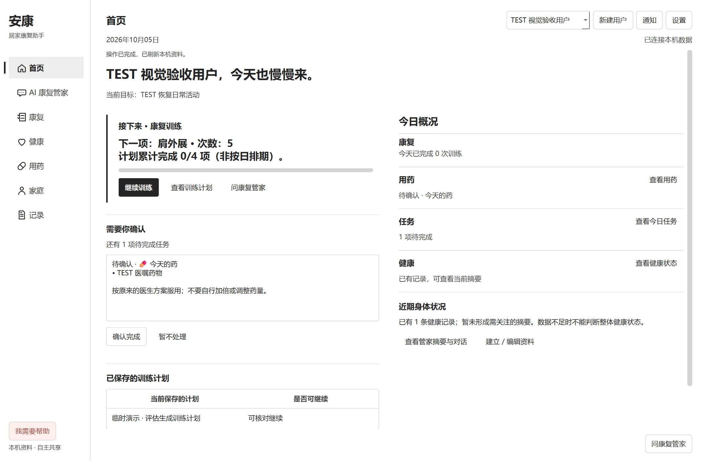
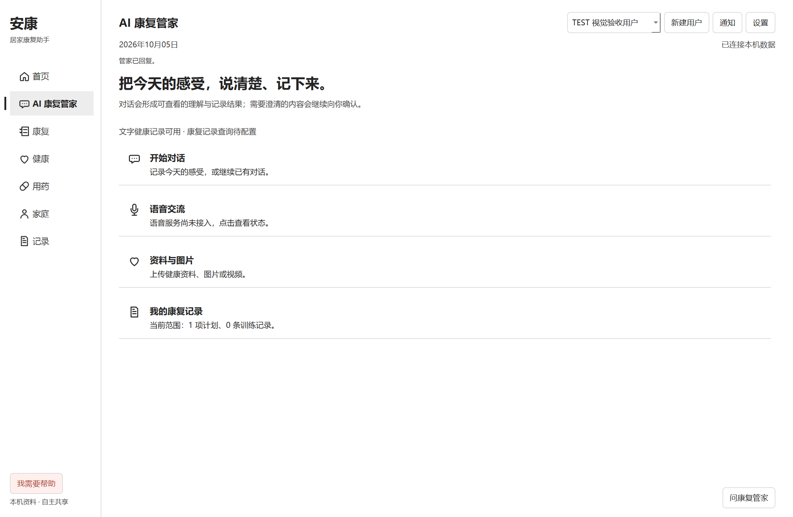
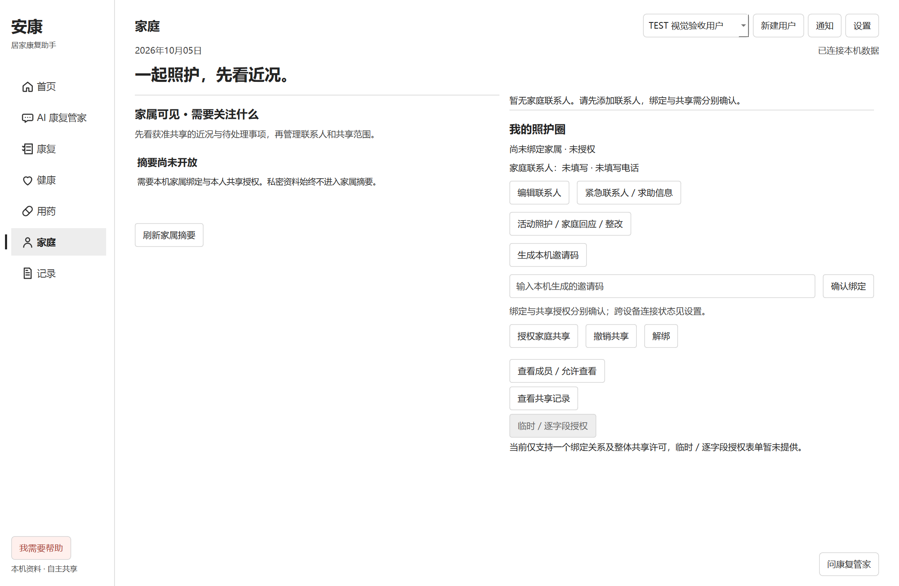
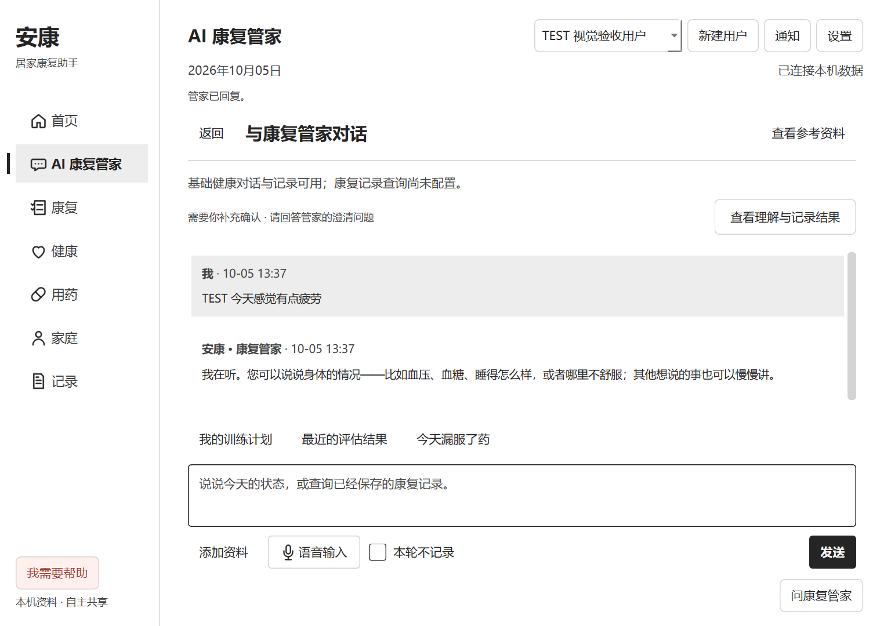

# 夜间产品 UI/UX 重构验收 · 2026-10-05

分支：`codex/product-ui-v1`。本轮起点 `4ac5f888`。上一轮界面被用户明确否定；本报告记录其后的实际结构重做，不以旧测试通过替代视觉验收。

## 范围与执行方式

正式产品入口为 PySide6 桌面应用。产品验收使用 Windows 原生 Qt 窗口、QTest 鼠标/键盘操作及真实窗口截图；浏览器用于 React Bits Preview、Props 和源码研究。没有将原生产品描述为浏览器验收，也没有新建 React 替代品。

完成 **4 轮主要迭代**，其间多次全局巡检；末尾另修复黑箱发现的语音提示覆盖问题。未修改 Agent Runtime、语义解释、grounding、人物/时间/否定/假设/不确定状态、医疗判断、保存与撤回、共享权限或存储结构。未删除核心业务功能，未迁移数据，新增依赖为 0。

## 迭代与页面

| 轮次 | 高收益问题 | 结果 |
| --- | --- | --- |
| 1 | 首页同权重统计卡、过重容器、按钮被拉满、导航缺少状态连续性 | 首页改为下一步训练 / 待确认 / 辅助概况；宽窗主辅列，窄窗单列；导航用单条选择标记 |
| 2 | 管家四格卡片与冗长标题、家庭摘要与管理操作混排 | 管家改为清晰的四项入口；标题与说明独立排版；家庭先近况再管理照护圈；回执与理解详情靠在一起 |
| 3 | 康复概况套卡片、少量记录占大表、操作纵向堆叠、设置被隐藏页撑高 | 康复改为连续阅读段；用药/记录/通知的操作归并；表格按实际条数收紧；设置按当前页真实高度布局 |
| 4 | Windows 中文小字渲染、选中/禁用勾选对比度、窄窗与主题状态 | 调整字体 hinting，保留微软雅黑；明确勾选状态；验证浅色/深色/高对比度及 1024/1440 窗口 |

涉及首页、AI 康复管家（对话/语音/资料/记录）、康复概况、健康、用药、家庭、记录与趋势入口、通知、设置。原训练工作区和银发照护页继续复用，未为视觉统一删除旧能力。

## 交互与 React Bits

| 研究对象 | 实际采用 / 拒绝 |
| --- | --- |
| [Line Sidebar](https://reactbits.dev/components/line-sidebar) | 研究实际选中/悬停 demo 和源码；采用选择标记沿导航移动的思路，以 Qt 实现 160 ms 可中断移动；拒绝相邻项跟随鼠标扭动 |
| [Status Mark](https://reactbits.dev/micro/status-mark) | 研究生命周期 Preview、Props、源码；采用真实结果才落定的状态原则；不引入循环动画或虚构完成进度 |
| [Fade Content](https://reactbits.dev/animations/fade-content) | 研究 Preview、Props 与 GSAP 源码；真实新回执以 180 ms 淡入落定；拒绝整页滚动揭幕、模糊、自动消失 |
| [Thought Line](https://reactbits.dev/micro/thought-line) | 研究思考轨迹、计时和折叠；保留按需打开理解/记录详情；拒绝伪造思考步骤、自动完成计时与呼吸动画 |
| [App UI](https://reactbits.dev/pro/app-ui) | 浏览公开目录；没有购买或使用付费源码；拒绝将产品套成统一 Dashboard 模板 |

没有直接安装 React Bits 组件。实际实现为原生 Qt 选择标记和真实回执反馈；保留原生键盘操作及可访问名称，设置提供“减少界面动画”。动画只跟随导航选择或新回执，不增加页面入场和装饰循环。

## 已修复问题与回归保护

- 原生入口按钮的标题/说明视觉权重混在一起：拆分内部排版，继续保持 QPushButton 的键盘与点击语义。
- 设置页只改变 sizeHint 仍无法缩小真实窗口布局：增加当前内容高度约束；回归测试检查实际高度，不只检查 sizeHint。
- 选中且禁用的勾选标记在不同主题不清楚：增加语义色对应的勾选图标和 disabled 状态。
- 快速导航可中断旧标记动画，减少动画模式直接定位；新增键盘与快速切换回归。
- 表格展示时间按本地可读格式渲染，日期型字段保留日期；存储与导出原值不变，原所选记录与滚动恢复继续受测。
- 完整黑箱一次发现银发页本地语音错误被覆盖；代码审查确认通用错误栏可被迟到的共享回执清空。独立保留语音状态，新增“语音失败后到达共享/刷新回执”的回归测试。首次失败与复验结果均保留，不把首次完整运行称为全绿。

## 最终视觉巡检

两轮完整产品巡检均遍历九个顶层页面、管家四模块及主要页签，并检查空态、加载、实际错误、hover、focus、键盘和返回路径。

- 第一轮：浅色 1440×940、深色 1024×720。
- 第二轮：浅色 1024×720、高对比度 1440×940；增加勾选和禁用勾选截图。
- Windows 实际 DPR 为 1.5；所有顶层页横向溢出为 0，管家输入/发送区可见。
- 原康复工作区在窄窗允许垂直滚动，返回入口可见；没有以裁切隐藏内容。
- 这两轮未发现新的高收益结构重做项。随后黑箱发现的语音反馈问题单独修复并复验。保留现有产品壳的信息结构，停止低收益装饰调整。

截图均为隔离 TEST 用户，无真实患者资料：

## 测试与构建

| 项目 | 本轮实际结果 |
| --- | --- |
| Python 产品/语音 UI | `pytest tests -q -k "product or voice_ui"`：121 passed，1581 deselected，147.58 秒 |
| 银发 UI（最终补丁） | `pytest tests/test_silver_ui.py -q`：9 passed，3.38 秒；含迟到共享回执覆盖语音错误的新回归 |
| 完整 Windows 原生黑箱 | 41 场景：40 PASS、1 FAIL；117 个发布按钮实际点击，19 个禁用按钮观察。唯一失败为语音错误回执，上文说明修复 |
| 最终代码窄窗复验 | 1024×720：首次建档、设置六页签、银发全流程、已保存康复/反馈/记录返回/用户隔离，4 PASS，0 FAIL |
| 源码检查 | 修改 Python AST/NUL 检查通过；`git diff --check` 无空白错误 |
| Node 构建与回归 | `npm run ci` 退出 0：TypeScript typecheck、bridge build、411 项核心测试、15 项产品测试、security check 均通过 |

保留[完整运行原始场景结果](PRODUCT_NIGHT_BLACKBOX_2026-10-05.csv)及[最终复验](PRODUCT_NIGHT_RECHECK_2026-10-05.csv)。没有把修复前的完整运行改写成 41 项一次全过。控制台未发现新增未处理异常；黑箱断言失败已留证并复验。原生字体/状态/布局问题在本轮修复，最终检查范围内未发现未修复的功能 regression。

正式入口 `Start-Rehab.ps1` 在最终构建后重新启动成功；窗口标题“安康 · 居家康复助手”，进程响应正常，启动 stderr 为空。代码保留在 UI 分支，未合并 main。

## 保留范围、问题与下一步

- 原康复工作区的人体图、复杂训练控件和部分旧弹窗保留兼容样式；这轮没有宣称它们全部完成视觉迁移。
- 外部模型、跨设备家属服务、通知送达、HealthKit 和语音硬件能力仍取决于原配置。本机缺 Qt TextToSpeech 模块时显示明确失败，不宣称播音成功。
- 测试覆盖软件交互和隔离合成训练结果；不代替真人动作准确度、临床结论或真实麦克风识别验收。
- 本轮未重跑全部 Python 项目测试；此前全量测试存在缺 YOLO 权重失败的历史边界，不能用本次相关测试通过宣称全仓全绿。
- 建议下一轮由患者/家属分别完成“找今日任务”“说明状态并核对记录”“查看获准近况”的短任务验收；优先依据实际误解和操作耗时继续改动。复杂原训练工作区的视觉迁移另按流程逐块进行。
