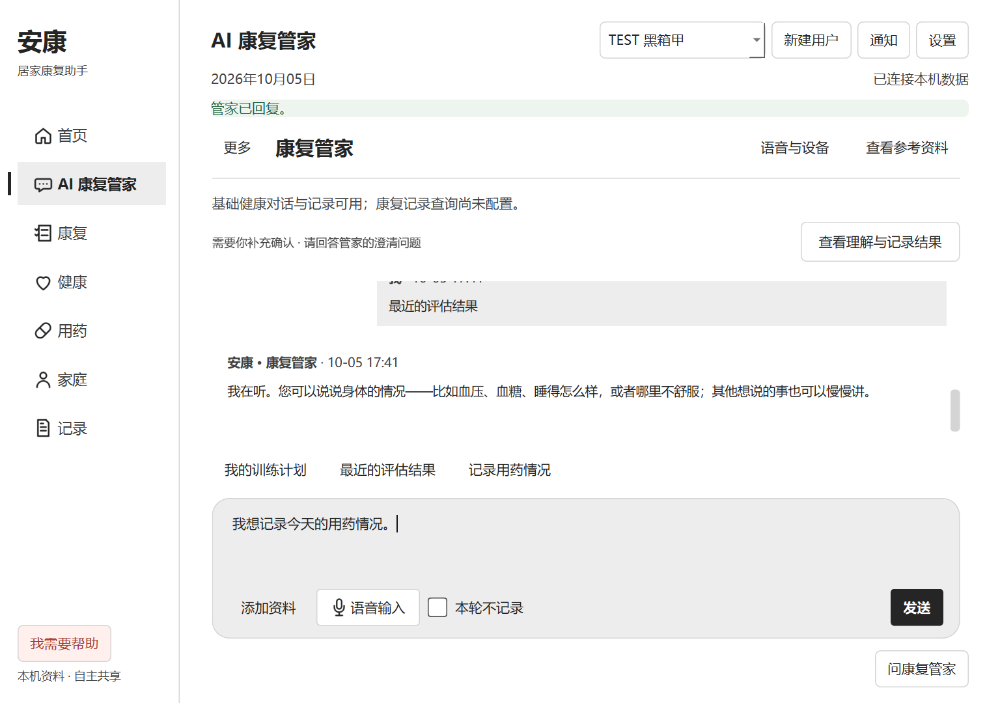

# UI 逐步优化 1：用药快捷入口 · 2026-10-05

## 用户目标与范围

按用户“一点一点来”的要求，先修审查中最明确的操作歧义。本轮只修改对话页用药快捷入口，没有展开全局视觉重排。

## 行为变化

- 之前：“今天漏服了药”点击即作为事实陈述发送到 Agent。
- 现在：“记录用药情况”只准备草稿。空输入填入“我想记录今天的用药情况。”，已有文字原样保留并聚焦输入框。
- 重复点击不重复插入、不发送，不改变“本轮不记录”；用户修改后点击发送或 Ctrl+Enter 才进入原 chat 流程。
- 原 `product-201` 稳定 ID 保留，UI 审计目标改为 `ui.chat.draft`。这个目标仅描述本地控件行为，不新增后台 API。
- 用药页明确的“记录漏服”、其他查询建议、Agent Runtime、医疗规则、存储结构与语音页不变。

## 验证

- Windows 原生 Qt：`pytest tests/test_product_assistant.py tests/test_product_ux.py tests/test_product_visual.py -q`，16 passed。覆盖用药草稿不发送、空输入 / 已有草稿、重复点击、鼠标与键盘、明确发送及隐私、原按钮合同与窄窗。
- 原业务回归：`test_medication_history_filter_and_restored_silver_entrance` 与 `test_metric_medication_chat_persistence_and_family_summary`，2 passed。原漏服记录、持久化及家庭摘要路径保留。
- 修改的 Python 文件语法 / NUL 检查通过。未修改 TypeScript 或依赖，未重跑完整 Node CI / 摄像头套件。
- Windows 可见黑箱首轮：1 PASS / 1 FAIL。原因是测试的清空操作用“粘贴空剪贴板”，Qt 保留选中的已有文字，未进入空草稿条件；截图确认不是应用覆盖或发送问题。测试助手改为实际全选后退格，原失败输出保留在 `qa-output/ui-step1-20261005`。
- Windows 可见黑箱复验：2 PASS / 0 FAIL（首次建档及 AI 模块路径），1024×720 窄窗。实际点击两个查询建议、用药草稿入口、返回及康复关联；空输入与已有草稿都未自动发送。截图已审阅，无新增裁切。输出 `qa-output/ui-step1-20261005-recheck`。

## 后续顺序

下一小步处理对话页重复标题、普通成功提示和重复入口，突出消息与输入区；记录待确认和错误状态继续保留。康复主按钮、家庭空状态随后单独处理。

## 实际界面

隔离 SYNTHETIC / TEST 用户，无真人资料；点击后仅填入草稿。

