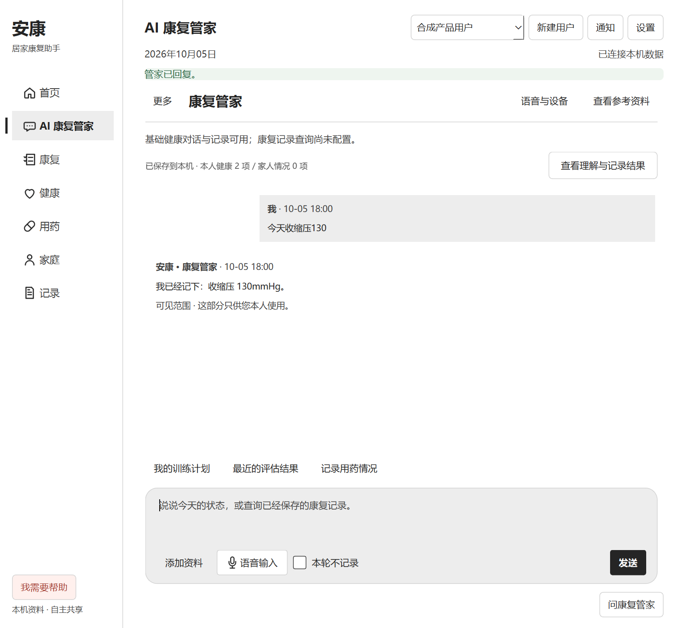
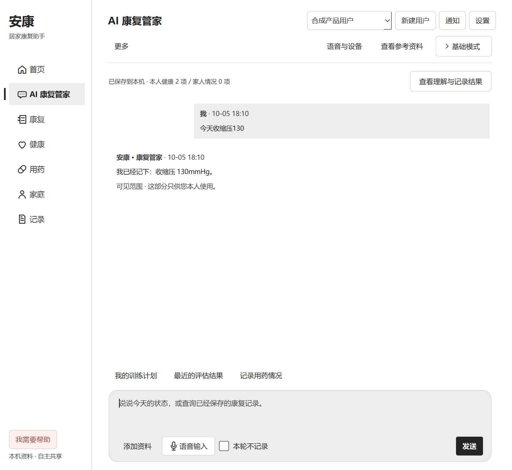
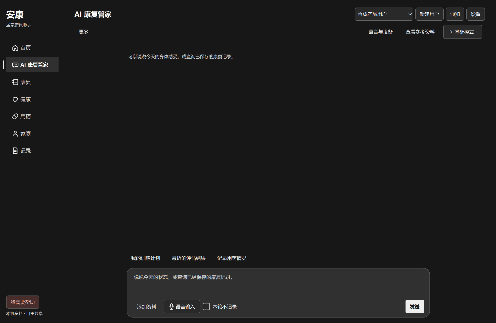
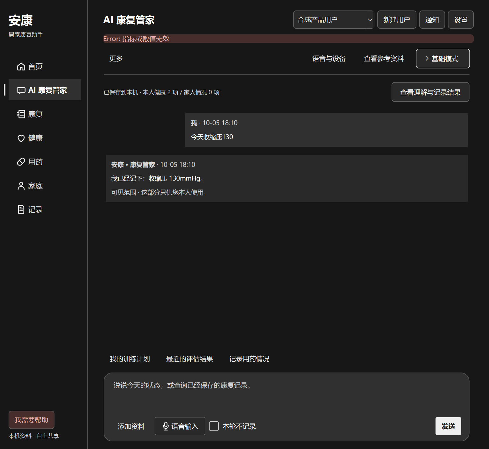

# UI 逐步优化 2：对话页层级 · 2026-10-05

## 冻结与呈现计划

| 区域 | 冻结的行为 | 允许的呈现调整 |
| --- | --- | --- |
| 发送 / 听写 / 隐私 | action IDs、回调、草稿、Ctrl+Enter、私密选择、取消 | 不改输入组件与语音页 |
| 记录回执 | 理解、保存、待澄清、错误与详情弹窗 | 保持可见，不折叠待确认信息 |
| 更多 / 语音 / 资料 | 原导航和返回历史 | 去掉重复局部标题，保留入口 |
| 全局管家 | Ctrl+J、其他页面侧栏、所有现有操作 | 仅在当前对话页收起重复按钮 |
| 运行状态 | 原连接/能力文字、错误、加载反馈 | 对话页将正常状态合并到可展开详情 |
| 业务 | Runtime / API / 数据 / 医疗 / 归属语义 | 不变 |

目标：当前对话只有一处主标题；消息和输入区优先，说明按需阅读。沿用黑白灰语义 palette、微软雅黑、现有字号 / 圆角 / 图标和 880 阅读宽度。工具行使用现有间距与原生 Qt 控件，不添加装饰动画。只收起与已显示回复重复的“管家已回复”成功行；其他操作的通用成功回执仍保留，避免上传或保存完成后失去反馈；不按 severity 批量隐藏成功，更不隐藏警告、错误、待确认或具体保存回执。

## 修改前证据与组件决策

- 本轮实际 Windows Qt 四组合：1440×940 / 1024×940 × light / dark，20 张状态截图位于 `qa-output/assistant-focus/before`。不是复用旧图。
- 问题：正常连接、日期、成功状态、局部标题、能力说明持续占消息上方；当前已在管家页却再次显示“问康复管家”。
- 本地 UX 搜索 `progressive disclosure visual hierarchy secondary actions` 返回偏 Web 的一般建议；仅采用层级与原生 hover/focus 原则，不套网站模板。
- React Bits registry 搜索 disclosure 无匹配；navigation 查询到 BranchedMenu，实际读取 TS/CSS 源码和 props（items、onToggle、foldDuration 等）。它有树形展开和分支动画，依赖 Hugeicons React 包，MIT + Commons Clause；本页只有一段状态详情，不需要树形导航。拒绝引入或移植。
- 采用项目既有 QToolButton toggled + QWidget 显隐模式（语音“更多选项”已有先例）；原生 Space、Tab、focus 和 checked 状态。无新依赖，无源码复制，无新增动效。

## 验证与结果

- Windows Qt 6.11.2 / DPR 1.5；修改前 20 个状态、修改后 24 个状态采集并通过脚本断言。四组合：1440×940 / 1024×940 × light / dark。覆盖空态、保存后、加载 / 发送禁用、focus / hover、状态详情展开、原记录弹窗 / Escape、真实服务校验失败。
- 已实际打开审阅浅色记录态、深色空态、深色错误态与展开详情：重复标题和普通成功条退出主阅读区；记录回执仍独立可见；错误仍是顶部明确文字与功能色；输入区无裁切、无水平溢出。
- 同尺寸、同状态比较：1024 与 1440 浅色记录态的消息区域高度均从 394 增至 529 逻辑像素，增加 135。没有缩小字体；数据来自 observations.json，不等于可用性用户实验。
- 语音 / 资料 / 更多入口保持；在语音及其他页面恢复原日期 / 状态 / 全局管家按钮；Ctrl+J 保留。未触碰 Agent、录音或确认保存流程。
- Windows 原生 Qt：`pytest tests/test_product_assistant.py tests/test_product_ux.py tests/test_product_visual.py tests/test_product_module_paths.py tests/test_native_voice.py -q`：29 passed。覆盖发送 / 草稿 / 记录回执 / 语音取消 / 隐私 / 主题对比 / 窄窗 / 原 action IDs / 上传返回 / 原用药路径。
- 末次将隐藏范围收紧为仅“管家已回复”，其他通用完成回执继续可见；专项复验 1 passed；最终 `validate_assistant_focus.py --stage final` 四组合 24 个状态通过，截图复审保持相同布局。原始输出保留在 `qa-output/assistant-focus/final`。
- Qt 原生采集脚本 exit 0，无未解释的新 stderr 错误；Python 修改文件 AST / NUL 与 diff 检查通过。没有修改 TypeScript / 依赖，未重跑 Node 全套或摄像头测试。

## 剩余范围

本轮只整理对话页顶部与重复入口。快捷建议仍常驻；记录回执仍是原单独摘要，尚未改为逐消息记录卡；其他页面的信息层级留待后续小步处理。没有宣称全局 UI 已优化完成。

## 实际截图

隔离 TEST 用户与数据；本轮没有启用摄像头、真实麦克风或外部 LLM。

修改前：

修改后（同尺寸）：

深色空态：

错误仍可见：

