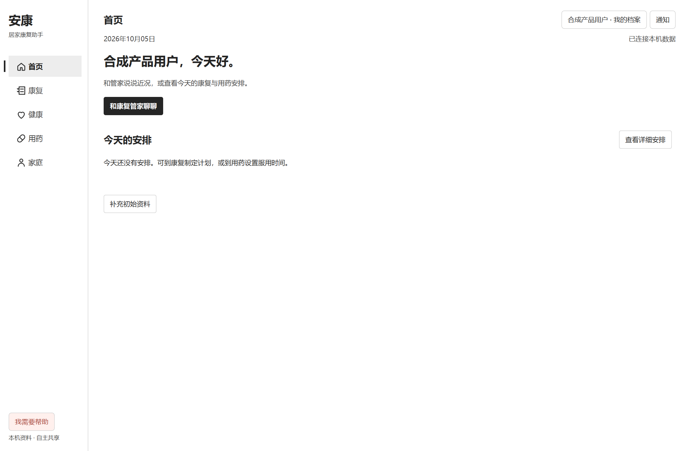
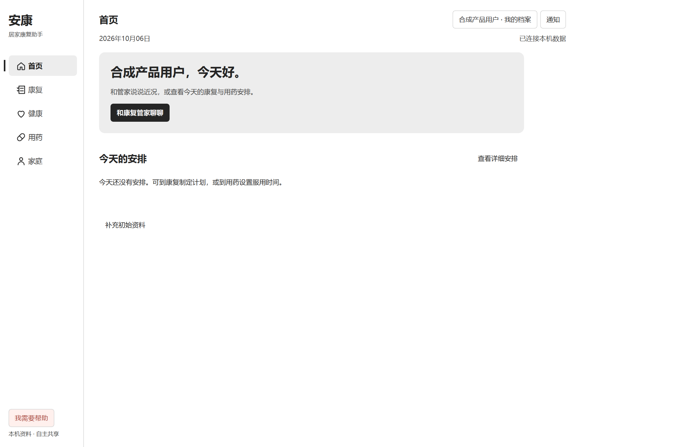
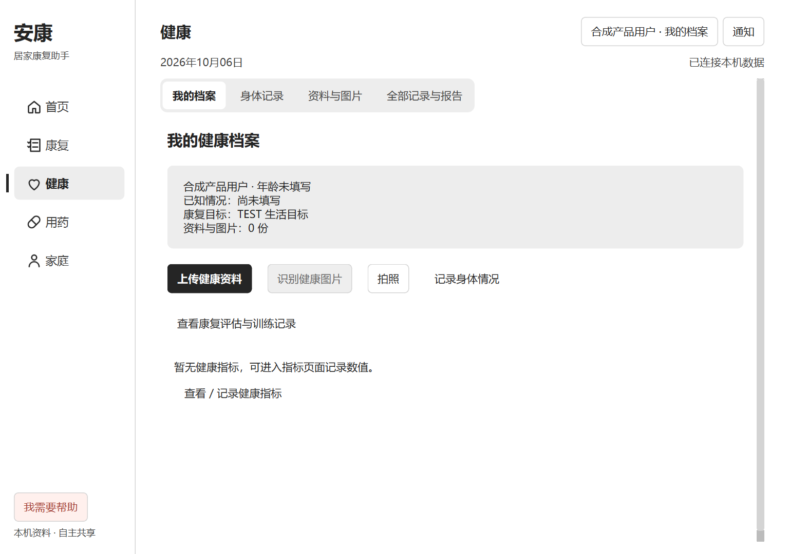
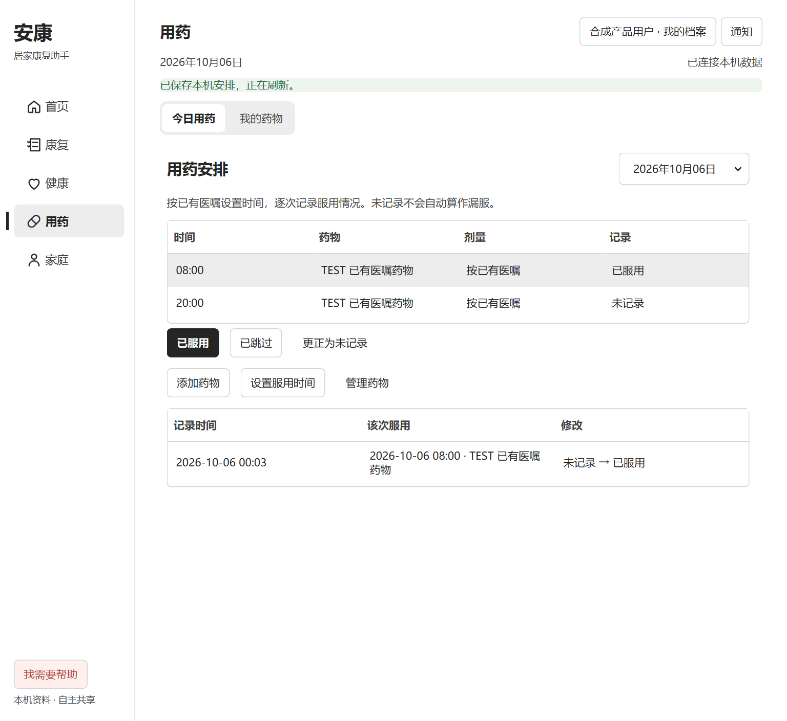
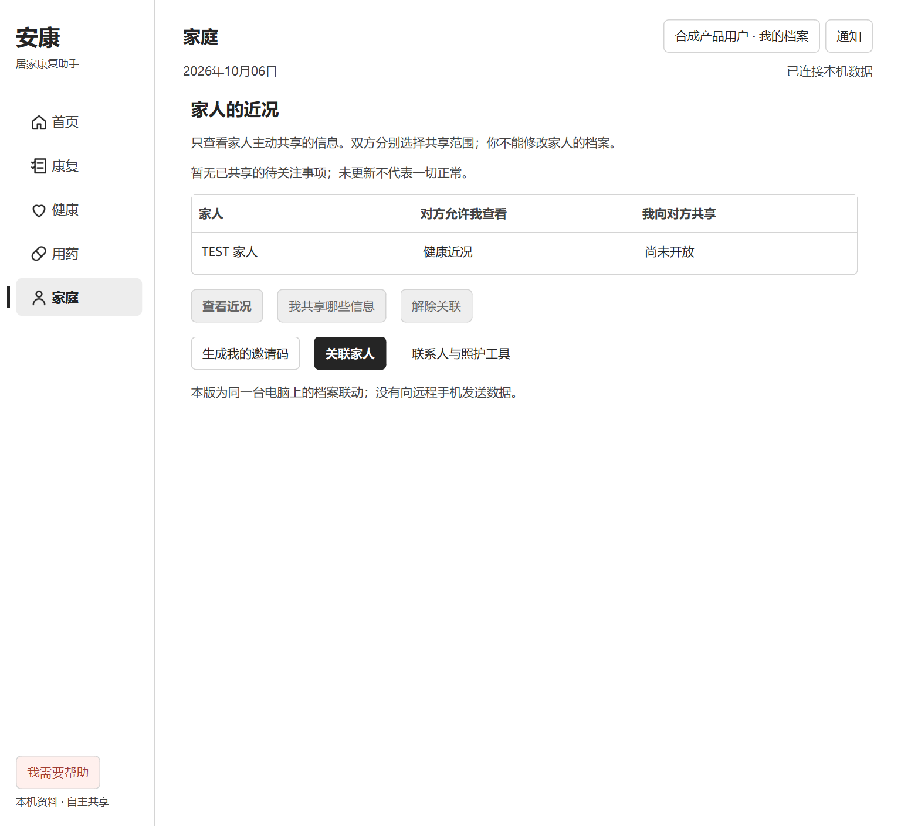
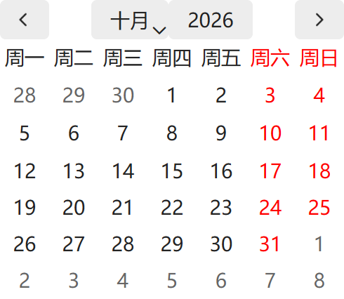
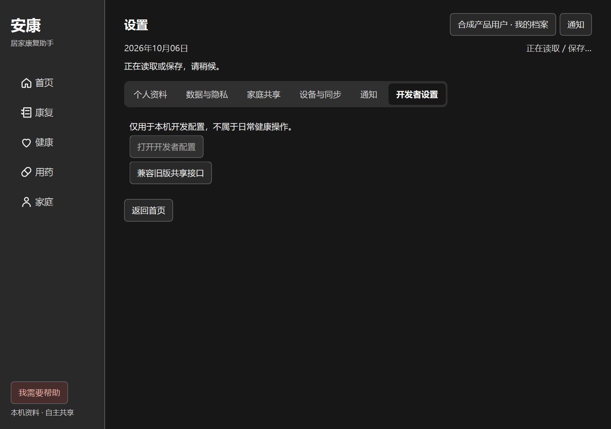
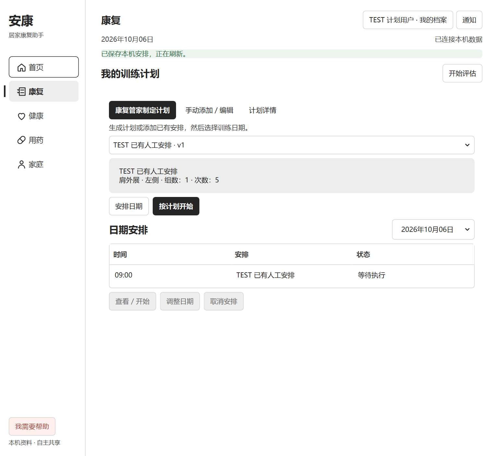

# UI POLISH MODE 验收记录（2026-10-05 → 2026-10-06）

本轮从 `db99b5e` 的患者五页版本继续，只调整呈现和交互反馈。正式产品仍是原生 PySide6/Qt Widgets。所有截图来自隔离 TEST 档案，不是网页产品、真实患者资料或视觉效果稿。

## 1. 修改页面与价值

| 页面 | 本轮结果 | 对实际使用的价值 |
| --- | --- | --- |
| 首页 | 原问候、介绍、对话入口组成一个克制的对话区域；今日安排维持原列表；阅读区域限制宽度并置顶 | 打开后首先找到康复管家，安排与主入口有主次，不再横向散落 |
| 康复 | 原当前计划摘要、日期、开始/编辑按钮统一层级；日期输入和日历浅深色一致 | 先阅读已有安排，再选择执行或修改；计划库、评估和真实训练工作区保留 |
| 健康 | 原个人档案摘要移到工具之前；身体记录、资料与图片、全部记录使用连续选择标记；活动页签按自身内容高度布局 | 先确认当前档案，再上传或记录；短空态不被隐藏长页面撑高 |
| 用药 | 今日用药/我的药物采用同一原生页签反馈，日期、表头、辅助按钮与空态统一 | 逐次记录仍是主路径，更正审计和旧每日记录不被视觉重构删除 |
| 家庭 | 摘要宽度与顶部对齐统一；隐藏长表单不再撑高短概览；主操作与管理操作分级 | 概览不用无意义滚动，进入长详情仍可正常滚动和返回 |
| 管家、设置及统一记录 | 管家既有文字/听写输入保留；设置/记录活动页签高度与选择反馈统一 | 保留已接受的对话体验，减少其他工具的视觉跳变和空白 |

没有新数字、虚构趋势、图表、渐变、玻璃特效或装饰背景。相机训练工作区仍由原容器管理，未强制套阅读页面的高度规则。

## 2. 冻结与保留能力

未修改 Runtime、Agent 推理、grounding validator、API、数据库模型、医疗规则、人物/时间/否定/假设/不确定语义。五个路由、原控件 ID、信号、快捷键、禁用条件、隐私选项、确认/保存/撤回、档案上传/OCR、拍照、评估/训练、计划版本和日期、逐次服药/更正审计、家庭授权/撤销和旧工具均保留。

健康/用药/记录的页签替换是 Qt 子类的绘制与活动内容布局；原标签索引、隐藏设备页、选中事件和原生键盘行为保留。没有删除核心业务功能，也没有迁移或清空患者数据。

## 3. 实际使用的 Skills 与组件来源

先读仓库 AGENTS、HANDOFF、软件规范和 UI 工作流，执行功能冻结表。设计记录见 [本轮计划](../plans/UI_POLISH_2026-10-05.md)。

- [UI polish](../../.agents/skills/ui-polish/SKILL.md)：功能冻结、实际截图、组件采购、回归和停止条件。
- [PySide6 Fluent UI](../../.agents/skills/pyside6-fluent-ui/SKILL.md)：Qt 原生控件、浅深主题、状态和键盘可用性。
- [frontend-design](../../.agents/skills/frontend-design/SKILL.md)：页面各自层级，拒绝等权卡片堆叠和落地页模板。
- [UI/UX Pro Max](../../.agents/skills/ui-ux-pro-max/SKILL.md)：实际检索 `readable desktop data table hierarchy density`，筛选适合桌面阅读的建议。
- 浏览器工具用于真实 React Bits 预览和明确标注的原生截图 QA 页面；正式 Qt 图像通过原生抓取后逐张查看。

执行注册表检索 `discover-components.mjs all`，阅读源码、Props、依赖，实际在浏览器操作 RubberSegment 标签和 GlideSelect 选择框。不是只凭组件名称选择。

| 候选 | 决定及原因 |
| --- | --- |
| [React Bits RubberSegment](https://reactbits.dev/c/micro/rubber-segment) | 采用其前后缘不同步移动、短暂拉伸、回落和空间连续性，用项目自写 Qt 绘制实现。300ms，快速切换从实际位置接续；开启减少动画时立即到位。保留 Qt 的焦点、键盘、辅助功能和隐藏/禁用标签，不新增拖拽导航。 |
| [GlideSelect](https://reactbits.dev/c/micro/glide-select) | 对照原 QComboBox 的键盘、模型与原生弹层后，保留成熟控件并完善日期/下拉可见提示。没有为滑动装饰重写选择逻辑。 |
| [PromptBar](https://reactbits.dev/c/micro/prompt-bar) | 对照现有已接受的管家输入；保持原听写、草稿、确认和发送，不添加没有业务取消契约的 Stop。 |
| [WarmTooltip](https://reactbits.dev/c/micro/warm-tooltip)、[BranchedMenu](https://reactbits.dev/c/micro/branched-menu) | 研究交互后拒绝：速度倾斜提示、树形菜单不改善当前五个稳定目的地。保留 Qt tooltip 和原导航轨迹。 |
| Switch / toast | 比较原 Qt 复选框及持久通知：保留文字、键盘和真实回执，不将医疗错误自动消失或滑动删除。 |

Qt 原生对照：[QTabBar](https://doc.qt.io/qtforpython-6/PySide6/QtWidgets/QTabBar.html)、[QComboBox](https://doc.qt.io/qtforpython-6/PySide6/QtWidgets/QComboBox.html)。无新增 React/WebView 或第三方依赖。React Bits 实际许可证为 **MIT + Commons Clause**，不是普通 MIT；[许可原文](../../rehab_codex_single_camera_v2_1/assets/ui/reactbits/LICENSE.md)和[使用说明](../../rehab_codex_single_camera_v2_1/assets/ui/reactbits/NOTICE.md)随项目保存，不以独立组件商品分发。

## 4. 替换的旧 UI

替换等宽散落的首页片段、竞争性的次要描边按钮、产品页下划线式标签绘制和浅深色混杂的日历外观。复用原控件与处理函数；旧业务工作区和旧工具继续可达。未删除业务、页面或状态。

## 5. 实际发现和修复的问题

1. 大窗文字与动作分散：限制阅读宽度、左对齐；不把所有页面改成 Dashboard。
2. 档案摘要被工具打断：把原摘要放到操作之前，以一份档案文档呈现。
3. 日期下拉和日历翻月箭头不清楚：明确图标，按当前主题处理 Qt 日历 Palette 与原生按钮图标。
4. 隐藏的长页签制造空白：仅按当前内容计算读取区高度。
5. 家庭隐藏旧表单制造多余滚动：修正活动页 heightForWidth，并仅在家庭启用最大高度限制。
6. 初次把高度限制全局启用会使首页问候区居中：缩小为家庭专用，新增首页置顶回归。
7. 标签动画在真实 ContentTabs 中被无变化的布局刷新打断：只有标签实际几何变化才重新对齐，新增真实健康页动画回归；70ms 和稳定后的截图已确认移动过程不同。

8. 最终 100% 设置截图发现说明裁切：活动高度的内容间距由 12 对齐实际 14px，并让设置的原说明使用已有 WrappingLabel、伸展到可用宽度，按实际换行高度保留完整文字。

## 6. 测试与原始失败

- 中途较广的产品/计划相关 Python 回归 **309 passed**；随后首页高度范围和实际页签动画又有修改，不能把这个计数冒充最终完整套件。
- 最终专项：36 passed / 1 setup error；该建档用例独立复跑 1 passed（37 个专项用例均有成功结果，整组末跑不是全绿）。涵盖视觉、UX、五页、原操作闭环、模块入口和页签。与前述重叠，不相加。最终命令：

  `python -m pytest -q tests/test_product_visual.py tests/test_product_ux.py tests/test_product_completion.py tests/test_product_module_paths.py tests/test_five_page_experience.py tests/test_product_segments.py`

- 原生五页巡检脚本完成 **56 个截图状态**（1440/1024 × 940，浅/深色），包含空态、加载、错误、hover/focus、键盘、首次建档、有用药记录、授权家人及只读详情。
- 扩展巡检 `validate_ui_polish.py` 在最小 1024×720，实测 DPR 1.0 / 1.5 / 约2.0，各 **39 个主窗口状态**，另有日历和移动/稳定标签截图。每组 Qt 警告 **0**、横向溢出 **0**；包含健康/用药/设置全部可见内部标签、键盘 Right、日历 Escape 和合成高对比。
- `validate_plan_experience.py` 的真实 Runtime、独立 TEST 数据验证四种宽度/主题下创建计划、保存、安排日期、返回与自动计划无评估状态；诊断复跑四种组合均通过。源代码最新验收脚本复跑：4/4 PASS。

保留失败事实：一次专项 **33 passed / 1 failed / 1 error**，其中家庭幽灵滚动修复；另一错误来自构建与测试并行，桥接发布中启动无输出文件。之后构建和测试分开执行。最终真实 Runtime 计划复验还发生一次 12 秒保存等待超时；55 秒有界等待的诊断复跑四种组合通过，验收脚本改用已有 Runtime 等待函数，不更改业务 busy、保存实现或数据。动画独立控件测试虽通过，最终真实页面截图仍抓到被布局停止，故补充集成回归后修复，而非只信单元测试。

最后整组 37 项运行耗时 450.27 秒，36 passed / 1 setup error：首次建档用例的 fixture 在等待初始 snapshot/pending 清空时超过 12 秒，并非建档操作断言失败。保持同一代码，独立复跑该用例 1 passed（10.41 秒，其中 setup 6.59 秒）；未通过修改业务或放宽断言消除失败。检查没有发现已结束 QA 遗留的 agent-bridge 进程，超时的具体根因未确认，不能把整组末跑称为全绿。

最后说明文字专项初次抓到档案摘要少 2px、复验抓到设备说明仍少 8px；两次各 1 failed，随后补齐实际换行最小高度，专项 1 passed。未以放宽断言掩盖裁切。

本轮没有重新运行全部科研/实体设备测试，也没有运行真实 OCR、真人 ASR、远程模型和真人训练。Node 全部语义测试计数见上一版本记录，本轮不将旧计数称为新验证。

## 7. Build

本轮 `npm run build`（typecheck + bridge）成功，`npm run security:check` 成功。最终修改是 Qt 呈现/测试和文档；无新依赖、无 backend 修改。

## 8. 视觉审查与停止判断

Windows 原生 Qt **6.11.2**；Microsoft YaHei UI 系统字体。基线与新版本在相同尺寸/主题比较；追加最小窗和不同实际 DPR。浏览器 QA 只是展示原生 PNG，并明确标注 TEST；浏览器 warn/error 日志为空，不能据此声称 Qt 应用是网页或已验收全部硬件。

完成初轮基线、实现后巡检、发现日历/空白/首页问题后的复验、最后真实动画纠正后的巡检。当前覆盖页面未观察到未解决的 P0/P1 呈现 regression；连续复查的剩余改动主要是低收益审美调整，因此停止继续添加装饰。自动计划规则、真实设备可用性和未接入的远程服务不属于视觉打磨解决范围。

## 9. 前后截图（隔离 TEST）

首页之前：

首页之后：

健康档案：

用药 / 家庭 / 日历：

设置说明修复后：

标签移动中与到位后：

完整本机证据在应用 `qa-output/five-pages/`、`qa-output/polish-detail-{100,default,200}/`，被 Git 忽略；不上传数据库和运行日志。

真实 Runtime 的已保存计划与日期安排：

## 10. 仍存在的限制与下一轮

当前仍是本机档案，正式远程登录/跨设备家庭共享未接入；OCR 依赖已有识别服务配置；无有效评估不生成疾病动作处方；原计划累计进度不会每日自动重置。均沿用前版，不借 UI polish 更改业务契约。现有本机 Python 环境在 Temp，清理后需重建及重新更新入口。

下一轮优先让真实使用者按“首页进入管家 → 康复查看安排 → 健康上传资料 → 用药记录 → 家庭只读查看”走一遍，再处理真实听写/OCR/相机功能验收和稳定环境位置。无需继续增加高级动画。

桌面入口保持 **安康康复（最新版本）.lnk**，指向当前仓库 Start-Rehab.ps1；版本描述在提交后刷新。旧的未保存窗口没有关闭。代码在 `codex/product-ui-v1` 提交、推送并核对远端，未合并 main。
