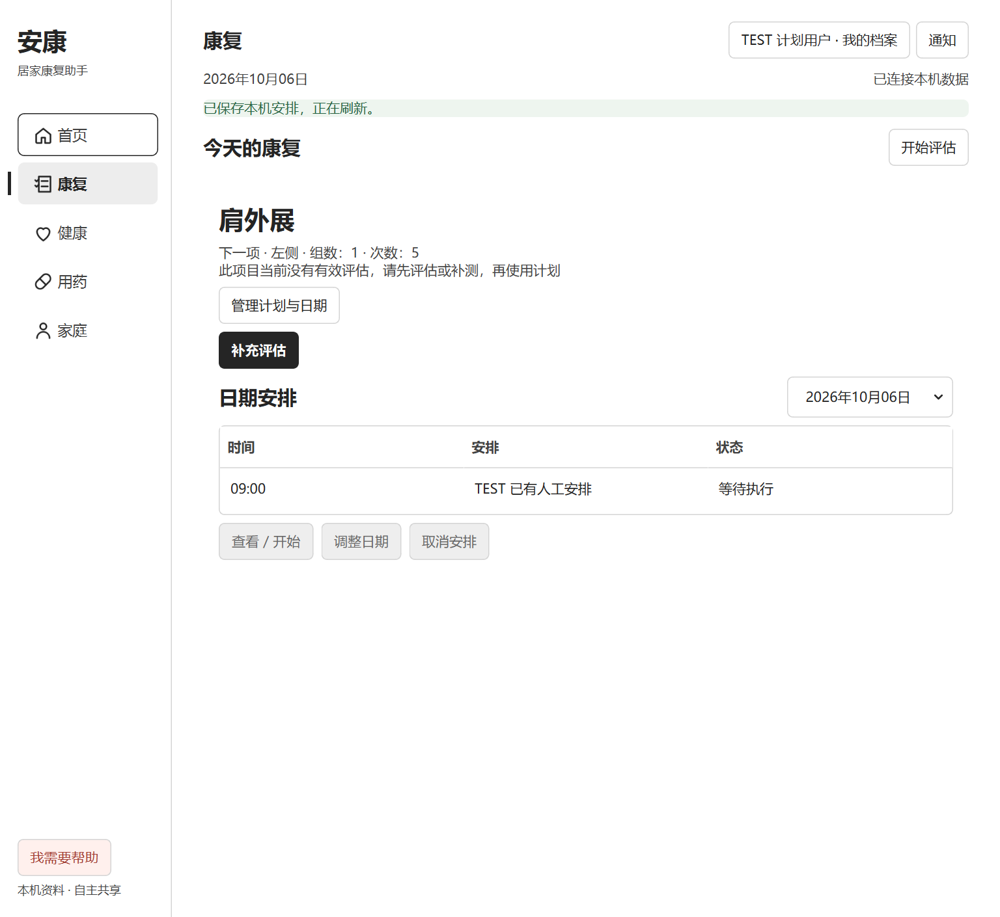
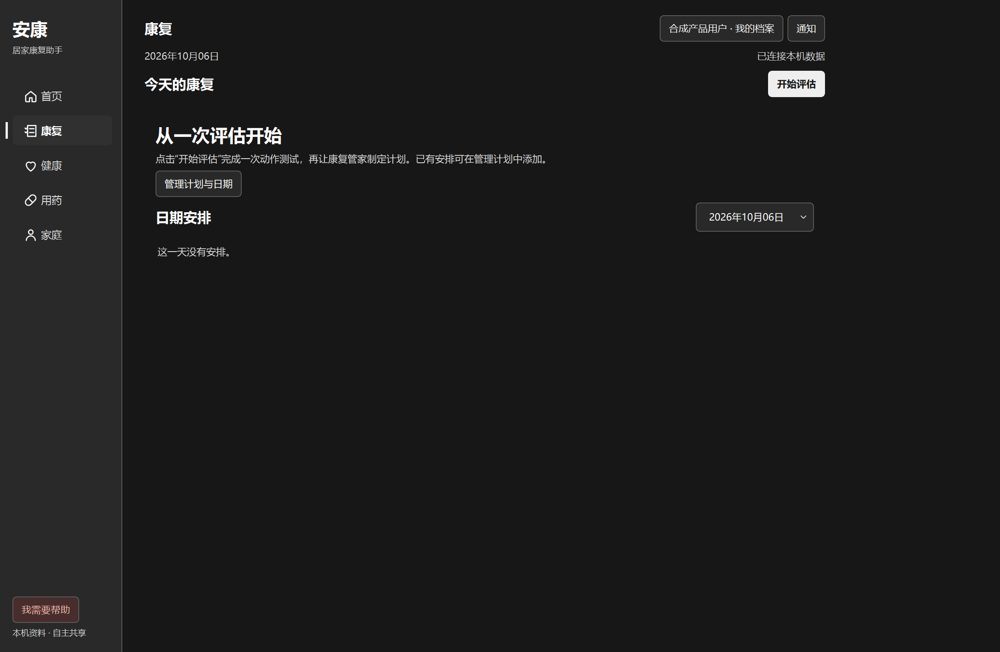

# 安康 0.19.0 双端整合验收

日期：2026-10-06。本轮针对统一桌面/手机产品及 main 整理。所有写入验证使用隔离 TEST 用户、临时数据库、合成图像或无人的测试视频；未操作用户真实健康资料。

## 完成范围

1. 桌面康复突出下一项及真实可执行动作，计划管理按需展开；健康新增手机录像记录与计划入口。
2. 手机统一首页、康复、健康、用药、家庭；管家对话归首页入口，资料拍照归健康页，用药逐日逐次，家属只能查看获准摘要。
3. 新增由电脑托管的本人手机配对，与桌面共用原 ProductBackend 和数据库；不同来源记录仍严格分开。
4. 队友独立 APK 放入已推送的归档分支；重复独立手机入口移到兼容工具目录；README 和当前交接简化。
5. 保留已有语义解释、确认、撤回、人物/时间/否定/不确定信息处理、药物审计、来源核对和测量能力。

## 实际测试

| 验证 | 本轮结果 | 解释 |
| --- | --- | --- |
| 桌面完整 Python 回归，Qt offscreen | 1,731 passed，14 skipped，4 subtests passed，380.78 秒 | 回归范围包含原测量/计划、产品、家庭、语音和新连接测试；跳过不计成功 |
| 手机完整 Python 回归 | 121 passed，2 skipped，41.33 秒 | 包含真实 bridge、本人隔离、并发读写、逐次用药、家庭权限、录像共享与断开撤销 |
| Agent TypeScript 测试 | 412 passed | 本轮合并后的语义与业务回归 |
| Agent 产品集成 | 16 passed | 图片确认、档案隔离、备份、家庭、同步、通知、语音等 |
| 手机原 UI Node 测试 | 31 passed | 原手机目录、模板、动作与已有交互保留 |
| Agent build | 通过 | typecheck + build:bridge；产品测试另重建 bridge 通过 |
| security:check / pip check | 通过 | 未发现明显硬编码密钥；当前 Python 环境无损坏依赖，不等于完整安全审计 |
| 原生手机连接专项 | 通过 | Win32 主窗口仍可输入；正常关弹窗、手机 HTTP 配对、撤销连接；桌面 backend 继续工作 |
| 实际 OCR | 通过 | 合成报告图片上传、识别、本人私有原件；不直接自动写健康事实 |
| 实际录像分析 | 通过 | 官方模型处理无人的测试录像：0 次而非伪完成；共享库本人 REPLAY 来源可见，LIVE 不污染 |

没有把重叠专项与完整测试相加宣传成唯一测试总数。最终原生 1440/1024 × 浅/深色四个组合均通过真实 Runtime 保存、安排、返回、Win32 输入及正常关闭；五页截图也在四个组合全部完成。

## 两轮审查与修复

第一轮检查并修复：电脑/独立手机原先是不同数据入口；手机产品缺乏统一五页；康复管理操作过于等权；隐藏音频文件控件被 CSS display 覆盖；原捕获页统一导航第一次接入时缺少对应样式；当前无有效评估却显示“开始下一项”。

第二轮实际渲染与边界检查修复：窄屏弹窗关闭文字换行；失去连接后保留旧 snapshot 可能产生仍在线的错觉；录音中刷新/发消息/跳转冲突；手机记录缺少次数时应显示“未测得”，不能默认为 0；连接启动避免 Windows hostname DNS 阻塞；停止服务立即撤销新请求且不阻塞 Qt。

桌面截图运行 1440×940、1024×940，浅色/深色，覆盖五页、对话、空数据、填充数据、错误和焦点。PNG 为实际 Qt 渲染，显示器 DPI 会使物理像素尺寸大于逻辑窗口尺寸。原生计划流程使用真实 Runtime，检查编辑、保存、安排日期、空自动计划、返回和正常关闭；直接检查 Win32 `IsWindowEnabled`，保留此前模态窗口锁死修复。

浏览器使用实际运行的统一手机站点，不是静态 mock：390×844、320×740 和 1024×800。操作本人配对、五页导航、两次每日用药的分别记录、家庭只读空状态、否定且不记录的管家消息、上传弹窗及 Escape 焦点返回、53 项动作目录与动作详情、原捕获流程入口。正常路径 console error/warn 为空；故意停掉 QA 服务时出现预期网络失败，页面给出重新连接入口。

## 保留的失败记录及原因

- 初始手机回归缺 Pillow、模型与推理依赖。安装明确依赖，下载清单指定的官方模型并核对 SHA256 后复验。
- 冷启动模型和完整 Qt 测试并行时，实时第一帧曾超时；单项复验通过，随后独立完整手机测试达到 121 passed、2 skipped。
- 在物理屏幕直接跑全部桌面测试，5 个请求 1600×1000 的断言被 Windows 实际工作区/DPI 限制为 1507×983；当时 981 项已通过。完整套件改为 offscreen 后通过，同时单独保留真实原生窗口验收，未以 offscreen 代替原生模态验证。
- 手机连接测试最初采用长时间 QTest 等待，妨碍后台首次导入获得 GIL；改为处理 Qt 事件并短暂释放 GIL，真实后台启动和退出通过。
- 第二次四组合原生计划验收有一次编辑保存等待失败；脚本原先只等待主窗口 busy，没有同时确认编辑器自身就绪，这是本轮定位的等待条件缺口；未据此断言唯一根因。补充新建/编辑状态断言、双重空闲条件及更详细上下文诊断，并释放后台 GIL 后复验。没有放宽业务保存规则或吞掉错误。
- FastAPI/Starlette 当前测试客户端产生一条关于 httpx 的弃用提示，测试通过；未为消除提示临时改换尚未验证的客户端。

## 截图证据

均为隔离 TEST 资料，非用户数据。

浏览器实际截图已在工作会话中审查；本文件没有将桌面截图伪称为手机实机截图。

## 环境与仍需验收的边界

- 本机实测 Python 3.12.14、Node 22+、PySide6；安装脚本面向 Python 3.13。没有宣称本轮在所有系统/版本验证。
- 官方 YOLO 模型 SHA256：`869e83fcdffdc7371fa4e34cd8e51c838cc729571d1635e5141e3075e9319dc0`。权重保留本地并忽略。
- 真实手机麦克风/相机权限、实际 Wi-Fi、防火墙、真人动作与双摄准确度未现场验收。合成空视频只验证诚实缺测和保存路径。
- HTTP 局域网下直接浏览器麦克风/摄像头可能不可用；已提供文件和系统键盘语音路径。这不是完整 ChatGPT Realtime 语音模式。
- 可选 ASR、OCR、腕踝/手部关键点依赖与模型仍有各自安装条件；不能把页面入口存在称为所有模型已在所有设备可用。
- 手机浏览器不是独立离线 APK；电脑关闭后不能访问。复杂人工计划编辑仍在桌面，电脑与录像计划来源不互换。家庭当前基于同一电脑上的独立档案，没有跨互联网账号体系。
- 尚无自动覆盖所有手机设备/屏幕阅读器的端到端测试。当前已测范围未发现阻断回归，不作“绝无 regression”的承诺。

下一轮优先做一台真实手机 + 本机桌面的完整真人评估、生成计划、按计划训练、记录回看，以及两名家人的授权/撤销验收。架构、来源与归档清单见 [整合说明](../plans/UNIFIED_PRODUCT_2026-10-06.md)。
