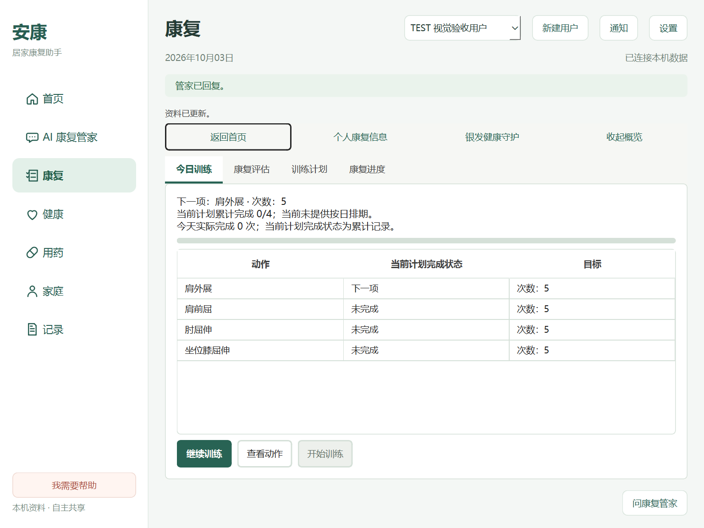
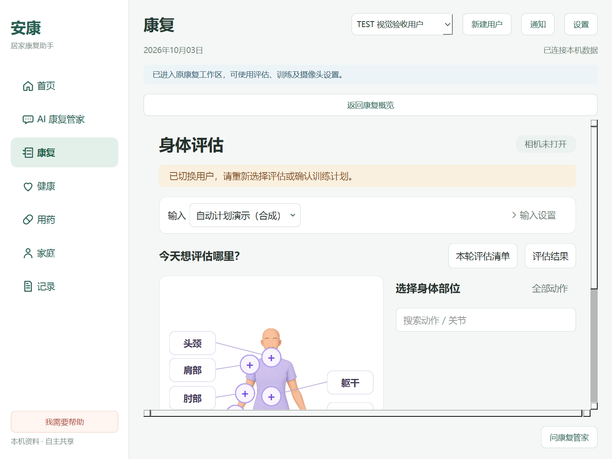
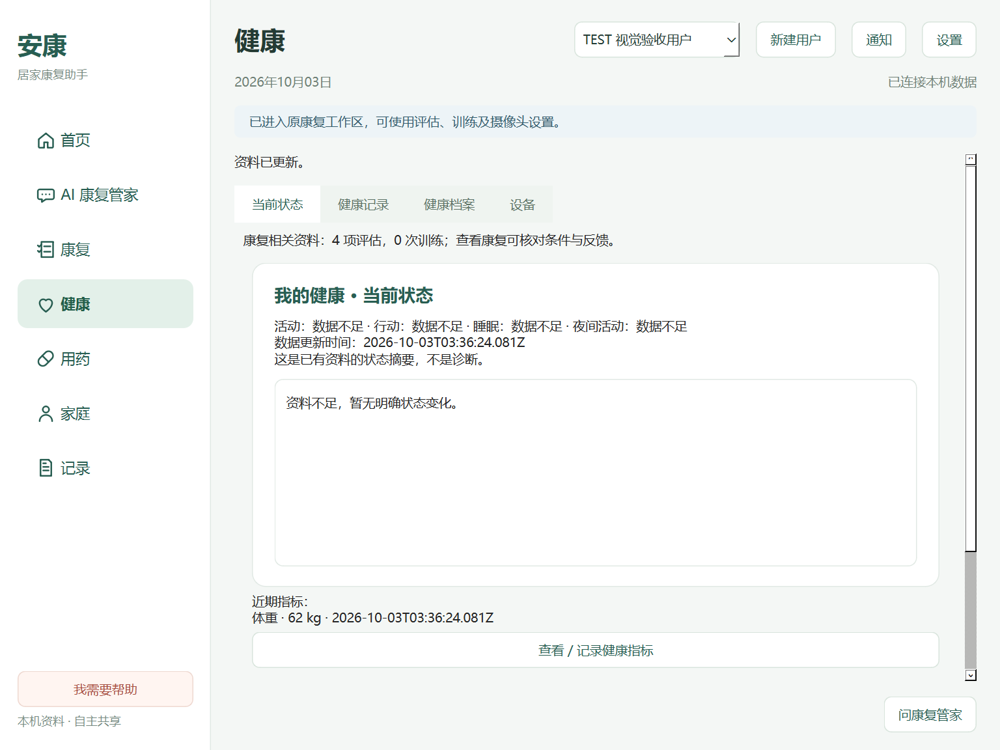
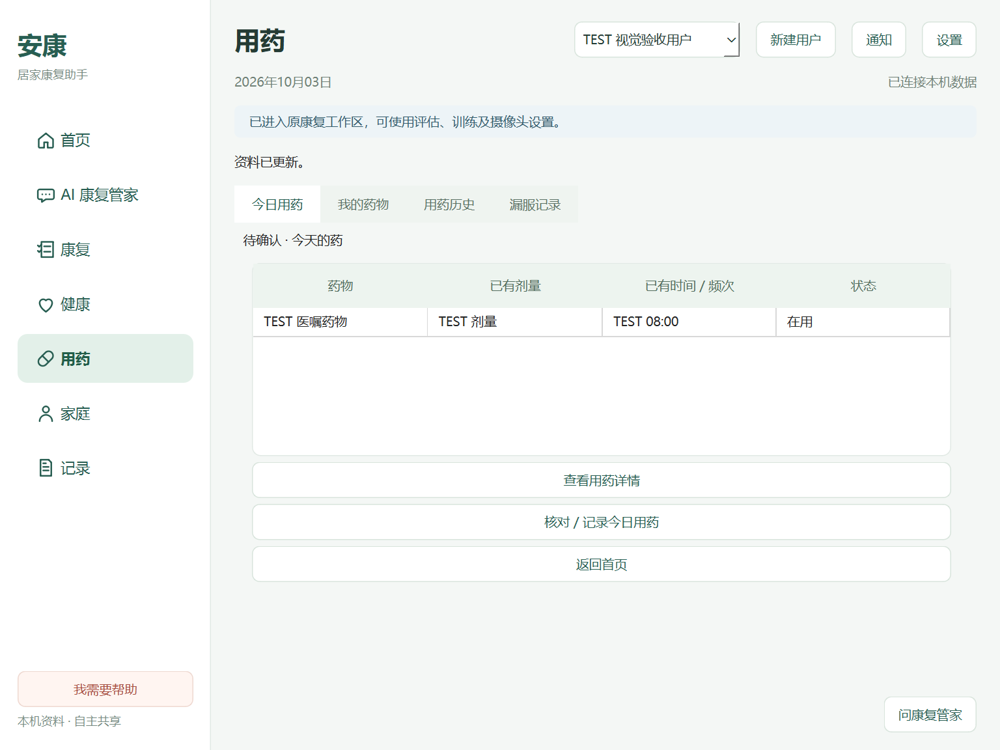

# 语音接线、AI 路径、康复/健康/用药模块简化

范围：用户授权的 1–3；仅 `codex/product-ui-v1`，不合并 main、不继续视觉美化。基线 `daae6b16527bb338e53cd02679456ab0b69b90f8`；第一阶段语音宿主提交 `241e67310710b24e0bcb94303f76b6c0d597cece`。最终 SHA 见 Git 和交付汇报。

一级导航、顶栏和全局管家不变。业务、模型、Runtime、数据库与原康复算法原位复用。主题 token、颜色、字号、图标没有重新设计。

## 1. 中文语音输入

正式麦克风/本地中文 ASR 宿主接入原 VoicePort、bridge、ProductService.chat。确认开始、30 秒录音上限、“说完了，开始识别”、立即取消、90 秒 ASR 上限、真实错误、重复提交防护、用户隔离与隐私保护已实现。识别在受控子进程中执行，Qt 主线程保持响应；音频只经内存/stdin，不存档、不上传。取消与提交结果在同一锁内决定：只有提交前接受的取消才能承诺本轮不发送。

可选组件/固定模型已在本机已有隔离应用环境安装；正常新环境使用 `Setup-Rehab.ps1 -IncludeVoice`，或应用 `scripts/setup_voice.ps1 -PythonPath <python>`。TTS 当前仍未接入并明确禁用，不宣称朗读成功。

**实体采集可运行，中文文件识别可运行；公开扬声器回采 ASR 两次未通过，真人中文识别未验收。** 这项边界没有因 UI/TEST 宿主测试通过而改写。完整实机证据、公开数据许可、安装方法和限制见[语音验收](NATIVE_VOICE_2026-10-03.md)。

## 2. AI 康复管家实际路径

保留四个可点击模块：对话、语音交流、资料与图片、康复记录。只有进入模块才显示完整工具。同一聊天控件/输入草稿/用户数据继续复用。

已在实际 Qt 控件上验证：模块卡键盘/鼠标进入、逐级返回、参考资料返回对话、未发送草稿保留、附件真实 archive.save 存档后返回、语音取消不写对话、结束录音按钮交给原聊天接口、全局侧栏真实发送且不离开当前页面、关闭侧栏返回、切换用户清空旧聊天/草稿/模块摘要。缺模型的康复工具查询、未配置图片识别和不可用外部端口仍明确显示限制，没有补造上下文或回复。

## 3. 页面按需进入

| 页面 | 默认所见 | 点击后进入 | 保留的真实动作 |
| --- | --- | --- | --- |
| 康复 | 今日训练 / 康复评估 / 训练计划 / 康复进度四个概览页签 | 继续训练、动作、评估、身体档案、计划、历史/报告等原入口打开原工作区；返回康复概览 | 同一 ProductRehabWindow、原 command bus、摄像头/双摄/回放、计划库/自动安排、Body Profile、反馈、报告和银发照护 |
| 健康 | 当前状态、康复相关资料、已有指标摘要 | 查看/记录健康指标→原表格和原录入控件→返回当前状态 | health.record；健康记录/档案/设备四页签及真实 Archive/media/device 接口 |
| 用药 | 今日已有医嘱安排、查看详情、核对/记录入口 | 核对/记录今日用药→原每日核对、漏服、明确禁用的逐剂按钮→返回今日用药 | task.status、原 chat、medication.save/status；我的药物/历史/漏服四页签 |

概览页签只切换概览，不自动把复杂工作区塞进首屏；具体业务按钮仍调用原路径。摄像头测试、连接/预览/训练、保存失败和忙碌时不能返回概览或离开监护。用户切换清空指标输入草稿及共享勾选；保存成功刷新数据，不强行关闭正在操作的详情。

截图发现普通产品页面继承系统文字 palette，浅色背景上的标签/表格文字可能为白色。仅明确设置原浅色页面的现有文字角色，修复可读性；不调整主题/颜色设计、不替换页面控件。其他四页没有继续视觉改造。

## 新按钮与原合同

原 116 个发布按钮、已有侧栏发送、前轮 13 个 AI 模块导航均保留，新增一个录音结束按钮和五个模块导航。当前静态合同 **136 个**；逐个有 actionId、A/B/C/D、实际连接、动作与反馈。动态对话框、原康复工作区的按钮继续使用此前审计和原回归。

| 新 ID | 用户按钮 | 动作 | 反馈/限制 |
| --- | --- | --- | --- |
| voiceFinish | 说完了，开始识别 | NativeVoiceHost.stop；在途原 voice.input 完成 ASR/chat | 仅录音期间启用，显示本机识别状态、成功/失败；不把“结束录音”称为识别成功 |
| rehabWorkspaceBack | 返回康复概览 | 同一 rehab_sections 切换 | 当前监护/保存未结束则禁用并解释原因；不停止或重建 Runtime |
| healthMetricsEntry | 查看 / 记录健康指标 | 同一 health_status_sections 进入详情 | 显示已有指标/输入；记录仍走 health.record |
| healthMetricsBack | 返回当前健康状态 | 同一 stack 返回 | 指标摘要读取已保存数据 |
| medTodayActions | 核对 / 记录今日用药 | 同一 med_today_sections 进入操作 | 原每日核对和漏服入口，逐剂确认仍禁用 |
| medTodayActionsBack | 返回今日用药 | 同一 stack 返回 | 保留已保存用药数据 |

[136 个按钮状态表](PRODUCT_MODULE_BUTTON_AUDIT_2026-10-03.csv)采自 Windows Qt 的 TEST 用户/真实本机语音配置；其 C 状态只是该时刻能力/条件，不表示按钮被删除。只依据 clicked 连接不宣称每个外部设备已验收。未发现未接线、console-only 或伪成功的新增控件。

## 连续路径复核

| 路径 | 结果 |
| --- | --- |
| 首页→训练→完成→反馈→首页 | SYNTHETIC/TEST 引擎及真实 Runtime/反馈/报告软件闭环通过；新增工作区进入/返回及监护保护通过，不能据此宣称真人摄像头训练验收 |
| 首页→今日用药→详情→返回 | 真实药物档案/详情通过；核对操作入内→task.status→返回通过 |
| 首页→管家→查询训练→康复 | 原 chat/Node Runtime/训练入口通过；缺 LLM 配置明确提示，不伪造实际工具查询 |
| 健康→添加资料→档案 | 原 archive.save/read/export 通过；AI 资料模块真实上传并返回对话也通过 |
| 家庭→成员→共享权限 | 原真实绑定/grant/revoke/详情确认通过 |
| 记录→康复筛选→详情→趋势/报告 | 全量当前范围记录→原纵向历史/Runtime.report/export 通过 |
| 通知→详情→对应业务 | 原确认/filter/健康或用药导航通过 |

## Qt 截图

实际 Windows Qt、Microsoft YaHei UI、DPR 1.5，1440×940 与 1024×768，均为隔离 TEST 档案，关闭模型网络调用与摄像头。AI 的四个模块无横向/纵向溢出，窄窗输入和发送可见；默认五页无横向溢出。原工作区在 1440 下无横向溢出、纵向滚动 152 px；1024 下保留 2 px 横向及 336 px 纵向滚动，返回按钮可见。健康详情仍使用原可滚动表格/表单，长时间戳由原表格省略显示，完整记录可在健康记录详情查看。没有为了截图删除控件或更改训练布局。

| 康复概览 | 原工作区 |
| --- | --- |
|  |  |

| 健康状态 | 用药概览 |
| --- | --- |
|  |  |

AI：[模块](images/product-module-paths/assistant-1024.png)、[对话](images/product-module-paths/assistant-conversation-1024.png)、[语音真实配置状态](images/product-module-paths/assistant-voice-1024.png)。详情：[健康指标](images/product-module-paths/health-metrics-1024.png)、[用药操作](images/product-module-paths/medication-actions-1024.png)。宽窗：[康复](images/product-module-paths/rehab-1440.png)、[健康](images/product-module-paths/health-1440.png)、[用药](images/product-module-paths/medication-1440.png)。

## 针对性验证

最终 Python/Qt **50 passed，104.52 秒**，无 skip；原 Node 产品扩展 **9 passed**。应用目录执行：

```
python -m pytest tests/test_product_module_paths.py tests/test_product_completion.py tests/test_product_assistant.py tests/test_native_voice.py tests/test_product_visual.py tests/test_product_window.py tests/test_product_navigation.py -q
```

覆盖七条既有软件路径、新模块进入/返回、原康复导航、136 个按钮合同、语音结束/取消/提交边界和现有页面文字可读性。固定日期测试改为当天 TEST 日期，未改变今日统计实现。真实截图命令：`QT_QPA_PLATFORM=windows QT_SCALE_FACTOR=1 ANKANG_VOICE_DISABLED=0 python tools/validate_product_visual.py --phase module-paths --width <1024/1440> --height <768/940>`。

用户验收重点：本人中文麦克风输入的识别结果、录音取消/结束、模块进入和返回、切换用户、原训练准备/评估/摄像头路径。外部设备/平台的未验收边界继续保留；视觉细节暂停。
