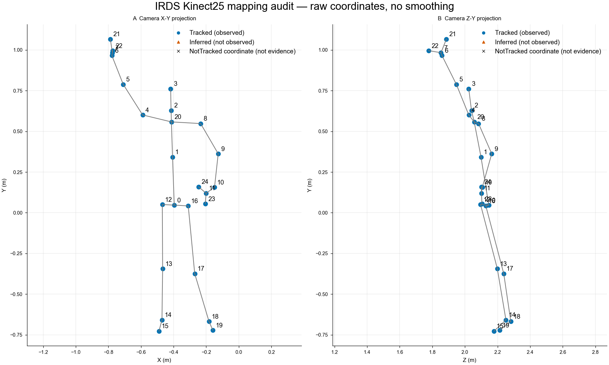

# 康复后端实施与真实训练：阶段记录与增量交付

日期：2026-10-11（Asia/Shanghai）。第一阶段实施基准：`b6d22fc392915738401fe6e14d9cc32b877a5acc`，提交 `1463929`；本次增量相对于上轮 `64b0b15`，以本文件所在交付提交为准。任务依据：本机 `docs/安康康复训练后端实施与训练任务书.md`。产品版本仍为 0.20.0，APK 仍为 0.2.1；新增后端协议版本 `rehab-protocol-2.0`，不是新客户端发布。

结论：P0–P4 的核心链路与一部分 P7 已实际完成。下载了真实获许可数据，训练了两个真实模型，也发现候选没有优于简单基线。正式会话为独立 opt-in 后端，尚未成为现有 UI/APK 的正式路径。P5 只有两段分析授权录像回放，缺独立参考标注；P6 没有姿态微调或产品影子上线。整个任务未完成，不能据此宣称真人准确度提高。

本次增量已接通唯一计划贡献、分页最终历史、原继续政策与跨计划版本反馈、显式时间安排和原手动保存计划。坐站站起计一次，随后回坐只补时间字段；逐次持久表和最终快照一致，不会重复计次。末次完整回归为 **74 项新后端、12 项旧康复、19 项旧手机接口通过**，1308 个受保护文件一致；会话 CLI 的 44 项是其中子集。新增日志、修复和未测边界见 [本次验收](../../docs/validation/REHAB_V2_TIMING_PROGRESS_2026-10-11.md)。以下历史训练结果、真人回放与性能数值没有重新运行，不能当本次新增验收。

## A. 实际完成情况

| 工作 | 状态 | 实际证据 | 剩余限制 |
| --- | --- | --- | --- |
| P0 盘点与保护 | done | [开工清单](../rehab_backend_inventory.md)、[1308 文件基准](protected_files.json)、[末次 hash 核验](scope_verification.json) | 仅本轮范围；不代表其他会话或临床验收 |
| P1 三动作后端协议 | done（工程定义） | `app/rehab_v2/protocols.py`、`engine.py`、`rounds.py`；15 项协议回放及几何契约测试 | 定义是二维投影和训练观察，不是解剖 ROM 金标准；实际机位仍由计划给出 |
| P2 正式会话与幂等 | partial | 74 项新增后端回归含 HTTP/JPEG、原自动／手动计划、时间、唯一贡献、历史、并发终结、退出恢复、报告与反馈 CAS | 独立 v2 事实及进度接口已接；旧页面未接入，深蹲尚无宿主兼容计划，完整故障验收待做 |
| P3 IRDS 下载与适配 | done | 198,985,485 字节骨架 ZIP、1974 字节 readme；CRC/MD5/SHA 校验；534 条/29 人，532 训练资格、2 隔离 | Kinect25 三维肩外展，不是手机 RGB、坐站或深蹲标签 |
| P4 模型训练 | done（离线实验） | [实验包摘要](experiment_summary.json)，两次完整训练链结果；检查点、验证/测试预测和锁文件均存在于忽略目录 | TCN 测试 macro-F1 低于 logistic；只整次正误，不可作为相位/提示/诊断 |
| P5 真人目标域验证 | partial | [目标域回放摘要](target_replay_summary.json)，443 帧肩外展与429帧深蹲真实 YOLO 输出 | 新协议均0确认次数；没有专业真值或规范准备，不能计算计次准确率 |
| P6 姿态微调 | blocked（数据条件） | [监督资格记录](pose_supervision_blocker.json)、标注模板 | 缺 RGB 训练授权、独立关节/可见性及动作边界标注；只实现拒绝入口，没有微调器 |
| 候选后端接入 | offline / off | [冻结模型对照](model_comparison.json)，Kinect 匹配返回非权威候选，RGB 被拒绝 | 未在实际服务加载新权重，没有正式质量判断/提示接管 |
| P7 回归与交付 | partial | [回归日志与 hash](regression.json)、[CPU 微基准](performance.json)、本报告与复现工具 | 未做规范真人标注、实机性能、全部 UI/API 回归或长期多用户压力验收 |
| 禁改范围 | pass | 1308 个 protected 文件 SHA256 一致；唯一现有业务文件改动为 `mobile_rehab/server.py` 的 opt-in 康复入口 | 用户本来未提交的动作图片、脚本、CSV、任务书仍原样保留、不纳入本次提交 |

## B. 修改清单：问题、实现与验证

### B1. 动作、观测、组次与提示

新增 `rehab_codex_single_camera_v2_1/app/rehab_v2/`：`__init__.py`、`protocols.py`、`evidence.py`、`engine.py`、`rounds.py`、`cues.py`、`temporal.py`、`sessions.py`、`compatibility.py`，本次补 `progress.py`、`timing.py`。

| 问题 | 实现 | 新行为 | 验证 |
| --- | --- | --- | --- |
| 肩主角度受腕/髋缺失阻断 | 复用 PoseAnalyzer 的肩肘图像垂直角；可选质量指标独立 mask | 肩肘有效可测；腕缺失肘质量 unknown，髋缺失不补造躯干质量 | C01 |
| 稳定站姿被当坐姿基线 | 协议起点同时要求姿势和持续稳定，坐站以膝屈曲观察坐姿 | 站着进入不计起立；站立后必须再观察坐回才能重装下一次 | C04/C05 |
| 遮挡/旧帧/预测补次 | 每指标 observed/computed/age/joints/kind；源 epoch、单调 seq/time、模型/几何契约门控 | 缺测不累积保持；隐藏转折只能 partial/UNASSESSABLE；预测不授权确认 | C02/C03/C08/C09 |
| 恢复后平滑器被旧结果污染 | 姿态推理与 EMA 分离；检查控制 epoch 后才更新 EMA，恢复重置滤波；gap边界沿用计划 | 暂停期间返回的旧推理不会更新相位、次数或平滑状态 | C08 慢推理故障注入 |
| 深蹲以髋高度替代膝角 | 直接采用 `180°−膝内角`；没有髋/膝/踝时该指标不可用 | 浅屈膝完成次数与个人幅度目标分开，非健身深度分数 | C06 |
| 组次/休息与视觉次数混在一起 | TrainingRounds 只编排明示的 reps/sets/rest，不生成新剂量 | 坐站到站立计次，但坐回后才结束组；休息/暂停不计；恢复核对给定休息 | C10 |
| 历史错误不断触发提示 | 当前有效质量约束与已完成次的历史问题分离，复用原 GuidancePolicy | 一条当前事件，证据引用、相位/epoch/TTL、取消；动作改善后旧纠正取消 | C11；取消/发出写审计 |
| 新视频被当作不能比较 | compatibility 与具体 evidence_fingerprint 分开 | 新 session/job/source identity 本身不阻断绝对投影角比较；相对幅度仍保留基线条件 | `test_contracts.py` |
| 明确节奏安排被 v2 拒绝 | 复用原 MovementTiming 和 timing_for_plan，加版本／时间基准／证据封套 | 出程、回程、保持与计次独立；缺测不补时间，完整往返后才做峰区分段 | `test_timing.py` 12 项，含持久化 |
| 坐站回坐时间未同步逐次表 | 同事务同步草稿时间扩展，同时校验已确认计次事实不可改 | 站起仍计一次；坐回时间在终结前补齐，终结后快照／回执不重写 | 时间持久化、重开、篡改回滚测试 |
| 覆盖新待处理帧污染较早在途帧 | 丢帧按 seq 前缀兑现，期间隐藏实时保持提示 | 旧有效帧可处理，下一幸存帧不得跨丢帧累计保持；隐藏转折不补次 | latest-frame replacement 时间回放 |

没有改原 `runtime.py`、`quality.py`、`rehab.py`、`training.py`、`guidance.py`、`storage.py` 或域对象。新路径组合原组件；旧引擎保持原结果。没有增加处方、继续资格或训练剂量决策。

### B2. 会话与数据库

新增 `mobile_rehab/rehab_v2/{__init__,api,service}.py`。现有 `server.py` 只在显式 v2 块增加安装、计划解析／查询及关闭回收；默认不启用。新宿主解析现有本人自动或手动保存计划的 ID、revision、entry_key、证据引用和已有资格，不接受用户关键点来伪造相机观测。手动计划复用 prepare_training_plan／validate_saved_binding，要求 training_plan_confirmed；安排要求陪同时另需 companion_confirmed，不让请求覆盖原剂量／节奏。

新增 namespace 表：`rehab_v2_meta/sessions/operations/frames/repetitions/audit/feedback/reports`，本次加 `rehab_v2_plan_contributions`，namespace 从 1 迁移到 2。使用原 Storage 的数据库 owning thread；原 `PRAGMA user_version=4` 不改。迁移前用 SQLite backup 保留一致副本；v1 最终事实回填贡献但不重写原回执／视觉快照。实际宿主 v2 使用独立 `rehab-v2.sqlite3`，不把测试写进正常患者库。

事实链：认证本人 → 查创建幂等记录 → 核验现有计划/明示剂量与节奏 → 冻结计划与来源 → JPEG原模型推理 → 逐次检查点及时间更新 → 控制 revision → 冻结接收边界 → 有界收尾 → 单事务最终逐次事实/快照/回执/唯一贡献 → 独立派生报告 → 追加反馈及审计 → 本人最终历史／原政策进度查询。

- 创建、frame event/seq、操作键和 repetition index 有 SQL 唯一性；同键改载荷冲突。已提交/正在执行的重复请求先查回执，再检查新前置条件。
- 并发不同 finish key 只能得到一个 commit_id；accepted/processed/persisted seq 分开，丢帧/超时未处理逐项记证据，terminal 之后晚结果不修改快照。
- 逐次确认增量保存；实际子进程 `os._exit(27)` 后重开保留1确认次，未确认半次保留为无法评价并终结 interrupted，不能 resume 已 finalized。
- 解码/推理异常明确保存 frame failed，终结 input_failed，而非永远留在准备中。持久化自身不可用时不能保证写下失败事实，仍需后续独立故障验收。
- 报告生成异步，不延迟最终回执；pending/failed 可在重启对账。反馈 revision CAS 防止旧报告覆盖新反馈。报告失败不会倒退已保存事实。
- feedback missing/null 保持缺失；自报不会改原视觉快照，反馈追加不重复增加执行量。
- 本次新回执标记 `unique_v2_contribution_committed`；唯一贡献与最终事实同事务，故障注入证明贡献失败一起回滚。旧回执保留其原标记。本人最终历史按 ordinal 游标分页，单页 1–100；计划查询只取当前版本最新条目尝试，并在同人／来源／情境／动作／侧别范围读取跨计划反馈。复用 `general-activity-rules-1`，不写旧测量，不把 v2 质量解释成旧 ROM。现有历史页面和 `/api/plan` 仍未接入。

### B3. 数据与实验工具

新增 `tools/rehab_ml/`：common、inventory、download、data、features、models、training、benchmark、target_domain、model_registry、visual_audit、crash_probe、summarize_target、run_minimal、verify_all、cli及README。新增 `configs/rehab_ml/{datasets,baseline,tcn,backend}.yaml` 和 `annotation-template.json`。

新增 `tests/rehab_backend/{test_protocols,test_sessions,test_api,test_contracts,test_ml}.py`，本次补 `test_progress.py`、`test_timing.py`。报告为本目录及 `reports/rehab_backend_inventory.md`，交接更新在 `docs/HANDOFF.md`。

下载器校验固定版本/字节/MD5，.part续传，206核对偏移；200不追加旧片段，完整损坏文件隔离，最终原子更名。ZIP检查目录穿越、链接、体积/文件数、压缩比、Windows保留名及大小写别名，CRC实际通过。原始数据/模型不提交Git。

标注模板分开物理完成、可观察完成、阶段、错误、提示机会、专业复核、训练授权和各任务 mask；unknown没有被编码为正确或负例。姿态微调的两个CLI只是资格检查/非零拒绝，不是已经实现的训练链。

## C. 数据与训练事实

### C1. 实际下载、许可与映射

IRDS 官方固定记录 [Zenodo 4610859](https://zenodo.org/records/4610859)，版本2.0.1。数据许可依据是作者原始数据描述的明确 Dataset License CC BY 4.0，不是仅看到论文开放获取；[描述论文 DOI](https://doi.org/10.3390/data6050046)。署名：Miron, A.; Sadawi, N.; Ismail, W.; Hussain, H.; Grosan, C. *IntelliRehabDS (IRDS)*, Data 2021, 6, 46。

| 文件 | 字节 | SHA256 |
| --- | ---: | --- |
| readme.txt | 1,974 | `c22584330c29d32b712e5b32e96fa842243540c37a5583a6f0a2de28ddb27bc6` |
| SkeletonData.zip | 198,985,485 | `a5fa88829f8538d415e0f0a24d5cdf473a006e23cba5d845ed0f0176cb6c8106` |

MD5分别为 `655525729cd70a00ae5b6863e98141d3` 和 `c243bcdbd1492e4928032e158accdd29`；ZIP 5185成员，实际全包CRC检查通过。未下载41GB深度图。

只取动作4/5。25关节名字/顺序来自官方 readme，逐帧核对 Simplified 与 RawData 命名关节的XYZ/TrackingState。Tracked、Inferred、NotTracked分别保留；没有假设其等于模型置信度。名义30Hz不冒充已验证曝光时间，原timestamp header保留但单位未核验。

样本534/29人：正449、误83、无法归类2；532可训练，2隔离。没有把坐姿/轮椅采集标签误当“坐站动作”。534条姿势分布：chair175、stand258、wheelchair66、Stand-frame10、sit25。整次标签正确1→class0、错误2→class1、3→未知，不生成相位、身体部位错误、提示机会或临床严重度。

数据指纹 `7ce09eae40508843179123bfef632d8b83cf5db72889eb67fb1a10b36c8bb0f5`；特征指纹 `f3188bede2e3ee4f2a90bd9c1166fcd1a1c8006069c9bf40bbab6bd9881c4959`。



配套[坐标/命名/状态原值](figures/kinect_mapping_source.json)、[SVG](figures/kinect_mapping.svg)、[导出参数](figures/kinect_mapping.export.json)。选取规则是样本ID排序第一条有效样本中间帧，没有筛选“最好看”的姿势；未平滑，仅正交投影。编号局部重叠尤其Z-Y属于审核图限制，全名和数值以JSON为准。图仅供开发核对，不能证明三维/左右映射已获专业验收或充当产品示范。PNG实际1800×1080、150dpi、白背景RGBA，符号/颜色冗余；已人工查看和元数据筛查，未声称期刊或完整无障碍认证。

REHAB24-6 未下载：学术/非营利资格待确认。MobiPhysio/SUMediPose 官方Dataverse元数据本机403，不能绕过登录或假定产品许可。KERAAL、Fit3D、QEVD按本次任务的许可/动作条件排除，不下载第三方镜像。

### C2. 人员先划分、再特征

seed20261011；17/6/6人，310/131/91条。正/误分别 train269/41、val97/34、test83/8；不切窗跨人泄漏，不用测试集调参。划分SHA `854f5791d7dcbfabdb2be89d81b7e1497b61053118900ba0669f7dc833c2fa28`。

- train：103,302,101,105,306,307,106,301,215,201,210,203,211,212,213,204,217。
- val：303,305,104,205,206,202。
- test：304,102,107,214,216,209。

特征版本 `kinect25-shoulder-causal20hz-1`，128维：当前帧肩中心/肩宽归一3D坐标、后向差分速度、观测/速度/状态已知mask、原TrackingState、局部角度+mask、结果年龄/新鲜度、侧别。20Hz向下因果取样、不插值、不用未来极值或整段归一统计；单条9–253步。标准化仅在训练集合拟合。整段统计/mean pooling只在整次结束后使用，不注册成实时阶段模型。

### C3. 实际训练与独立预测

产品环境 Python3.13.12 / torch2.9.1+cpu / numpy2.2.6 / PySide6 6.11.2，未升级。独立训练环境 `.runtime/rehab_ml/venv` 实际继承基础site-packages：torch2.11.0+cu128、numpy2.4.4；NVIDIA RTX4070 Laptop 8GiB 可用。系统依赖锁和训练代码hash在各run的 `provenance.json/environment.lock.txt`，未将依赖混同产品运行环境。

实际最小完整链命令（已经执行；训练后不自动上线）：

```powershell
& '.\.runtime\rehab_ml\venv\Scripts\python.exe' -X utf8 tools/rehab_ml/run_minimal.py
```

它记录了resolve→fetch→verify→prepare→split→features→baseline/TCN真实训练→val/test明确run评估→协议/会话检查。开工环境检查另见inventory；本次运行后的脚本补入doctor步骤，尚未为这一小改动再重复训练。每个阶段实际输出与耗时见[完整实验摘要](experiment_summary.json)。更早两次单独训练保留，完整链重复训练得到相同检查点hash；不是拷贝一个下载模型冒充训练。

| 项目 | Logistic基线 | 因果TCN候选 |
| --- | --- | --- |
| run ID | `20261010T185211Z-logistic_regression-c78b48c6` | `20261010T185214Z-causal_tcn-84cbc486` |
| 检查点SHA | `ed8ca32d15f15615dfc83ec782beafbebe1c4218c27456521a3540bf1a0c694d` | `ef76c10bf543999fe18eb84d5e340f6335cba6b84037ee4cf17233e4d7d14b8b` |
| 训练设备/耗时 | NumPy CPU / 0.873秒 | CUDA / 11.301秒，峰值94,780,416字节 |
| 选中epoch /停止 | 17 / early stop77 | 11 / early stop21 |
| val macro-F1 | 0.6375 | 0.6572 |
| test macro-F1 | 0.6341 | 0.5444 |
| test balanced accuracy | 0.8675 | 0.5384 |
| 错误动作precision / recall | 0.2667 / 1.0000 | 0.2000 / 0.1250 |
| test混淆矩阵（行真值，列预测；正/误） | [[61,22],[0,8]] | [[79,4],[7,1]] |
| 95%按人bootstrap macro-F1区间 | [0.4125,0.7390] | [0.4246,1.0000] |

基线使用整段mean/std/min/max/median/p90/首末差/时长的标准化L2 logistic；TCN为64通道、4残差块、每块2卷积、kernel3/dilation1/2/4/8、left padding、逐时刻LayerNorm、dropout0.1，感受野61步、108226参数；mask mean后整次head。AdamW lr0.001/wd0.0001、batch16、max60/patience10、clip1；类别权重仅train计算[0.5762,3.7805]，固定概率阈值0.5，不用test调阈值。

候选不优：TCN漏掉7/8错误条；基线虽然找到8/8错误条，但把22/83正确条误报为错误。测试只有6人、8条错误，区间很宽，还有病种/姿势与label相关性。这些不是手机准确率或临床能力。多数类“全正确”也可获91.21%准确率而错误召回0，因此不以普通accuracy宣传成绩。

模型、实际val/test逐条预测、混淆矩阵、分人/队列/姿势结果和500次按人bootstrap在 `.runtime/rehab_ml/run/<明确runID>/`；模型副本在 `.runtime/rehab_ml/model/<runID>/`。公共摘要保留实际hash，二进制和原始骨架包继续忽略。完整模型卡只有肩外展整次正误任务，Kinect3D、25关节、明确特征/协议、CCBY署名，`product_enabled=false`。

## D. 后端验证与回退

### D1. 最新增量回归与第一阶段记录

产品环境本次运行 `python -X utf8 tools/rehab_ml/verify_all.py`，全新隔离目录 `verification-3b62b733`；74项新后端、12项旧康复、19项旧手机接口通过。另运行 `cli.py verify-sessions --database-mode isolated`，44项通过，是74项子集。手机1条既有 Starlette/httpx弃用warning，未升级依赖。日志命令/退出码/摘要/hash详见[regression.json](regression.json)、[session_verification.json](session_verification.json)与[本轮验收](../../docs/validation/REHAB_V2_TIMING_PROGRESS_2026-10-11.md)。第一阶段 `verification-303d8fcf` 的49项是历史结果；此前61项属于尚未提交阶段，不代替最新结果。没有借用交接中之前的324项计数，本轮没有跑全UI/Android/照护回归。

确定性覆盖：C01肩腕缺测，C02短gap不累积保持，C03隐藏转折，C04站姿进入，C05坐站rearm，C06真膝角，C07左右/水平镜像/等比例分辨率及契约变化，C08乱序/epoch/年龄/慢推理污染，C09换人，C10组休息，C11提示TTL/当前纠正，C12因果特征与70前缀TCN未来扰动，C13缓存隔离，C14–16持久幂等，C17报告失败，C18真实退出恢复，C19未知感受，C21跨域拒绝，C22无标签零梯度，C23接收/丢帧/超时收尾边界。

C20禁改范围以独立文件保护命令核验，不混入74项计数。新增测试覆盖贡献迁移／回滚／范围／游标、反馈跨计划版本、手动计划原保存绑定和显式时间连续性。C07尚不覆盖任意相机旋转/剪裁/非等比例拉伸；显示镜像不会换解剖侧，外部未经声明的视频翻转或实质机位变化不能自动宣称等价。未知设备时钟、全部动作、人群真实误差与跨端重启仍未验收。

最初工具测试的失败也保留：unittest从根目录找不到app（补子进程PYTHONPATH）；默认宿主探路被旧X-Rehab-Client保护403（正确加header并检查路由确实未注册）；异步报告刚提交状态仍pending（测试等待最终派生状态）；崩溃半次只输入一帧、实际尚未形成半次（改为6帧并断言current真实存在）。没有把这些失败计为通过，末次证据才是本轮结果。

### D2. 真实录像回放并非准确率验收

使用已有本机两段录像，显式analysis-consent，原 SourceWorker + VisionWorker/YOLO。首次提取工具使用preview Context导致一帧后暂停；修复为明确run_id，未改原采集组件。后续成功读取443/429帧，手机视频首个负PTS只按原兼容逻辑跳过一帧，原媒体PTS保留。

肩外展：434/443主指标可观测（97.97%），新协议0确认/旧引擎2；新协议未取得默认1秒稳定起始姿势基线。深蹲：48/429膝主指标可观测（11.19%），新协议0；没有把健身髋代理当康复膝角。结果说明流程能运行但这些片不能支持新协议完成验收；不反向调起点阈值以强行适配这两段，没有人工计次/专业金标准，accuracy保留null。

私人RGB及逐帧骨架仅在忽略目录，Git只提交无身份图像/关键点的[统计摘要](target_replay_summary.json)。训练权限为false，未进入IRDS训练集；没有把用户自拍视频假称专业标注。

### D3. 性能、资源与故障边界

训练环境CPU、4线程、真实IRDS一条51步×128特征、10warmup+100次整次特征/TCN；预先设定20ms预算：特征p95 0.792ms、TCN2.281ms、总3.058ms。80次隔离数据库pause/resume控制p95 17.408ms，预先200ms预算。RSS534,720,512字节。明确run和所有统计见[performance.json](performance.json)。

这是CPU微基准，不包含手机、相机解码/YOLO、网络、多客户、与正式训练并发。真实录像逐帧包含原YOLO的时间只作为离线记录，不能等同实时直播采样/手机FPS。结束有2秒收尾例外，不用pause/resume的p95冒充finish或整个系统p95。实时服务单活动会话/最新帧槽1/并发控制8/24,000帧/20分钟上限；队列覆盖和终止丢帧记录可复核。

尚缺完整trace汇总、用户负载下所有阶段p50/p95、任务取消/检查点恢复压力测试和报告/推理硬挂起进程隔离。推理及报告是独立线程；挂起时关闭不会假称资源释放，但尚不能安全杀除线程。数据库磁盘满/真实损坏/持久化失败自动重试未完成，之前照护库异常不是本轮已修复事项。

### D4. 关闭与历史比较

正式前端和旧live未更改，也未重启原服务。使用默认 `create_app(..., rehab_v2=False)` 即不安装新入口、不初始化v2库；已有新事实库保留，不删除。候选默认无生产加载；ShadowSequence research_mode默认false，Kinect模型不得接YOLO/MediaPipe。`backend.yaml`是实验/开关声明，不会单凭改YAML自动上线；实际宿主入口参数才是启用条件。

未改现有权重，可始终使用原YOLO及旧规则；本轮无ONNX导出、产品质量头、提示模型或APK替换。新v2数据、旧康复/健身session及Kinect整次标签有不同protocol/source/domain/reference，不能混拼纵向曲线。比较契约单独核对指标、单位、参考、来源情境、机位、侧、schema/model/time/preprocess；具体证据指纹始终另存。二维投影角能工程比较不表示解剖ROM可比。

## E. 后续依赖与下一阶段

1. 首先补资格：REHAB24-6学术/非营利身份或其他正式RGB授权资料；MobiPhysio/SUMediPose官方访问和许可条款核验。未回答资格问题前不接受条款、不绕过受限访问，也不默认购买数据/GPU。
2. 采集三动作目标域素材：规范准备→动作→回位，肩肘/髋膝踝依动作可见；另有遮挡、旁人、换人、站姿进入坐站、可接受扶手和异常动作。独立专业人员标注物理/可观察完成、相位、错误/许可变式、提示窗口并复核；需明确训练与分享授权。不能只给模型现有结果当标签。
3. 再训练真实RGB域的质量/相位任务，比较旧EMA/规则、版本化规则、简单基线、因果候选四组；动作计数仍由观察规则确认。今后的模型改进先由新验证集/交叉验证确定，不用当前固定test反复调参。
4. 只有独立2D关节和visibility mask到位才实现姿态微调；如果原标签不含完整关节，先自定义masked loss，不能将没标的关节写成0负例。两个资格拒绝命令没有完成这条训练线。
5. 后端继续完善：康复深蹲的版本化本人计划绑定；v2 时间结果的专门比较契约、完整故障/容量压力与任务硬隔离、时间/坐标契约更细的审核、医疗参考误差及不同来源的可比性验证。唯一贡献和后端历史／进度已实现，但旧页面／APK未连接；不能用新增 API 通过代替跨端上线。客户端/前端仍不在本轮范围。

### 实际复现入口

本轮使用的训练配置是 `configs/rehab_ml/baseline.yaml` 和 `tcn.yaml`，不是任务书示例路径。命令从仓库根执行：

```powershell
& '.\.runtime\rehab_ml\venv\Scripts\python.exe' -X utf8 tools/rehab_ml/run_minimal.py
& '.\rehab_codex_single_camera_v2_1\.venv\Scripts\python.exe' -X utf8 tools/rehab_ml/verify_all.py
& '.\rehab_codex_single_camera_v2_1\.venv\Scripts\python.exe' -X utf8 tools/rehab_ml/cli.py compare --suite rehab_core --baseline 20261010T185211Z-logistic_regression-c78b48c6 --candidate 20261010T185214Z-causal_tcn-84cbc486
& '.\.runtime\rehab_ml\venv\Scripts\python.exe' -X utf8 tools/rehab_ml/cli.py benchmark --run-id 20261010T185214Z-causal_tcn-84cbc486
& '.\rehab_codex_single_camera_v2_1\.venv\Scripts\python.exe' -X utf8 tools/rehab_ml/cli.py verify-scope --baseline reports/rehab_backend/protected_files.json
```

公开数据来自[IRDS官方记录](https://zenodo.org/records/4610859)与[数据描述论文](https://doi.org/10.3390/data6050046)。图表流程采用scientific-visualization的原值、缺失、冗余编码及人工审核要求；参考 Kassis, T., Agarwal, V., He, Y., Patel, D., & Brueckner, A. M. (2026), *Scientific Agent Skills: A Library of Procedural Knowledge for Research Agents*, [DOI](https://doi.org/10.48550/arXiv.2609.00065)，2026-10-11核验最新v2（2026-09-02）。这些引用是数据/流程来源，不能替代本项目有效性验证。
